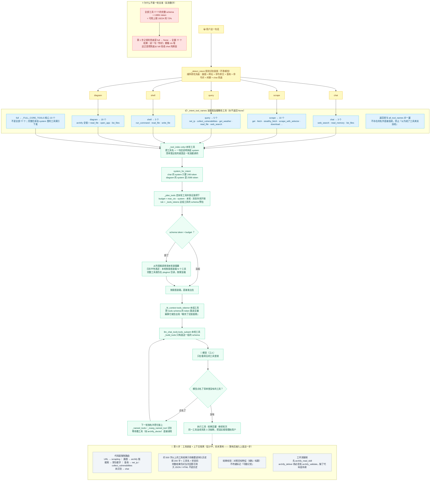

# 工具按需加载流程图

> 「工具无限」的准确含义是：**工具一个不删、不暂缓、不砍**；载体只决定"这一轮真发哪几个的 schema 出去"。
> 完整工具目录始终随 system 下发，模型点名的工具下一轮就装上。
> 对应实现：`_detect_intent` / `_intent_tool_names` / `_tool_index` / `_plan_tools` / `_build_tools`。

**四条硬性规则（第 1 步就钉死的）**：

1. **`_intent_tool_names` 永不返回 `None`**。`None` 的旧含义是"全部 77 个"，那是把 ctx 挤爆的根因。
   现在拿不准就给核心集，绝不回落全量。
2. **`_FULL_CORE_TOOLS` 是核心 10 个，不是全部**。`full` 分支保留下来只供"工具目录查询"，
   不再由意图识别触发（兜底已改为 `chat`）。
3. **`full` 意图下 `_tool_index(only=None)` 是故意的**：本轮 schema 只发核心集，但目录要列全 77 个，
   模型才知道"还有哪些工具可以点名"。
4. **日志措辞必须中性**。这里以前会写"本轮因为额度不够，所以少发了 N 个工具"——那是**错的**：
   工具一个都没删、没停用、没缩减，`plugins/` 目录 77 个一个不少。已 grep 确认
   `暂缓|预算不足|砍掉|工具预算` 在代码里 0 命中。

**一个真实事故值得记住**：`plugins/search.py` 曾被移到 `_disabled/`，实测导致 `web_search` 工具**消失**（只剩 76 个）
—— 它不是重复插件，而是 `web_search` 工具 schema 的**唯一**提供者（`load_plugins` 里 `web-search` 那条是
`builtin:True` 占位，`_build_tools` 会跳过 builtin）。已还原。**这就是"工具一个不删"这条铁律的由来。**

> 实测（`python tools/check_prompt_size.py`）：`全部工具：77 个 → 13891 token（占上限的 72%）`；
> 各意图固定开销：chat 657 / scrape 4614 / diagram 5478 / query 2666 / shell 2299 / full 7742。
>
> 配套阅读：[03-data-flow.md](03-data-flow.md)（工具装载在数据流里的位置）、
> [six-infinity.md](../six-infinity.md)（第 5 步的完整设计与验收计划）。
