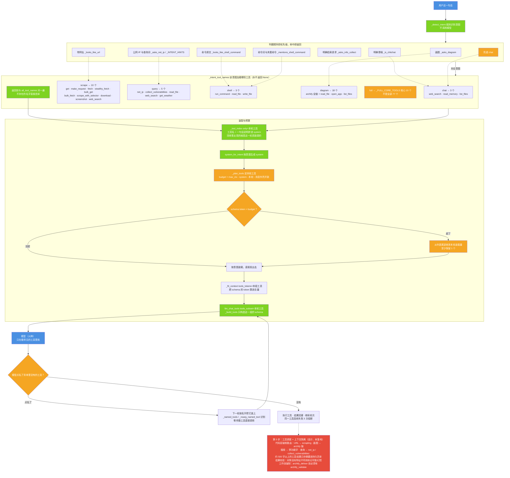

# 图 7 · 工具无限：按意图装载 + 点名即下轮装载

| 项 | 内容 |
| --- | --- |
| 适用版本 | v1.0 |
| 最后更新 | 2026-09-14 |
| 维护者 | 小焦项目 |
| 文档状态 | 稳定 |

**摘要**：工具无限的含义是工具一个不删、不暂缓、不砍；载体只决定"这一轮真发哪几个工具的 schema"，
完整工具目录始终随 system 下发，模型点名的工具下一轮就装上。

配色与术语约定见 [01-overview.md](01-overview.md) 的「图册约定」。

## 1. 图 7 · 从一句话到"这一轮发哪几个工具"

**一句话说明**：意图决定这一轮装载哪一小撮工具，预算只影响这一轮发几个 schema，
完整工具目录始终在 system 里——所以"能力不封顶"与"单次不超"能同时成立。

## 2. 代码位置索引

| 节点 | 代码位置 |
| --- | --- |
| 意图识别 | `xiaojiao_app.py` → `_detect_intent`（第 5895 行）；辅助判据 `_asks_diagram`（第 5355 行）、`_looks_like_url`（第 5350 行）、`_looks_like_shell_command`（第 5369 行）、`_asks_net_ip`（第 5388 行）、`_asks_info_collect`（第 5442 行）、`_mentions_shell_command`（第 5944 行）、`_is_chitchat`（第 5877 行） |
| 意图词表 | `_INTENT_HINTS`（第 5420 行） |
| 意图到工具 | `_intent_tool_names`（第 5847 行）、`_INTENT_TOOLS`（第 5767 行）、`_FULL_CORE_TOOLS`（第 5763 行）、`all_tool_names`（第 5831 行） |
| 工具目录 | `_tool_index`（第 5998 行） |
| system 生成 | `system_for_intent`（第 6040 行）；模式提示 `_CHAT_SYSTEM_HINT`、`_CHAT_FALLBACK_HINT`、`_DIAGRAM_SYSTEM_HINT`（第 5776–5787 行） |
| 预算与收敛 | `_plan_tools`（第 6066 行）、`_tools_tokens`（第 5822 行）、`_estimate_tokens`（第 6105 行）、`_max_context_tokens`（第 6122 行）、`_fit_context`（第 6154 行） |
| 下发与调用 | `llm_chat_tools`（第 3339 行）、`_build_tools(only=...)`（第 1159 行） |
| 点名装载 | `_named_tools`（第 4351 行）、`_noarg_named_tool`（第 4380 行） |
| 工具熔断 | `_tool_breaker`（第 3554 行） |
| 第 5 步设计 | 见 [six-infinity.md](../six-infinity.md) 的「设计目标（尚未落地）」一节 |

## 3. 为什么不能一轮全发

| 事实 | 数字 |
| --- | --- |
| 全部工具 | 77 个 |
| 全部 schema | 13891 token |
| 占可用上限 | 72%（上限 19224） |

单这一项就吃掉上限的 72%，所以"每轮全发"必然顶穿本地上下文。历史缺陷：`full` 意图的兜底
曾经等于"全部 77 个"，说一句"你好"都可能撞上下文墙。现在 `_detect_intent` 的兜底是 `chat`，
而 `_intent_tool_names` 对未知意图、空子集一律返回核心集，**永不返回 `None`**。

## 4. 各意图的实测开销

`python tools/check_prompt_size.py`（可用上限 19224）：

| 意图 | system | tools | 本轮 | 合计 | 占上限 | 本轮装载工具 |
| --- | --- | --- | --- | --- | --- | --- |
| chat | 284 | 381 | 4 | 693 | 4% | 3 个 |
| scrape | 2041 | 2576 | 9 | 4650 | 24% | 10 个 |
| diagram | 2632 | 2850 | 8 | 5514 | 29% | 18 个 |
| query | 1789 | 884 | 5 | 2702 | 14% | 5 个 |
| shell | 1727 | 581 | 4 | 2336 | 12% | 3 个 |
| full | 5678 | 2069 | 7 | 7778 | 40% | 10 个 |

| 意图 | `_intent_tool_names` 返回个数 | 该组 schema token |
| --- | --- | --- |
| chat | 3 | 381 |
| scrape | 10 | 2576 |
| query | 5 | 884 |
| shell | 3 | 581 |
| diagram | 18 | 2850 |
| full | 10 | 2069 |

## 5. 四条硬性规则

1. **`_intent_tool_names` 永不返回 `None`**。`None` 的旧含义是"全部 77 个"，那是把上下文挤爆的根因；
   现在拿不准就给核心集，绝不回落全量。
2. **`_FULL_CORE_TOOLS` 是核心 10 个，不是全部**。`full` 分支保留下来只供"工具目录查询"，
   不再由意图识别触发（兜底已改为 `chat`）。
3. **`full` 意图下 `_tool_index(only=None)` 是故意的**：本轮 schema 只发核心集，但目录要列全 77 个，
   模型才知道还有哪些工具可以点名。
4. **日志措辞必须中性**。这里以前会写"本轮因为额度不够，所以少发了 N 个工具"，那是错的：
   工具一个都没删、没停用、没缩减，`plugins/` 目录 77 个一个不少。现在的措辞是
   "本轮按意图装载 N 个工具（完整工具表仍在 plugins/ 目录，按需加载）"。

## 6. 一次真实事故：`plugins/search.py` 被移走

`plugins/search.py` 曾被移到 `_disabled/`，实测导致 `web_search` 工具消失（工具数从 77 变成 76）。
它不是重复插件，而是 `web_search` 工具 schema 的**单独提供者**：`load_plugins` 里 `web-search` 那条是
`builtin: True` 的占位，而 `_build_tools` 会跳过 builtin 条目。已还原。
这就是"工具一个不删"这条铁律的由来。

## 7. 边界与限制

| 边界 | 说明 |
| --- | --- |
| 意图判据是启发式 | 纯规则字符串判据，认不出来一律兜底 `chat`；判错时这一轮不装某些工具，模型可以点名，下一轮补装 |
| 收敛只影响一轮 | `_plan_tools` 超预算时从列表尾部收敛，**至少保留 1 个**；它不动"系统有多少工具" |
| 工具目录依赖 system | 模型能点名的前提是目录在 system 里；system 被截断或意图为 `chat` 时目录仍然存在（`_tool_index` 只收窄清单，不删除目录文本） |
| 连续失败熔断 | 同一工具连续失败 3 次后熔断并把真实报错摆给用户；熔断期间不再重复调用该工具 |
| 第 5 步未落地 | 图里红色那一格（代码层强制路由、工具结果上下文隔离、结果校验、工作流强制）是设计，尚未落地；落地前这些行为仍由模型与提示词约束 |
| 工具数量会变 | 本文的 77 个 / 13891 token 来自最近一次 `tools/check_prompt_size.py`；新增插件后需复测 |

## 8. 相关阅读

- [03-data-flow.md](03-data-flow.md)：工具装载在数据流里的位置（阶段 3）
- [06-memory-retrieval.md](06-memory-retrieval.md)：同样属于"按需装配"的记忆注入
- [six-infinity.md](../six-infinity.md)：工具无限的定义与第 5 步的完整设计

## 变更记录

| 日期 | 版本 | 变更 |
| --- | --- | --- |
| 2026-09-14 | v1.0 | 重写：对齐代码 + 统一文风 |
