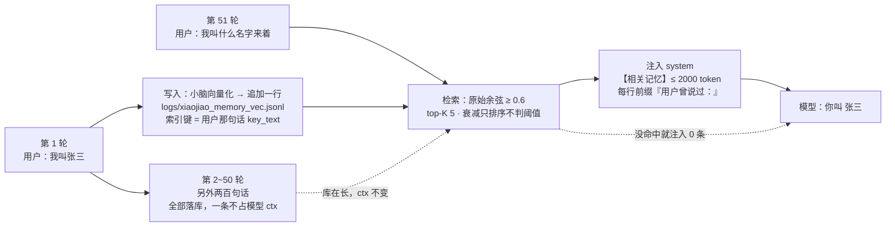
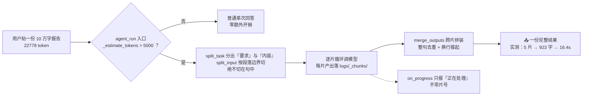
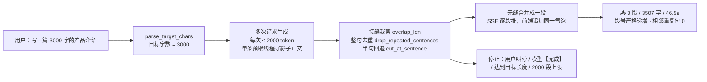
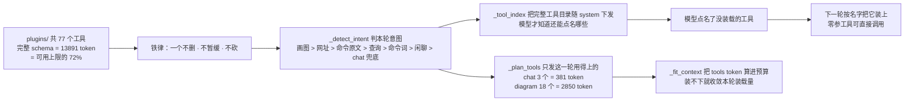
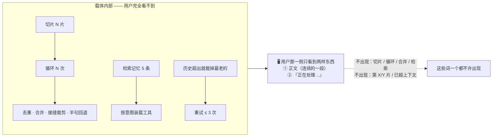
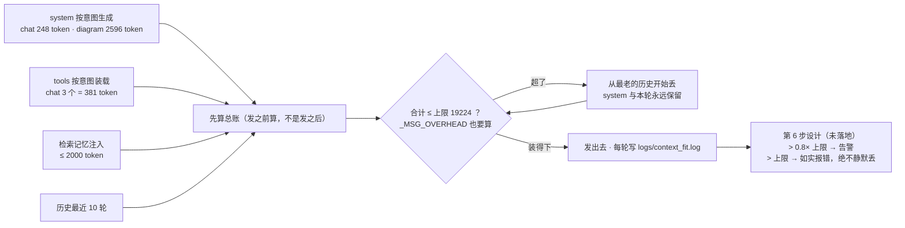
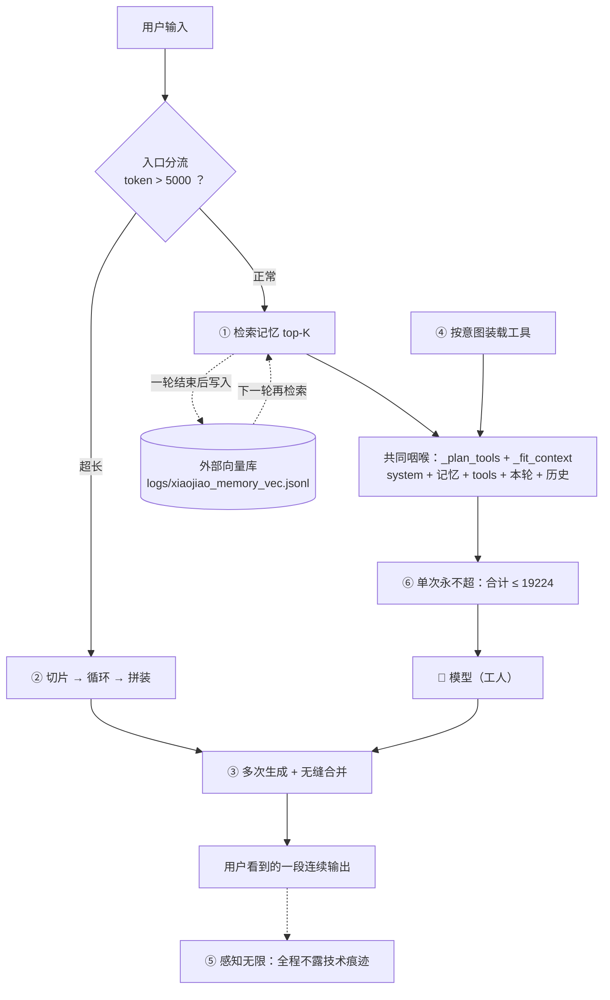

# 六个无限 · 载体优先重构

> 这一版重构只回答一个问题：**当单次请求的 token 数是硬物理上限时，怎么让用户感觉不到上限？**
>
> 答案是**载体优先**：能力不靠模型，靠载体。模型是工人，载体是工厂——
> 模型永远只处理"当前这一小块"，任务分解、上下文装配、状态管理、外部存储、结果拼装、循环调度、
> 工具调度、校验纠错**全部由载体实现**。单次请求的 token 数是有限的（这是物理红线，不假装无限），
> 但**总处理量**和**用户的感知**可以是无限的。
>
> 这六个"无限"就是这句话的六个可验收面。

本文只讲原理、取舍、真实数字和已知问题。每个无限的详细流程图放在
[`six-infinity-diagrams/`](six-infinity-diagrams/01-overview.md)，本文末尾有索引。

---

## 0. 状态总览（先说实话）

| 无限 | 核心实现 | 状态 | 实测来源 |
| --- | --- | --- | --- |
| ① 记忆无限 | `core/embedder.py` `core/memory_vec.py` `core/retriever.py` | ✅ 已实现 + 已实测 | `tools/test_memory_recall.py`、`logs/memory_retrieval.log` |
| ② 输入无限 | `core/input_splitter.py` | ✅ 已实现 + 已实测 | `logs/xiaojiao.log`、`logs/_step4_unit.py` |
| ③ 输出无限 | `core/continuation.py` | ✅ 已实现 + 已实测 | `logs/_step3_run.log`、`logs/_step3_unit.py` |
| ④ 工具无限 | `_intent_tool_names` `_FULL_CORE_TOOLS` `_plan_tools` | 🟡 **第 1 步已完成并实测**（不删不暂缓 + 按意图装载）；**第 5 步的强制路由/上下文隔离/结果校验设计中** | `tools/check_prompt_size.py` |
| ⑤ 感知无限 | `on_progress` 不带片号、SSE 只推正文 | 🟡 **部分落地 + 其余属架构约定**；措辞统一收口在第 5/6 步，**设计中** | `xiaojiao_app.py` 的 `api_chat_stream` |
| ⑥ 单次永不超 | `_estimate_tokens` `_plan_tools` `_fit_context` | 🟡 **第 1 步已完成并实测**（含 ctx 校准）；**第 6 步的 0.8 告警 / 超限报错 / 统一日志行设计中** | `logs/context_fit.log` |

> 本文所有数字都标了出处。**实测**＝有命令输出或日志原文；**设计目标**＝方案里写明、尚未落地的判据。
> 第 5、6 步仍在实现中，本文对它们**只写设计，不编数字**。

---

## 1. 六个无限是什么

### ① 记忆无限

**全部对话历史永久存在外部向量库里**，不依赖模型上下文。每轮请求按需检索 top-K 注入系统提示词。

关键词是"全部"和"永久"：不是"最近 10 轮摘要"，不是"模型自己记着"。模型上下文里永远只有**这一轮需要的那几条**，
但库里躺着的是从第一天到现在的所有对话。

### ② 输入无限

**任意长的用户输入由载体切片**，逐片循环处理，再拼装成一份结果。用户能贴 10 万字报告、50 万字文档。

### ③ 输出无限

**任意长的输出要求由载体拆成多次请求生成**，然后无缝合并：接缝去重、句子边界修复、
整句复读过滤，最终流式推给用户的是**一段连续输出**。

### ④ 工具无限

**`plugins/` 里的每个工具都永久保留**——一个不删、不暂缓、不下线。工具**按意图装载**：
每轮只加载相关的那几个 schema；完整工具目录**始终**写在系统提示词里，模型点名的工具下一轮装载。

### ⑤ 感知无限

**用户永远看不到技术痕迹**。不出现"切片 / 循环 / 合并 / 检索 / 按需加载"，不出现"第 X/Y 片"，
不出现"已超出上下文，已截断"。用户看到的是"正在处理…"和一段连续的正文。

### ⑥ 单次永不超

**单次请求永不超上下文窗口**。这一条和前五条性质不同——它是**物理红线的守门人**，不假装无限，
而是靠精确的按需装配保证"每一次都装得下"。装不下时如实报错，**绝不静默丢内容**。

---

## 2. 用户痛点：不这么做会怎样

这六条都不是设计洁癖，每一条背后都有一个具体的、用户能复现的坏体验：

| 无限 | 不做的后果（都是真实发生过的） |
| --- | --- |
| ① 记忆无限 | 聊到第 50 轮，模型已经忘了第 3 轮说过的名字。本地 4B 的 ctx 只有两万 token，历史一多就被裁掉；关掉窗口重开全部失忆。用户会觉得"这东西没有记忆，跟搜索框没区别"。 |
| ② 输入无限 | 粘一份 10 万字的报告进去，直接撞 `request exceeds the available context size` 报错；或者模型只看了个开头就开始总结，还一本正经地说"综上所述"。 |
| ③ 输出无限 | 用户要"写一篇 3000 字的产品介绍"，模型吐了 800 字就停；要"5 万字"根本物理上做不到。多问几次"继续"，拼起来又是重复句、断句，一眼就看得出是拼的。 |
| ④ 工具无限 | 工具越装越多，一轮里把所有 schema 全发出去 → **单这一项就吃掉 19224 上限的 72%**，说句"你好"都可能撞 ctx 墙。于是有人为了"省地方"去删工具、暂缓工具——结果能力**真的**丢了（见下文 `plugins/search.py` 事故）。 |
| ⑤ 感知无限 | 界面上写着"第 3/5 片处理中""已检索到 3 条记忆""内容过长已截断"。用户立刻明白这是个半成品：他在跟一个会喘气的工具说话，不是一个助手。 |
| ⑥ 单次永不超 | 两条岔路都是坑：不精确装配 → 随机撞 ctx 报错；搞"静默截断" → 用户看到答非所问，却不知道自己的输入被砍掉了。**报错要如实，但不能无缘无故地报。** |

痛点④值得单独展开。最刺眼的一次事故是 `plugins/search.py`：它曾被移到 `_disabled/` 目录来"精简工具表"，
实测导致 `web_search` 工具**消失**（从 77 个掉到 76 个）。后来查清楚：它不是重复插件，
而是 `web_search` 工具 schema 的**唯一**提供者（`load_plugins` 里 `web-search` 那条是 `builtin:True` 占位，
`_build_tools` 会跳过 builtin）。**"工具一个不删"这条铁律就是这么来的。**

正确做法不是删工具，而是**不在一轮里全发**——工具的**存在**和工具的**本轮装载量**是两件事。

---

## 3. 载体如何做

### 3.1 记忆无限：外部向量库 + 按需检索

**三个模块，职责分开**：

| 模块 | 职责 | 关键实现 |
| --- | --- | --- |
| `core/embedder.py` | 文本 → 512 维单位向量 | 主后端：小脑 MiniGPT 过完**整个编码器栈**（embedding + pos → 8 层 Transformer）→ 均值池化 → L2 归一化；兜底：字符 2/3-gram 哈希向量（同样 512 维） |
| `core/memory_vec.py` | 存 + 算余弦 | `logs/xiaojiao_memory_vec.jsonl`，**一行一条 append-only**；向量 base64 编码 float32 小端；numpy 快路径一次矩阵乘扫全库 |
| `core/retriever.py` | 检索**策略** | 时间衰减、相似度阈值、top-K、注入 token 上限、如实写 `logs/memory_retrieval.log` |

**为什么向量化要走完整个编码器栈，而不是只用 `nn.Embedding` 那一层**：这是实测对比出来的，不是偏好。

- 只用 embedding 层：rank-1 命中 **4/5**，gold 分 **0.49~0.66**，而无关项最高 **0.52** —— 相关和无关几乎分不开。
- 过完编码器栈：rank-1 命中 **5/5**，gold 分 **0.72~0.85**，无关项 ≤ 0.72 —— 区分度好得多。

两者都是 512 维。载体选**更能干活**的那个。

**一条最关键的设计取舍：阈值判在"原始余弦"上，时间衰减只参与排序。**

Spec 的原话是"余弦相似度 + 时间衰减，阈值 0.6"。如果**把衰减乘进阈值判定**，会出事：
一条 0.85 分的老记忆，衰减 0.4 之后只剩 0.34 < 0.6 → 被丢掉。
那"三年前说的那件事"就**永远检索不到**了——正好打死无限 1 的招牌场景。

所以拆开用：

- **阈值只判原始余弦**（判"这条到底相不相关"）：相关就是相关，跟多久以前无关。
- **时间衰减只参与排序**（同样相关时，优先想起最近的）：这才是人类式记忆——老的能想起来，但新的更靠前。

衰减分档照 spec：7 天内 ×1.0 / 30 天内 ×0.7 / 更早 ×0.4。阈值 0.6、top-K 5、注入 ≤ 2000 token。

**硬隔离**：`memory_vec._assert_not_forbidden` 直接抛错拒绝把库指到 `self_learn/knowledge_vec.json`。
那是小脑的**工具经验库**（工具用法 + 失败反思），跟对话记忆是两回事，混在一起会污染它。

**三个真实踩坑（第 2 步实测撞出来的）**：

1. **注入的记忆没有"说话人框定"** → 模型把「我叫张三」当成在说它自己，回答"你叫小焦"。
   修法：`_MEMORY_INSTRUCTION` 写明"记忆里的「我」= 用户，不是指你小焦"，注入行加前缀「用户曾说过：」。
2. **`detect_tool_intent` 用光杆动词"写"判"要新建"** → 问句「我平时最喜欢用什么语言**写**代码」被判成
   `write_file`，`plan_tool` 让 4B 模型把它转成 `run_command whoami`，再把用户名 "jiao" 总结成
   "已在 jiao 目录下创建了 jiao 文件夹"。**答非所问，还谎报执行。**
   修法：新建类判据只认**带宾语的动作短语**（写一个 / 写个 / 创建 / 新建 / 保存…），不认光杆"写"；
   顺带修了「文件夹」含「文件」导致建目录被判成写文件的 substring bug。
3. **写入路径存了整段回答** → 均值池化按长度加权，用户那句「我叫张三」被几百字寒暄淹掉，
   cos 掉到阈值以下、注入 0 条。修法：`add_memory(..., key_text=用户那句话)`——
   **向量按"用户说了什么"算，注入用完整原文**，回答只存 ≤ 200 字摘要。

第 3 条背后的洞察是：**检索的本质就是"按用户问过的去找"，用户那句话才是索引键。**

### 3.2 输入无限：入口切片 + 循环 + 拼装

`core/input_splitter.py`，在 `agent_run` 的**最前面**分流（`_needs_input_split`：`_estimate_tokens > 5000`）。

为什么要放在最前面：超长输入一旦进入下面的链（记忆检索 → 意图识别 → 装 ctx），**无论怎么裁都装不下**。
必须在入口就分流，由载体切好、循环、再拼装。

**切片的硬要求（每条都有实测理由）**：

1. **按段落边界切，绝不切在句中**。语义完整比"刚好凑满 5000 token"重要得多；
   半句单独喂给模型，它会当成残缺输入去猜。
2. **段落本身超长 → 退到句边界**（`_SENT_SPLIT` 按 `。！？!?；;…` 切）；**单句还超长 → 才硬切**。
3. **硬切要留 0.85 的字符余量**。字符数→token 是线性估计，边界上会差几个 token。
   第 4 步单测实测：不留余量时切出来 `5010 > 5000`——差一点点也是超。
4. **粘合开销必须算进累加**。每多粘一段就多一个换行分隔。第 4 步单测实测：只累加各段自己的 token，
   `sum=4988` 拼出来实际是 `5003`。
5. **最后一道保险不能省**：收尾逐片复验，任何一片仍超限就硬切。这样"每片 ≤ max_chunk"才是**不变量**，
   而不是"通常成立"。
6. **`split_task` 把"要求"和"内容"分开**，只对内容切片，每片带着同一条要求去处理。
   判据是启发式的（第一段 ≤ 200 字且总段数 ≥ 3，或第一段 ≤ 60 字且总段数 ≥ 2），找不到就用一句通用要求兜底。
7. **每片产出落 `logs/_chunks/`**：进度不丢、可核对、可续跑。
8. **拼装时再做一次跨片整句去重**。模型处理相邻两片时会把上一片结尾的结论又复述一遍，
   直接拼会出现重复段落（和第 3 步续写的接缝问题是同一类）。

**`on_progress(done, total)` 故意不暴露片数**——这是无限⑤的要求。它只给界面一个"正在处理…"的信号，
SSE 也只发 `{"type":"progress"}`。

### 3.3 输出无限：多次请求 + 无缝合并

`core/continuation.py` 的 `generate_unlimited(task, system, max_per_chunk=2000, max_total=None)`。

**载体负责七件事，一样都不推给模型**：

| # | 职责 | 实现 |
| --- | --- | --- |
| ① | 定长度 | `parse_target_chars`：从任务里解析「3000 字 / 5 万字 / 两万字 / 20000 words」 |
| ② | 装上下文 | 第 1 次给完整任务；第 N 次给「任务 + 已写梗概 + 上段最后 200 字」 |
| ③ | 去重（接缝） | `overlap_len`：与已写正文末尾做**最长重叠**比对（后缀 = 前缀），重叠 ≥ 8 字才裁 |
| ④ | 断句 | `cut_at_sentence`：段落结束必须是完整句子；半句回退到上一个句号，残句带进下一轮 |
| ⑤ | 校验 | `looks_offtopic`：空输出 / 重新开场 / 又短又与关键词零重合 → 丢弃重试（≤ 3 次） |
| ⑥ | 提速 | 并发预取 + 缓冲池（`buffer_size=3`） |
| ⑦ | 停止 | 模型说「【完成】」/ 达到目标长度 / 用户叫停 / 单段数上限 2000 |

**模型只干一件事：接着写下一小段。它不知道自己在被循环调度。**

**并发预取那段代码为什么长这样**（第 3 步真撞过才想明白）：

预取第 N+1 段，必须知道"第 N 段已经写了什么"——要拿它当衔接锚点，还要拿它做去重。
所以**不能**让预取线程和主循环同时对着同一份状态写，否则第 N+1 段拿到的锚点是残缺的，
去重也会算错，拼出来就会重句。

做法是：**只有一条生成线程**（预取线程），它自己维护一份"影子正文"（`shadow` = 已提交正文 + 池子里
已生成但还没被取走的部分），一直把池子填到 `buffer_size` 为止。主循环只从池子里取、只做合并，
从不并发生成。再配一个 `Condition` + `inflight` 认领，防止主循环和预取线程同时生成同一个段号。

第 3 步实测撞到的 bug 就是段号出现 `[1,2,2]`——根因正是主循环的串行兜底和预取线程竞态。
修好之后段号严格递增 `[1,2,3]`。

**`【完成】` 必须在偏题校验之前处理**：模型说完结了就是完结了，不能让"风格校验"把它的收尾句当成跑题丢掉。
（第 3 步单测抓到的第二只虫子。）

**后端接口**：

- `/api/chat/stream`（SSE）：每通过一段就推一段，前端追加到同一个气泡。
- `/api/chat/stop`：用户叫停（无限③要支持"写 20 万字 → 一直写，用户叫停才停"）。
- `/api/chat`：**保留**作为非流式入口，第三方客户端仍可用。
- 短内容**完全不触发**续写（`needs_continuation` 默认门槛 ≥ 800 字）——普通问答一点额外开销都没有。

### 3.4 工具无限：一个不删 + 按意图装载

**先说清楚"无限"的准确含义**：工具**一个不删、不暂缓、不砍**；载体只决定"这一轮真发哪几个的 schema 出去"。

**为什么不能一轮全发**（实测数字）：

```
全部工具：77 个 → 13891 token（占可用上限 19224 的 72%）
```

单这一项就吃掉 72% 的窗口。第 1 步之前的兜底逻辑是 `full → None → 全量 77 个`，
结果就是**说一句"你好"都可能撞 ctx 墙**。这是把兜底从 `full` 改成 `chat` 的直接原因。

**第 1 步的四处改动**：

1. `_detect_intent` 的兜底从 `full` 改成 `chat`（最省上下文）。
2. `_intent_tool_names('full')` 返回 `_FULL_CORE_TOOLS` 核心 **10 个**，不再是 `None`（= 全部 77 个）。
3. `_intent_tool_names` **永不返回 `None`**；返回前与 `all_tool_names()` 对一遍，
   不存在的名字直接丢掉，防止"以为给了工具、其实没给"。
   这里也有一个真坑：不能用 `real_tool_names()` 当真实工具表——它只登记**插件**工具，
   `run_command` / `read_file` / `list_files` 这些**内置**工具会被当成"不存在"而丢掉，
   结果 shell 意图一个工具都不剩，悄悄回落成"全部工具"。
4. `_plan_tools` 的日志措辞改中性。以前会写"本轮因为额度不够，所以少发了 N 个工具"——那是**错的**：
   工具一个都没删、没停用、没缩减，只是**这一轮**不发那么多 schema。

**按意图装载的实测值**（`python tools/check_prompt_size.py`）：

| 意图 | 本轮装载工具数 | tools token | 固定开销合计 |
| --- | --- | --- | --- |
| chat | 3 | 381 | 657 |
| shell | 3 | 581 | 2299 |
| query | 5 | 884 | 2666 |
| scrape | 10 | 2576 | 4614 |
| diagram | 18 | 2850 | 5478 |
| full | 10（核心集） | 2069 | 7742 |

> 「固定开销合计」= system + tools + 本轮 + 消息外壳。真实请求还要加历史与检索记忆，
> 那部分由 `_fit_context` 按上限自动裁剪。

**完整目录始终下发**：`_tool_index` 把"这一轮真能调的"工具名 + 一句话说明拼进 system。
`full` 意图下 `_tool_index(only=None)` 是**故意的**：本轮 schema 只发核心集，但目录要列全 77 个，
模型才知道"还有哪些工具可以点名"。

**第 5 步（设计中，尚未落地）**：在代码层做**强制路由**——URL → scrapling；画图 → archify 链；
搜索 → 禁功能字；查询 → `net_ip` / `collect_vulnerabilities`；未识别 → chat。
另外三项也是设计：

- 工具结果超过 ~500 字只把**摘要**（前 200 字 + 工具名 + 状态码）写进持久历史，
  完整结果仍对当次回答可用；大 JSON / HTML 不进历史。
- **结果校验**：对照目标特征（域名 / 标题），不符就标记"可能幻觉"。
- **工作流强制**：先 `archify_read_skill`；`archify_deliver` 之前必须有 `archify_validate`，缺了代码层补调。

### 3.5 感知无限：痕迹不进用户视野

这条不是独立机制，而是①~④ 的**对外表现要求**。已经落地的部分：

- `on_progress(done, total)` 的**片数参数根本不给界面用**，`api_chat_stream` 里只发 `{"type":"progress"}`。
  用户看到的是"正在处理…"，不是"第 3/5 片"。
- 续写走 SSE 时，`on_chunk(piece, n, total_chars)` 的段号也不显示，前端只做**追加**——
  一个气泡里连续长出来，没有分段痕迹。

**属于约定、要靠后续步骤收口的部分**：日志与报错文案里不出现"切片 / 循环 / 合并 / 检索 / 按需加载"
（第 5/6 步设计里有"措辞统一"这一项，尚未全量核对）。这一条**本文不宣称已完成**。

### 3.6 单次永不超：精确按需装配

**这一条不假装无限。** 单次请求的 token 数是硬物理上限——载体能做的是"精确装配 + 切片 + 多次请求"，
不是让单次变大。

**第 1 步已完成的三件事**：

1. **`_estimate_tokens` 校准**：`cjk × 1.5 + other / 3`。
   原来按 1.05 估，**低估约 40%**——于是 `_fit_context` 报"合计 4216 / 上限 19500"，
   实际请求却是 22562，直接 400/500。原则是**宁可高估**（少留点历史），绝不低估（一低估就是硬报错）。
2. **`_fit_context(..., tools_tokens=...)` 把工具 schema 算进预算**。
   漏算它就会出现"裁完了还是超限"——63 个工具的 JSON 有几千 token。
   另外每条消息的**外壳**（role/content 的键名与括号）也要占 token，按 `_MSG_OVERHEAD = 12` 计。
3. **ctx 校准**：llama-server 收到 `-c 20000` 后**实际给的是 20224**——llama.cpp 会把 `n_ctx`
   **向上取整到 256 的倍数**（20000 / 256 = 78.125 → 79 × 256 = 20224，实测
   `GET /props` → `n_ctx = 20224`）。所以操控文件里直接写 20224（本身就是 256 的倍数，
   不会被再取整），载体算出的上限才和大脑真容量**对齐**，不白扔那 1224 token 的窗口。

`_max_context_tokens()` = 20224 − 1000 安全余量 = **19224**。
本地按 `brain.llama.ctx` 取，云端按 128000 取，都可以被 `capabilities.max_context_tokens` 覆盖。

**`_fit_context` 的硬规则**：**system 与本轮问题永远保留**；历史从最老的一端开始丢，直到总 token ≤ 上限。

**第 6 步（设计中，未落地）**：

- 日志统一成一行：`system=a + tools=b + 检索记忆=c + 历史=d + 本轮=e = 合计 f / 上限 g`。
  （现在 `logs/context_fit.log` 已有 `system=a + tools=b + 本轮=c = 合计 d / 上限 e ｜ 历史 X→Y 轮` 这一行，
  第 6 步是把"检索记忆"和"历史"也拆出来。）
- 超过 **0.8× 上限**给告警。
- 超过上限**如实报错给用户，绝不静默丢内容**。
- 自检工具 `tools/check_prompt_size.py`（**已存在，本文实测跑通**），打印 system 各部分占比 + 各意图的
  system/tools 总量。

---

## 4. 每个无限一张图

### 4.1 记忆无限



### 4.2 输入无限



### 4.3 输出无限



### 4.4 工具无限



### 4.5 感知无限



### 4.6 单次永不超



### 详细流程图（单独文件）

| 文件 | 内容 |
| --- | --- |
| [01-overview.md](six-infinity-diagrams/01-overview.md) | 六个无限总览图 |
| [02-carrier-layer.md](six-infinity-diagrams/02-carrier-layer.md) | 载体层内部结构图（工厂的八个车间） |
| [03-data-flow.md](six-infinity-diagrams/03-data-flow.md) | 数据流向图：请求 → 检索 → 装配 → 模型 → 拼装 → 输出 |
| [04-output-continuation.md](six-infinity-diagrams/04-output-continuation.md) | 输出续写合并流程图 |
| [05-input-splitter.md](six-infinity-diagrams/05-input-splitter.md) | 输入切片流程图 |
| [06-memory-retrieval.md](six-infinity-diagrams/06-memory-retrieval.md) | 记忆检索流程图 |
| [07-tool-on-demand.md](six-infinity-diagrams/07-tool-on-demand.md) | 工具按需加载流程图 |

> ⚠️ **维护提示**：`python tools/check_mermaid.py --all` 扫的是仓库根 `*.md`、`docs/*.md`（**不递归**）
> 和 `tests/**/*.md`，所以它**扫不到 `docs/six-infinity-diagrams/`**（那是 `docs/` 的子目录）。
> 改动这七个文件后要显式传路径检查：
>
> ```powershell
> python tools/check_mermaid.py docs/six-infinity-diagrams/*.md
> ```

---

## 5. 六个无限怎么协同

六条不是六个独立功能，而是**一条流水线上的六个环节**，共用同一套载体代码。协同关系有四层：

### 5.1 装配是共同的"咽喉"

`_plan_tools` + `_fit_context` 是唯一一处计算 token 总账的地方，**所有注入内容都要从这里过**：

```
system（按意图生成）
  + 相关记忆（无限①注入的）
  + tools schema（无限④按意图装载的）
  + 本轮问题（无限②切过片的、或原样）
  + 历史（从最老的一端裁）
  ≤ 19224（无限⑥守的那条线）
```

第 1 步踩过的一个真坑正好说明这层协同：**以前先裁剪、后拼"相关记忆 / 联网资料 / 小脑经验"**，
于是这些注入内容完全没被算进去——裁剪报告写"合计 18926 / 上限 19000"，实际请求却是 19898，照样超限。
修法是：**先把"本轮"拼完整，再算 token**。记忆的注入点也被特意放在 system 拼好之后、`_plan_tools` 之前。

**没有无限⑥，无限①和④就是空话**：记忆可以无限注，工具可以无限装，但总账一超全部白干。

### 5.2 唯一的一次"入口分流"决定走哪条路

`agent_run` 的第一件事就是判 `_needs_input_split`（无限②）。超长输入走 `_process_long_input` 提前返回，
**根本不进**记忆检索/意图识别/装配那条链。理由前面说过：进来了也装不下。

不超长才继续往下走，之后在装配完成处再判一次 `_needs_continuation`（无限③）。
**两条路互斥且都在入口判定**，这样长输入 + 长输出的极端组合也不会叠加出错。

### 5.3 输出侧和输入侧复用同一套"接缝处理"

`drop_repeated_sentences`、`cut_at_sentence` 这套合并逻辑，被 `input_splitter.merge_outputs` 直接复用
（`from . import continuation as _c`）。**同一个问题在两处出现**：

- 输出续写：模型"接着写"时会把上段结尾重抄一遍 → 接缝重复句。
- 输入切片：模型处理相邻两片时会把上一片结尾的结论又复述一遍 → 跨片重复段。

所以修一次两处都好。这是"载体优先"的一个额外红利：**能力沉淀在载体层，就自然会被复用。**

### 5.4 无限⑤是①~④ 的验收面

前四条做完了，第五条才可能成立。反过来说：**只要界面上漏出一个"第 3/5 片"，前四条做得再对，用户也感受不到。**

### 协同总览



---

## 6. 为什么换模型不改变这些

这是"载体优先"最实际的价值。**六个无限的实现全部在 `core/` 和 `xiaojiao_app.py` 里，
一行都不在模型里。** 换大脑（本地 4B ↔ 编码 8B ↔ 云端 API）时：

| 项 | 换模型时会变吗 | 为什么 |
| --- | --- | --- |
| 记忆的**存储与检索** | ❌ 不变 | 向量由**小脑** MiniGPT 算（`core/embedder.py`），不是大脑。512 维不变，`logs/xiaojiao_memory_vec.jsonl` 不用重建。换了大脑照样读同一份库。 |
| 记忆的**策略参数** | ❌ 不变 | `memory_top_k` / `memory_threshold` / `memory_max_tokens` 是操控文件里的载体参数。 |
| 输入的**切片** | ❌ 不变 | 纯文本处理 + token 估算，`core/input_splitter.py` 不调模型（只在逐片处理时调）。 |
| 输出的**合并** | ❌ 不变 | 重叠检测、整句去重、断句回退全是字符串算法，`core/continuation.py` 里不依赖任何模型特性。 |
| 工具的**目录与装载** | ❌ 不变 | 工具表由 `plugins/` + `TOOLS` 决定，装载由意图决定，与模型无关。 |
| 单次的**上限** | ❌ 不变（数值不同） | 本地 20224 / 云端 128000，`_max_context_tokens()` 按 `BRAIN_ENGINE` 取；**算法一致，只是数字不同**。 |
| 调模型的**唯一接口** | ✅ 这一处会变 | `continuation._default_call` 复用 `_llm_targets()` + `_llm_post`（自带重试 + 云端被拒自动兜到本地大脑）。模块内部**不另起一套**。 |

一句话：**换模型换的是"工人换了个手巧的"，工厂的流水线、仓库和质检一个都不动。**

而且这套载体**对弱模型更值钱**：

- 换成 4B 弱模型：接缝裁剪、整句复读守卫、偏题重试、工具候选回退全都在替它兜底。
  **它不会因为变弱而丧失"无限"这个性质。**
- 换成强模型：同一套机制照样用，也不需要拆——它只是更少被守卫触发。

**唯一会变的是"效果"，不是"能不能"**：文笔好坏、是否记得用上注入的记忆、工具选得准不准——
这些是模型能力的差异。而"能不能记住三年前的事""能不能贴 50 万字""能不能写 5 万字"
是载体保证的，与模型能力**正交**。

值得单独说明一个副作用：换模型后 `minigpt` embedding 后端**不受影响**（它读的是小脑权重文件）；
但如果新大脑的输出风格变化很大，"整句复读"守卫的收益会跟着变——风格越啰嗦、复读越多，这个守卫越重要。

---

## 7. 验收标准与实测数据

### 7.1 已实测（有命令输出或日志原文）

**第 1 步 · 意图路由 + 上下文预算**（本次文档编写时现场复测，`python tools/check_prompt_size.py`）：

```
可用上限 = 19224 token
全部工具：77 个 → 13891 token（占上限的 72%）
SYSTEM_PROMPT 合计 5723 token
  _TOOL_RULES 1117 ｜ _SEARCH_RULES 350 ｜ _MEMORY_INSTRUCTION 146 ｜ role 41

意图      system   tools    本轮    合计   占上限
chat         248     381       4     657     3%    3 个
scrape      2005    2576       9    4614    24%   10 个
diagram     2596    2850       8    5478    28%   18 个
query       1753     884       5    2666    14%    5 个
shell       1690     581       4    2299    12%    3 个
full        5642    2069       7    7742    40%   10 个

spec 判据：你好 → chat 合计 657 < 3000 ✅
          用 Archify 画图 → diagram 合计 5527 < 10000 ✅
```

> 说明：上表的「合计」是**固定开销**（system + tools + 本轮 + 消息外壳），**不含历史与检索记忆**。
> 真实一轮的数字看 `logs/context_fit.log`。例如第 1 步验收记录里"你好"那一轮：
> `system=248 + tools=381 + 本轮=451 = 合计 2053 / 上限 19224`（含当时的历史与记忆）；
> 本次复测日志里的同类一轮是 `system=248 + tools=381 + 本轮=451 = 合计 2389 / 上限 19224 ｜ 历史 10→10 轮`，
> 差值来自历史条数不同。**判据 < 3000 在两种口径下都满足。**

**第 1 步 · 其它实测**：

| 判据 | 实测 |
| --- | --- |
| 意图/裁剪/永不超 ctx/无违规措辞自检 | `python logs/_step1_selftest.py` → **34/34 通过** |
| 30 轮 × 3 意图最大合计 | **4949 ≤ 19224** |
| 无违规措辞 | grep `暂缓\|预算不足\|砍掉\|工具预算` → **0 命中** |
| ctx 校准 | llama-server 收 `-c 20000` 实给 **20224**（向上取整到 256 的倍数），`brain.llama.ctx` 已改成 20224 |

**第 2 步 · 记忆无限**（`python tools/test_memory_recall.py`）：

| 指标 | 要求 | 实测（第 2 步验收记录，含模型调用） |
| --- | --- | --- |
| 命中率 | ≥ 80% | **5/5 = 100%** ✅ |
| 使用率 | ≥ 70% | **5/5 = 100%** ✅ |
| 检索延迟 | < 100ms | **平均 4.5ms** ✅ |

本文编写时复跑检索侧（`python tools/test_memory_recall.py --no-model`，用临时库、不碰真实记忆、
不调模型；退出码 0）：

| 指标 | 实测 |
| --- | --- |
| 后端 / 维度 | `minigpt` / **512** |
| 命中率 | **5/5 = 100%** ✅ |
| 最相似那条的原始余弦（gold 分） | 0.711 · 0.753 · 0.663 · **0.852** · 0.685 |
| 检索延迟 | **平均 2.8~3.3ms / 最大 5.0ms**（两次复跑）✅ |

embedding 后端对比实测（同样 20 条记忆）：

| 抽取方式 | rank-1 命中 | gold 分 | 无关项 |
| --- | --- | --- | --- |
| 只用 `nn.Embedding` 层 | 4/5 | 0.49~0.66 | 最高 0.52 |
| 过完整个编码器栈 | **5/5** | **0.72~0.85** | ≤ 0.72 |

20 轮无关对话冲淡的实测（`logs/_step2_live.py`，通过 6 / 失败 0）：
问「我叫什么」仍检索命中「张三」**3 条 / 739 token**，回答"你叫 **张三**"，延迟 **5.1ms**。

**第 3 步 · 输出无限**（`logs/_step3_run.log` 原文）：

```
长文续写：3 段 / 3507 字 / 去重裁掉 22 / 重试 0 / 停止=达到目标长度（3000 字） / 耗时 46.5s
```

真实模型端到端（`logs/_step3_run.log`）：

| 判据 | 实测 |
| --- | --- |
| "写一篇 3000 字的产品介绍" | 3 段、**3507 字**、耗时 46.5s（端到端约 49s，含落盘与会话写入） |
| 段号严格递增 | **[1,2,3]**（修复前实测出现 `[1,2,2]` 竞态） |

离线单测（本文编写时复跑 `python logs/_step3_unit.py`，用假模型，不调真模型）：**通过 27 / 失败 0**。

| 判据 | 实测 |
| --- | --- |
| 目标字数解析 | 3000 / 20000 / 5 万字 → 50000 / 20 万字 → 200000 / 两万字 → 20000 / 3 千字 → 3000 / 20000 words → 20000 / 无关句 → None ✅ |
| 最长重叠（无缝的核心） | `'他走进房间。'` + `'他走进房间。屋里很暗'` → 重叠 **6**；`'今天天气不错。'` + `'今天天气不错。我们去'` → 重叠 **7** |
| 断句半句回退 | 完整部分 `'这是一句完整的话。'`，残句 `'这是半句没有结束'` 带入下一轮 ✅ |
| 假模型故意重抄上段末尾 | 15 段 / 3210 字 / **去重裁掉 598 字符** / 重试 0 ✅ |
| 病态复读机（整篇复读同一句） | 被判为「整段都是重复内容」停止，**没有硬拼进正文** ✅ |
| 相邻重复句 | **0 处**；最常见句出现次数 ≤ 2 ✅ |
| 短内容不触发续写 | `needs_continuation("你好")` → False ✅ |
| 用户叫停 | 立刻停，且已产出内容仍保留 ✅ |
| 【完成】处理 | 识别并停止，且 `【完成】` 不被写进正文 ✅ |

**第 4 步 · 输入无限**（`logs/xiaojiao.log` 原文）：

```
长输入切片：22778 token → 拆成 5 片处理 / 输出 923 字 / 耗时 16.4s（产出存 logs/_chunks/）
```

切片正确性单测（本文编写时复跑 `python logs/_step4_unit.py`）：**通过 15 / 失败 0**。

| 判据 | 实测 |
| --- | --- |
| 短输入不切片 | 短句 → 1 片；5000 字文章 → 1 片 ✅ |
| 3 万字级文档 | 20006 字 / **25934 token** → **6 片** |
| 10 万字级文档 | 66907 字 / **86485 token** → **18 片** |
| 每片 ≤ 5000 token | ✅ 两种规模观测最大都是 **4930** |
| 无片切在句中 | ✅ 半句收尾 **0 片** |
| 极长单段（没有段落边界） | 也能切 → 9 片，每片 ≤ 5000（最大 4843）✅ |
| 覆盖全文不丢内容 | 拼回去长度一致 **64907 vs 64907** ✅ |
| 指令与内容分离 | 识别出「帮我总结一下这篇文章的要点。」且没混进正文片 ✅ |
| 拼装去重 | 相邻片复述同一结论 → 只留一份；不同内容都保留 ✅ |

真实模型端到端（`logs/xiaojiao.log` 原文）：

| 判据 | 实测 |
| --- | --- |
| 一份 17326 字 / **22778 token** 的文档 | 5 片 → **923 字完整摘要 / 16.4s**，无重复段落 ✅ |
| 这 5 片各自的 token | `[4888, 4895, 4909, 4909, 3156]`，最大 **4909 ≤ 5000** ✅ |
| 指令与内容分离 | 指令识别为「帮我提炼这篇文章的核心要点。」✅ |

**全量基线**：第 2 步后实测 **249/249 通过**。

### 7.2 设计目标（尚未落地，**不计入上表**）

| 项 | 步骤 | 设计判据 |
| --- | --- | --- |
| 工具调度强制路由 | 第 5 步 | URL → scrapling；画图 → archify 链；搜索 → 禁功能字；查询 → `net_ip` / `collect_vulnerabilities`；未识别 → chat |
| 工具结果上下文隔离 | 第 5 步 | > ~500 字的结果只把"前 200 字 + 工具名 + 状态码"写进持久历史 |
| 工具结果校验 | 第 5 步 | 对照目标特征（域名 / 标题），不符标记"可能幻觉" |
| archify 工作流强制 | 第 5 步 | 先 `archify_read_skill`；`archify_deliver` 前必须有 `archify_validate` |
| 统一 token 日志行 | 第 6 步 | `system=a + tools=b + 检索记忆=c + 历史=d + 本轮=e = 合计 f / 上限 g` |
| 超限告警 | 第 6 步 | > 0.8× 上限给告警 |
| 超限报错 | 第 6 步 | > 上限**如实报错给用户，绝不静默丢** |
| 单次请求体检工具 | 第 6 步 | `tools/check_prompt_size.py`（**已存在，本文已实测跑通**） |

### 7.3 严格衔接测试（阶段 3，计划中）

按方案共 6 项：① 全量 249/249 ｜ ② 六个无限逐项 ｜ ③ 跨步骤衔接 ｜ ④ 连续 200 轮长跑 ｜
⑤ 多模型（本地 4B + 云端）｜ ⑥ 极端（贴 50 万字、写 20 万字、连问 500 轮）。
入口是 `tools/strict_integration_test.py`（`--test 1..6`，`--scale small/normal/full`）。
其中 ④⑥ 非常耗时（每轮一次模型调用，2~5s）。**本文不虚报跑到什么规模——这几项尚未跑。**

---

## 8. 已知局限与未来方向

这一节只写**真实存在**的问题，包括本文编写时在日志里现场看到的。

### 8.1 embedding 后端是字符级的，中文区分度有限

后端是小脑 MiniGPT（字符级、8 层、`embed=512`），而且不是只取 embedding 层——是把文本过完整个
编码器栈再均值池化。它的区分度**够用但不高**：
无关的中文句子也能拿到 0.6 左右的相似度。本文编写时在 `logs/memory_retrieval.log` 里直接看到的例子：

| 查询 | 最高原始余弦 | 实际情况 |
| --- | --- | --- |
| 介绍一下围棋的规则 | **0.884** | 与记忆无关 |
| 推荐几首轻音乐 | **0.864** | 与记忆无关 |
| 跑步前要怎么热身 | 0.671 | 与记忆无关 |
| 介绍一下唐朝的历史 | 0.616 | 与记忆无关 |
| 空调一般设多少度合适 | 0.603 | 与记忆无关 |
| 我叫什么名字来着 | 0.711 | **正确命中** |
| 我现在住在哪个城市 | 0.852 | **正确命中** |

**这正是阈值定在 0.6 而不是更高的原因**：阈值抬高会误杀真正相关的记忆
（本文复跑的 5 个正确命中里，最低那条 gold 分只有 **0.663**；把阈值提到 0.7 就会漏掉它）。
代价是偶尔注入不相关的内容——而"注入了没用上"是可接受、可观测的（日志里有"模型使用=否"），
"该检索的检索不到"是不可接受的。

### 8.2 检索延迟在冷启动时不是毫秒级

"< 100ms"是**稳定态**指标（验收实测平均 4.5ms）。日志里也如实记录了冷启动的单次：

| 耗时 | 场景 |
| --- | --- |
| 416.7ms / 538.0ms / 170.2ms / 139.0ms | 首次前向 + 未命中 embed 缓存（`_SELF_TEST` 只缓存同一段文本） |
| 2.5 ~ 12.8ms | 稳定态（同一文本重复问会走缓存，出现 0.1ms） |

**这条不打算"优化掉"**：冷启动的代价是模型前向，不是检索算法。

### 8.3 "使用率"这个指标只在特定前提下成立

脚本化验收里使用率是 5/5 = 100%——因为那 5 个问题问的**都是记忆里的事实**。
但在真实闲聊长跑里，日志中大量是"模型使用=否"，原因是**那些轮次注入的记忆本来就与问题无关**
（载体注入了，模型按指令"与本次问题无关就忽略"是对的）。

所以"使用率"只在"问的正是记忆里记着的事"时才有意义。**把真实闲聊的所有轮次算进去会低估，
只看验收脚本又会高估。** 这是一个口径问题，本文如实说明，不挑好看的那个数。

### 8.4 本地 4B 会整句复读——守卫是被逼出来的

`drop_repeated_sentences`（整句去重）和 `looks_offtopic`（偏题重试）都是**为弱模型准备的**：

- 只裁接缝不够。弱模型"接着写"时第二、三句会把同一句话再抄一遍，正文里照样留重复句。
  所以每段合并前再过滤一次：整句 ≥ 12 字且已出现过就丢掉。
- `looks_offtopic` 必须**保守**：长文的后段不复述任务关键词是**正常的**，
  所以只在"又短、又与关键词零重合"时才判跑题。
  这里也踩过坑：一开始把整句里的连续中文都当关键词，抠到的是"写一篇""字的产品介绍"这类**指令措辞**，
  模型正文里当然没有 → 每一段都被误判跑题、整篇生成不出来。现在先把数字与指令/助词剥掉，剩下的才是主题。

### 8.5 续写速度：能用，但要等

3000 字约 **46.5 秒**（3 次请求 × 2000 token）。按这个速率：

- 1 万字 ≈ 2.5 分钟
- 5 万字 ≈ 13 分钟起

这是"本地 4B + 消费级显卡"的物理速度，不是算法问题。载体能做的已经做了（预取线程填缓冲池，
段与段之间不留空档），再快只能靠更快的模型或更大的 `max_per_chunk`。

### 8.6 单次 token 是物理红线，不可以被"优化"掉

六个无限里，**只有⑥ 站在"物理上限"这一侧**（另外五条都是载体在模型外围兜出来的，
不对物理上限做任何承诺）。载体能做的是"精确按需装配 + 切片 + 多次请求"，
**不是让单次变大**。有两点要记住：

- `19224` 这个数字来自 `brain.llama.ctx = 20224` 减去 1000 安全余量。换引擎、换量化、
  换上下文长度设置后**必须重新校准**（llama.cpp 的"向上取整到 256 的倍数"行为是那次校准的原因）。
- `/api/chat/stream` 与 `/api/chat` 走的是同一条 `agent_run`，因此上限口径完全一致，不会出现
  "流式那条路超了、非流式没超"的错位。

### 8.7 输入切片的"指令识别"是启发式

`split_task` 靠"第一段很短 + 总段数够多"来判断哪一段是用户的要求。如果用户把要求写在**末尾**
（"……以上是全文，帮我总结要点"），识别不到，会走通用要求"请完整、如实地处理下面这段内容"，效果会打折。
这是个已知的启发式局限，不是 bug。

### 8.8 感知无限：部分落地，其余靠后续步骤收口

已经落地的：`on_progress` 不带片号、SSE 只发 `progress`、前端只做追加。
**尚未全量核对的**：日志与报错文案里"切片 / 循环 / 合并 / 检索 / 按需加载"这类词。
第 5/6 步的"措辞统一"落地前，**本文不宣称⑤已完全达成**。

### 8.9 未来方向

| 方向 | 收益 | 代价 / 前提 |
| --- | --- | --- |
| 换真正的句向量模型（替代字符级 MiniGPT） | 区分度直接上一台阶，阈值可抬到 0.7+，8.1 的问题基本消失 | 多一个模型文件与显存占用；需要重新验证已入库向量的维度兼容（库是固定 512 维，换维度要重建） |
| 向量库上加 HNSW / FAISS 索引 | 现在是"一条 numpy 矩阵乘扫全库"，10 万条几十 ms 尚可，百万条就需要索引 | 多一个依赖；`append-only` 的写入路径要适配索引增量更新 |
| 记忆的合并与冲突消解 | 现在是 append-only 只增不减。同主题会越积越多，且可能互相矛盾 | 需要判定"同主题"和"谁更新"，属于策略层设计 |
| 续写提速 | 更大 `max_per_chunk`、真正的连续批处理 | 单次物理上限仍在；`max_per_chunk` 调大要和 ctx 预算一起重算 |
| 工具结果的语义压缩 | 第 5 步的设计是"前 200 字 + 工具名 + 状态码"这种**结构压缩**，不判断内容 | 理想是让模型摘要，但那要多一次调用、还引入了模型幻觉风险 |
| 感知无限自动化核对 | 把禁用词（切片/循环/合并/检索/第 X 片/超出上下文）做成 CI 检查，而不是靠人看 | 需要一份"允许/禁止措辞"清单，且要能排除文档自身的引用 |
| 阶段 3 严格衔接测试跑起来 | 现在是"分步各自实测"，跨步骤衔接和长跑还没验证过 | ④⑥ 两项耗时很长（每轮 2~5s），需要专门的机器时间 |

---

## 附：一句话总结

**模型是工人，载体是工厂。**
单次请求的 token 数是物理红线（第⑥条老老实实守着它）；但记忆的总量（①）、输入的总量（②）、
输出的总量（③）、工具的总数（④）全部由载体在模型外面兜出来，
而且**用户不该看见兜的过程**（⑤）。

这就是为什么这六条要一起做：**少任何一条，"无限"都会立刻露出破绽。**

---

> 相关文档：
> [architecture.md](architecture.md)（整体架构与工具选择四层）、
> [xiaojiao_model.md](xiaojiao_model.md)（小脑 MiniGPT，也是记忆的向量后端）、
> [project-overview.md](project-overview.md)（项目全景）、
> [six-infinity-diagrams/](six-infinity-diagrams/01-overview.md)（七张 Mermaid 原理图）。
>
> 实现代码：`core/embedder.py` · `core/memory_vec.py` · `core/retriever.py` ·
> `core/continuation.py` · `core/input_splitter.py` · `xiaojiao_app.py`
> （`agent_run` / `_plan_tools` / `_fit_context` / `_detect_intent` / `_intent_tool_names`）。
