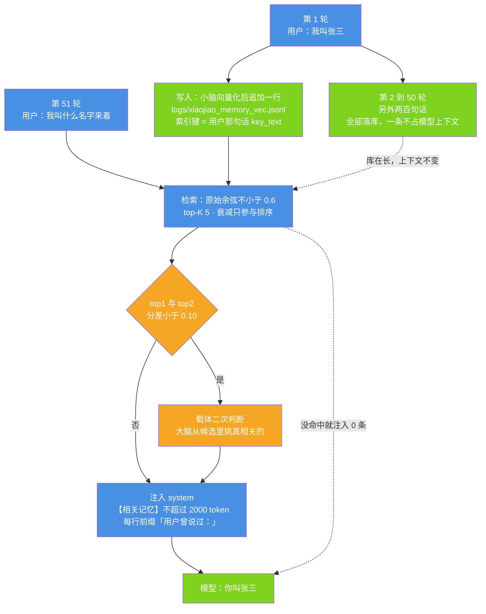
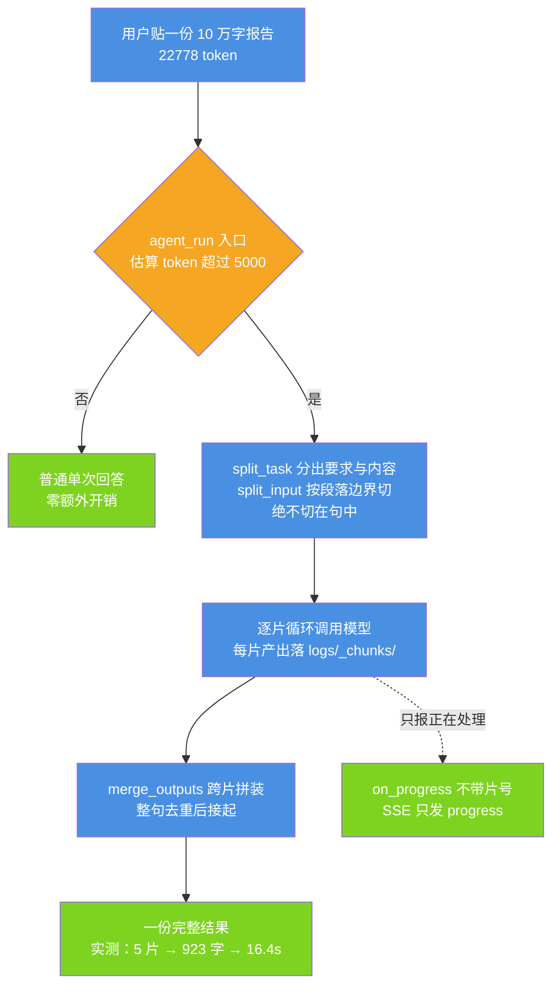
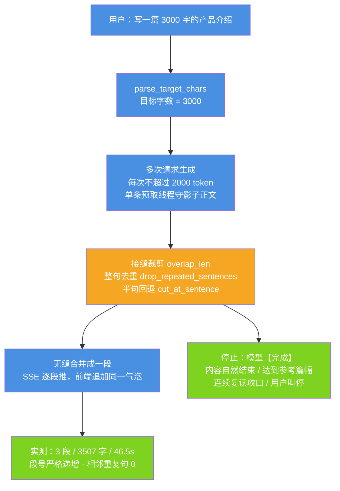
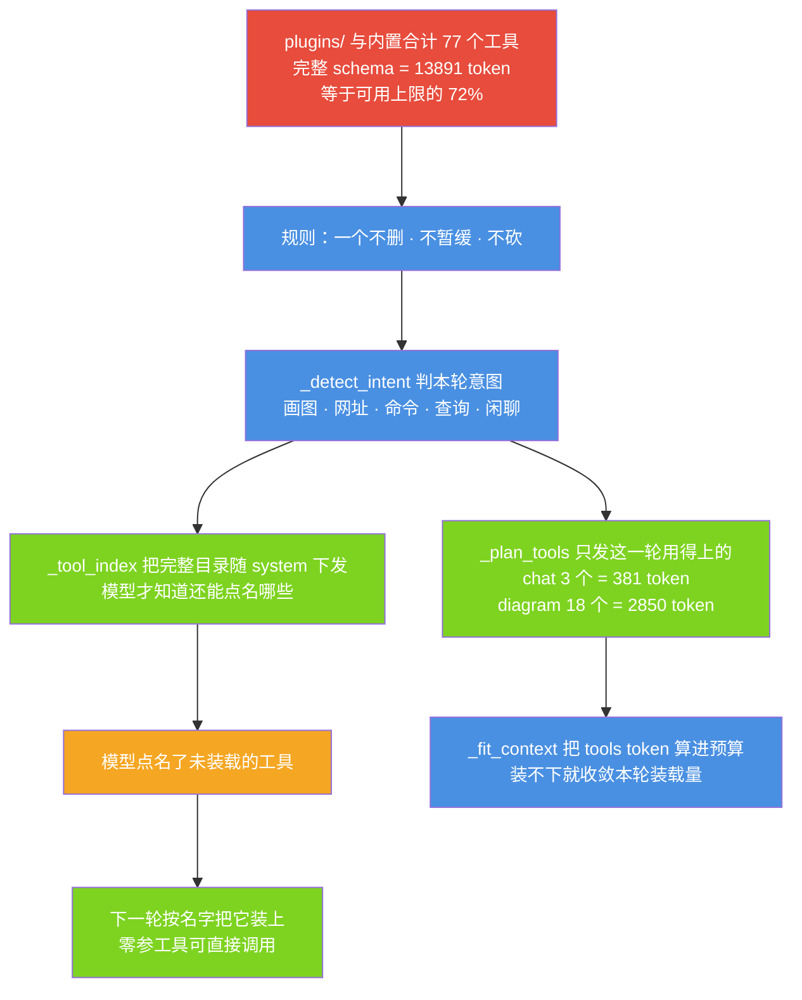
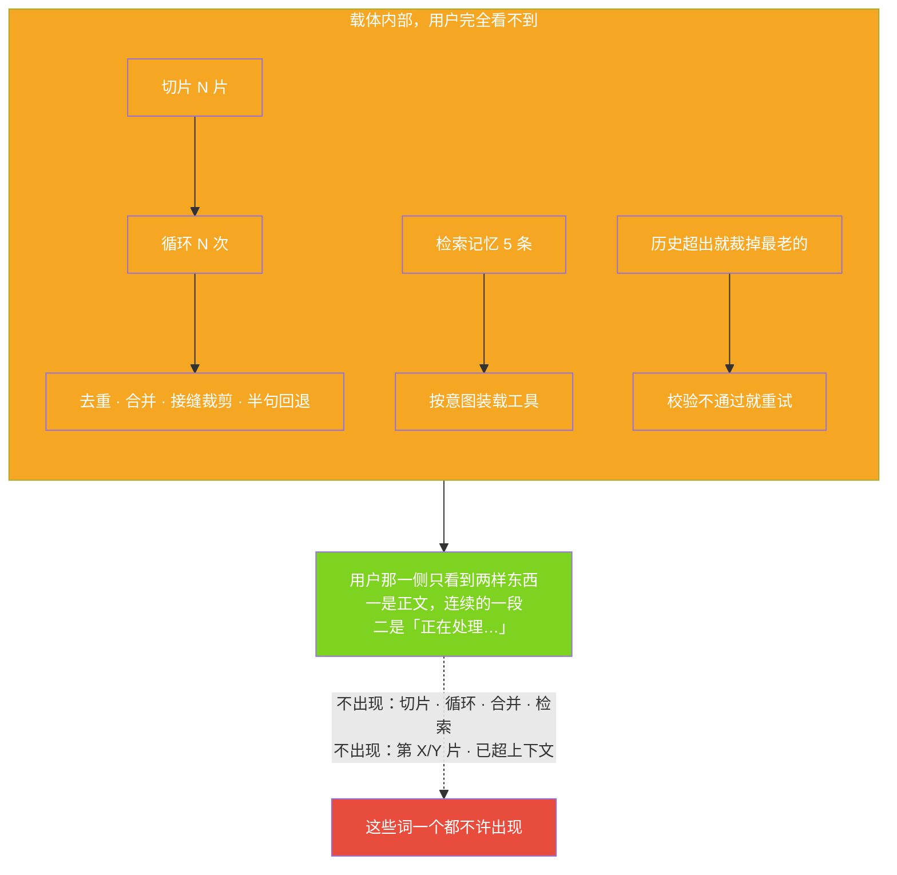
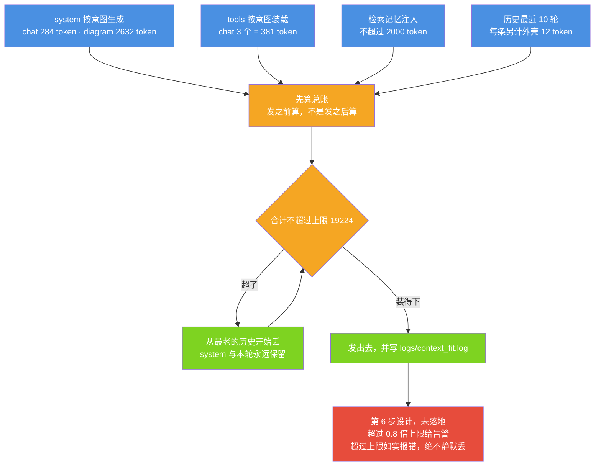
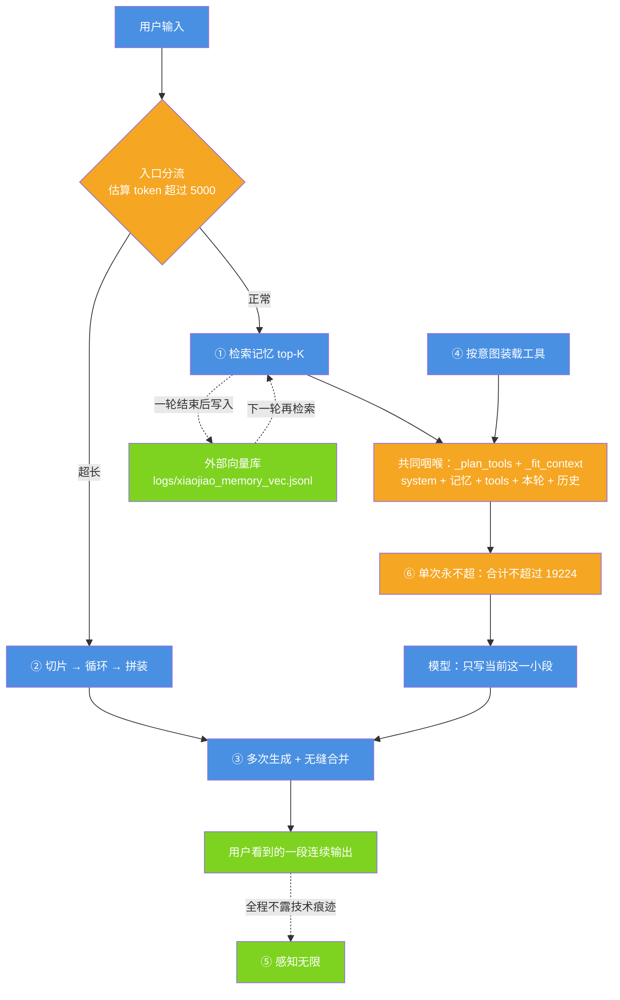

# 六个无限 · 载体优先重构

| 项 | 值 |
| --- | --- |
| 适用版本 | v1.0 |
| 最后更新 | 2026-09-14 |
| 维护者 | 小焦项目 |
| 文档状态 | 稳定 |

**摘要**：本文回答一个问题——当单次请求的 token 数是硬物理上限时，怎样让用户感知不到这个上限。答案是**载体优先**：能力不放在模型里，放在载体里。模型负责生成当前这一小段文本，任务分解、上下文装配、状态管理、外部存储、结果拼装、循环调度、工具调度、校验纠错全部由载体实现。单次请求的 token 数是有限且不可突破的，但总处理量可以很大，用户的感受也不受单次上限约束。六个「无限」就是这句话的六个可验收面。

每个无限的详细流程图另有一组独立文件，见 [5.7 节](#57-详细流程图索引)。

---

## 目录

- [1. 六个无限是什么](#1-六个无限是什么)
- [2. 状态总览](#2-状态总览)
- [3. 背景：不做会怎样](#3-背景不做会怎样)
- [4. 实现](#4-实现)
- [5. 六张原理图](#5-六张原理图)
- [6. 六个无限如何协同](#6-六个无限如何协同)
- [7. 换模型为什么不改变这些](#7-换模型为什么不改变这些)
- [8. 验收与实测数据](#8-验收与实测数据)
- [9. 已知局限与未来方向](#9-已知局限与未来方向)
- [10. 参考](#10-参考)

---

## 1. 六个无限是什么

### 1.1 定义

| 编号 | 名称 | 定义 |
| --- | --- | --- |
| ① | 记忆无限 | **全部对话历史永久存在外部向量库里**，不依赖模型上下文。每轮按需检索 top-K 注入系统提示词。 |
| ② | 输入无限 | **任意长的用户输入由载体切片**，逐片循环处理，再拼装成一份结果。 |
| ③ | 输出无限 | **任意长的输出要求由载体拆成多次请求生成**，再无缝合并成一段连续输出。 |
| ④ | 工具无限 | **`plugins/` 里的每个工具永久保留**，一个不删、不暂缓、不下线；工具按意图装载，完整目录始终下发。 |
| ⑤ | 感知无限 | **用户看不到技术痕迹**：不出现「切片 / 循环 / 合并 / 检索 / 按需加载」，不出现「第 X/Y 片」，不出现「已超出上下文，已截断」。 |
| ⑥ | 单次永不超 | **单次请求永不超上下文窗口**。这一条与前五条性质不同：它是物理红线的守门人，不假装无限，靠精确的按需装配保证每次都装得下。 |

关键区分在两处：

- 记忆无限的关键词是「全部」和「永久」：不是「最近 10 轮摘要」，也不是「模型自己记着」。模型上下文里只有这一轮需要的那几条，但库里存着从第一天到现在的所有对话。
- 单次永不超不做任何「无限」承诺：装不下时如实报错，绝不静默丢内容。

### 1.2 术语与口径

后文所有数字都标注了出处，两类口径不可混用：

| 口径 | 含义 |
| --- | --- |
| **实测** | 有命令输出或日志原文，可复核 |
| **设计目标** | 方案里写明、尚未落地，或尚未全量核对的判据 |

本文对仍在实现中的能力只写设计，不编数字。

---

## 2. 状态总览

| 无限 | 核心实现 | 状态 | 实测来源 |
| --- | --- | --- | --- |
| ① 记忆无限 | `core/embedder.py` `core/memory_vec.py` `core/retriever.py` | 已实现 + 已实测 | `tools/test_memory_recall.py`、`logs/memory_retrieval.log` |
| ② 输入无限 | `core/input_splitter.py` | 已实现 + 已实测 | `logs/xiaojiao.log`、`logs/_step4_unit.py`、`tools/test_input_infinity.py` |
| ③ 输出无限 | `core/continuation.py` | 已实现 + 已实测 | `logs/_step3_run.log`、`logs/_step3_unit.py`、`tools/test_longform_quality.py` |
| ④ 工具无限 | `_intent_tool_names` `_FULL_CORE_TOOLS` `_plan_tools` `_tool_index` | 已实现 + 已实测（不删不暂缓 + 按意图装载 + 下一轮按名装载） | `tools/check_prompt_size.py`、`tools/test_tool_infinity_live.py` |
| ⑤ 感知无限 | `on_progress` 不带片号、SSE 只推正文 | 主要部分已落地 + 已实测；日志与报错文案的措辞统一仍属**设计目标** | `xiaojiao_app.py` 的 `api_chat_stream`、`tools/test_perception_infinity.py` |
| ⑥ 单次永不超 | `_estimate_tokens` `_plan_tools` `_fit_context` `_max_context_tokens` | 已实现 + 已实测；0.8 倍告警、超限报错口径、统一日志行仍属**设计目标** | `logs/context_fit.log`、`tools/test_single_request_limit.py` |

第 5 步的四个子项（工具调度强制路由、工具结果上下文隔离、工具结果校验、archify 工作流强制）**已经落地**，见 [4.4.5](#445-第-5-步已落地的四项)；第 6 步的三项口径仍是设计目标，见 [4.6.4](#464-第-6-步设计未落地)。

---

## 3. 背景：不做会怎样

这六条都有对应的、用户能复现的坏体验，不是设计洁癖。

| 无限 | 不做的后果（均为真实发生过的情况） |
| --- | --- |
| ① 记忆无限 | 聊到第 50 轮，模型已经忘了第 3 轮说过的名字。本地 4B 的上下文只有两万 token，历史一多就被裁掉；关掉窗口重开则完全失忆。用户的判断是「这东西没有记忆，跟搜索框没区别」。 |
| ② 输入无限 | 粘一份 10 万字的报告进去，直接撞 `request exceeds the available context size` 报错；或者模型只看了开头就开始总结，还一本正经地写「综上所述」。 |
| ③ 输出无限 | 用户要「写一篇 3000 字的产品介绍」，模型吐了 800 字就停；要「5 万字」则在物理上做不到。多问几次「继续」，拼起来又是重复句、断句，一眼能看出是拼的。 |
| ④ 工具无限 | 工具越装越多，一轮里把全部 schema 发出去，**单这一项就吃掉可用上限 19224 的 72%**，说一句「你好」都可能撞上下文墙。为了「省地方」去删工具、暂缓工具，结果能力真的丢了（见 3.1）。 |
| ⑤ 感知无限 | 界面上写着「第 3/5 片处理中」「已检索到 3 条记忆」「内容过长已截断」。用户立刻明白这是半成品：他在跟一个会喘气的工具说话，不是一个助手。 |
| ⑥ 单次永不超 | 两条岔路都是坑：不精确装配就会随机撞上下文报错；搞「静默截断」则用户看到答非所问，却不知道自己的输入被砍掉了。报错要如实，但不能无缘无故地报。 |

### 3.1 `plugins/search.py` 事故

痛点④值得展开。最刺眼的一次事故是 `plugins/search.py`：它曾被移到 `_disabled/` 目录来「精简工具表」，实测导致 `web_search` 工具**消失**（工具总数从 77 掉到 76）。

事后查清：它不是重复插件，而是 `web_search` 工具 schema 的提供者。`load_plugins()` 里 `web-search` 那条是 `builtin: True` 占位（`xiaojiao_app.py` 第 563~564 行），而 `_build_tools()` 会跳过 `builtin` 项。「工具一个不删」这条规则就是从这次事故来的。

正确做法不是删工具，而是**不在一轮里全发**：工具的**存在**与工具**本轮的装载量**是两件事。

---

## 4. 实现

### 4.1 记忆无限

#### 4.1.1 三个模块

| 模块 | 职责 | 关键实现 |
| --- | --- | --- |
| `core/embedder.py` | 文本 → 512 维单位向量 | 主后端：小脑 MiniGPT 过完整个编码器栈（embedding + pos → 8 层 Transformer，**双向注意力、无因果掩码**）→ 池化 → 加公共方向标定 → L2 归一化；兜底：字符 2/3-gram 哈希向量（同为 512 维） |
| `core/memory_vec.py` | 存 + 算余弦 | `logs/xiaojiao_memory_vec.jsonl`，**一行一条、只追加**；向量 base64（float32 小端）编码；numpy 快路径一次矩阵乘扫全库 |
| `core/retriever.py` | 检索**策略** | 时间衰减、相似度阈值、top-K、注入 token 上限、载体二次判断、如实写 `logs/memory_retrieval.log` |

#### 4.1.2 向量口径

池化不是简单均值，当前口径为：

```text
双向注意力过完 8 层编码器栈
  → 0.65 × 全文均值 + 0.35 × 末尾 32 字均值
  → 加 α × MU（α = 0.15，MU 是 48 句固定通例文本的平均方向）
  → L2 归一化 → 512 维
```

常量：`_MAX_CHARS = 1024`（截断长度）、`_TAIL_WIN = 32`、`_TAIL_W = 0.35`、`_CALIB_ALPHA = 0.15`、`SPACE_VERSION = 2`。

为什么走完整个编码器栈，而不是只取 `nn.Embedding` 那一层——这是实测对比出来的，不是偏好（数据见 `core/embedder.py` 模块注释）：

| 抽取方式 | rank-1 命中 | gold 分 | 无关项 |
| --- | --- | --- | --- |
| 只用 `nn.Embedding` 层 | 4/5 | 0.49~0.66 | 最高 0.52 |
| 过完整个编码器栈 | **5/5** | **0.72~0.85** | ≤ 0.72 |

两者都是 512 维，载体选区分度更好的那个。

三点补充说明：

- **尾窗的作用**：纯均值池化按长度稀释，500 字记忆里结尾那句只占 1/500 权重。加上末尾 32 字窗口后，用结尾句检索时的分差从 +0.0049 升到 +0.0112。长度不超过 32 字的短文本不受影响。
- **公共方向的作用**：去掉因果掩码换来区分度，代价是整体余弦被压低，实测把命中率打到 3/5。按 α=0.15 混入公共方向后分值区间回到阈值 0.6 认得的量纲，命中率恢复 5/5。α 调到 0.22 时无关项会越过 0.6，因此上限取在 0.18 附近。α 是分值口径旋钮，不是质量旋钮。
- **换口径要迁移存量数据**：向量空间随编码口径变化，因此有 `SPACE_VERSION` 与 `embedder.reembed_store()`：先整文件备份成 `<库>.pre-v{旧版本}`，再原子替换；任何一条算不出来就整批放弃，不动原文件。

#### 4.1.3 检索策略

**一条关键取舍：阈值判在原始余弦上，时间衰减只参与排序。**

方案原文是「余弦相似度 + 时间衰减，阈值 0.6」。如果把衰减乘进阈值判定，会出事：一条 0.85 分的老记忆，衰减 0.4 之后只剩 0.34 < 0.6，会被丢掉，于是「三年前说的那件事」永远检索不到——正好打死记忆无限的招牌场景。

所以拆开用：

- **阈值只判原始余弦**（判「这条到底相不相关」）：相关就是相关，与多久以前无关。
- **时间衰减只参与排序**（同样相关时优先想起最近的）：老的能想起来，新的更靠前。

衰减分档照方案：7 天内 ×1.0 / 30 天内 ×0.7 / 更早 ×0.4。默认参数：阈值 0.6、top-K 5、注入 ≤ 2000 token，均可被操控文件 `capabilities` 覆盖（`memory_threshold` / `memory_top_k` / `memory_max_tokens`）。

**硬隔离**：`memory_vec._assert_not_forbidden` 会直接抛错拒绝把库指到 `self_learn/knowledge_vec.json`。后者是小脑的工具经验库（工具用法 + 失败反思），与对话记忆是两回事，混在一起会互相污染。

#### 4.1.4 载体二次判断（精排）

这是检索里容易漏掉的一层。小脑是**字级**模型，池化出来的向量在主题级够用，在精细语义上不行。实测：

- 「我非常喜欢这个方案」与「我非常讨厌这个方案」余弦 **0.904**，而真正的近义对只有 0.814——两者共享 10/11 个字，字级表示看到的是「同一串字」，不是「相反的意思」。
- 「今天天气真好」与「数据库索引用 B+ 树」余弦 0.570，无关项也偏高（各向异性）。

阈值 0.6 只能挡住一部分，剩下的反义或无关记忆一旦注入 system，模型就会拿反面去回答，比「没记住」更糟。因此加一层「小脑召回 → 大脑精排」：小脑负责多召回，大脑负责判断相关性，代价是一次额外的小模型调用。

为了不无条件承担这次调用的开销，精排设了三道闸门（`core/retriever.py`）：

| 常量 | 值 | 作用 |
| --- | --- | --- |
| `RERANK_MIN_HITS` | 2 | 只有 1 条候选时不值得多跑一次模型 |
| `RERANK_MAX` | 5 | 最多让大脑看 5 条 |
| `RERANK_GAP` | 0.10 | top1 与 top2 的分差 ≥ 0.10 视为排名不含糊，跳过精排 |

分差闸门的依据：top1 明显领先时向量排序本身可信；top1 与 top2 咬得很近时，正是反义或无关记忆混进来的典型形状（实测「我喜欢蓝色」0.90 对「我讨厌蓝色」0.88，分差只有 0.02），必须让大脑裁一下。

**失败一律放行**：判官不可用、解析不出编号、判官返回「无」，都保留全部候选。理由是小模型偶尔会把全部候选判成无关，真按它说的清空，用户会觉得「它什么都不记得了」，那种观感比多注入一条更差。

精排带来一个必须说明的口径变化：检索延迟因此拆成两段报——`vector_ms`（纯向量检索）与 `rerank_ms`（精排），**「检索延迟 < 100ms」这条判据判的是 `vector_ms`**。合成一个数报，要么用 400ms 冤枉向量层，要么用 5ms 掩盖精排开销。

#### 4.1.5 说话人框定与索引键

- **注入的记忆必须有说话人框定**：不加这层，模型会把「我叫张三」当成在说它自己，回答「你叫小焦」。修法是 `_MEMORY_INSTRUCTION` 写明「记忆里的『我』= 用户，不是指你小焦」，并在注入行前加「- 用户曾说过：」前缀（正文已是 `用户：…` 对话格式时不重复加）。每条注入行截断到 240 字。
- **向量按「用户说了什么」算，注入用完整原文**：一轮对话原文里用户那句很短，而回答又长又水，池化按长度加权会把「张三」这个信号淹掉，cos 掉到阈值以下、注入 0 条。因此 `add_memory(..., key_text=用户那句话)`。检索的本质是「按用户问过的去找」，用户那句话才是索引键。落库时用户那句截断到 300 字、回答只保留 ≤ 200 字摘要、整条 `text` 上限 2000 字。

#### 4.1.6 三个真实踩坑

1. **注入的记忆没有说话人框定** → 模型把「我叫张三」当成在说自己，回答「你叫小焦」。修法见 4.1.5。
2. **`detect_tool_intent` 用光杆动词「写」判「要新建」** → 问句「我平时最喜欢用什么语言**写**代码」被判成 `write_file`，`plan_tool` 让 4B 模型把它转成 `run_command whoami`，再把用户名 "jiao" 总结成「已在 jiao 目录下创建了 jiao 文件夹」。答非所问，还谎报执行。修法：新建类判据只认**带宾语的动作短语**（写一个 / 写个 / 创建 / 新建 / 保存…），不认光杆「写」；顺带修了「文件夹」含「文件」导致建目录被判成写文件的子串匹配问题。
3. **写入路径存了整段回答** → 池化按长度加权，用户那句「我叫张三」被几百字寒暄淹掉，cos 掉到阈值以下、注入 0 条。修法即 4.1.5 的 `key_text`。

#### 4.1.7 记忆库规模

`logs/xiaojiao_memory_vec.jsonl` 的存储形式是每行一条 JSON，向量用 base64（float32 小端）编码：512 维即 2048 字节 → 2732 字符，比 JSON 浮点数组省约三分之一空间，且没有浮点文本精度损失；`text` 字段仍是明文，便于人工排查。

选 JSONL 而不是一个 JSON 大对象的原因：追加一条不必重写整个文件，写入中途崩溃也不会让整库报废。检索时查询向量做一次矩阵乘扫全库；没有 numpy 时退化为纯 Python 循环（慢但可用）。

### 4.2 输入无限

实现文件：`core/input_splitter.py`。分流点在 `agent_run` 的**最前面**，判据 `_needs_input_split()`：`_estimate_tokens(text) > 5000`（阈值可被 `capabilities.input_split_threshold` 覆盖），单片上限默认 5000 token（`DEFAULT_MAX_CHUNK`，可被 `input_split_chunk` 覆盖）。

为什么必须放在最前面：超长输入一旦进入后面的链（记忆检索 → 意图识别 → 装配上下文），无论怎么裁都装不下，只能在入口分流，由载体切好、循环、再拼装。

#### 4.2.1 切片的八条硬要求

1. **按段落边界切，绝不切在句中**。语义完整性比「刚好凑满 5000 token」重要得多；半句单独喂给模型，它会当成残缺输入去猜。
2. **段落本身超长 → 退到句边界**（`_SENT_SPLIT` 按 `。！？!?；;…` 切）；**单句还超长 → 才硬切**。
3. **硬切要留 0.85 的字符余量**。字符数到 token 是线性估计，边界上会差几个 token。`logs/_step4_unit.py` 实测：不留余量时切出来 `5010 > 5000`——差一点点也是超。
4. **粘合开销必须算进累加**。每多粘一段就多一个换行分隔。同一份单测实测：只累加各段自己的 token，`sum=4988` 拼出来实际是 `5003`。
5. **最后一道保险不能省**：收尾逐片复验，任何一片仍超限就硬切。这样「每片 ≤ max_chunk」才是不变量，而不是「通常成立」。
6. **`split_task` 把「要求」和「内容」分开**，只对内容切片，每片带同一条要求去处理。判据是启发式的：第一段 `_estimate` ≤ 200 token 且总段数 ≥ 3；或第一段字符数 ≤ 60 且总段数 ≥ 2。找不到明显指令时用一句通用要求兜底。
7. **每片产出落 `logs/_chunks/`**：进度不丢、可核对、可续跑（该目录随 `logs/` 一起被版本控制忽略）。
8. **拼装时再做一次跨片整句去重**（`merge_outputs` 调用 `continuation.drop_repeated_sentences`）。模型处理相邻两片时会把上一片结尾的结论又复述一遍，直接拼会出现重复段落。

#### 4.2.2 进度回调不暴露片数

`on_progress(done, total)` 把片数留给调用方自行取舍——`api_chat_stream` 里只用它发一个 `{"type":"progress"}` 信号，界面显示「正在处理…」，不显示「第 3/5 片」。这是感知无限的要求。

### 4.3 输出无限

实现文件：`core/continuation.py`，入口是 `generate_unlimited(task, system="", max_per_chunk=2000, max_total=None, max_retries=3, summary_interval=5, buffer_size=3, parallel_prefetch=True, llm_fn=None, on_chunk=None, should_stop=None, cfg=None, close_with_model=True, stream_fn=None, on_delta=None)`。

#### 4.3.1 载体负责的七件事

| # | 职责 | 实现 |
| --- | --- | --- |
| ① | 定长度 | `parse_target_chars`：从任务里解析「3000 字 / 5 万字 / 两万字 / 20000 words / 3 千字」 |
| ② | 装上下文 | 第 1 次给完整任务；第 N 次给「任务 + 已写章节清单 + 已写梗概 + 上段最后 200 字 + 已出现人名」 |
| ③ | 去重（接缝） | `overlap_len`：与已写正文末尾做最长重叠比对（后缀 = 前缀），重叠 ≥ 8 字才裁；比对窗口 800 字 |
| ④ | 断句 | `cut_at_sentence`：段落结束必须是完整句子；半句回退到上一个句末，残句带进下一轮 |
| ⑤ | 校验 | `looks_offtopic`：空输出 / 重新开场 / 又短又与关键词零重合 → 丢弃重试 |
| ⑥ | 提速 | 并发预取 + 缓冲池（`buffer_size = 3`） |
| ⑦ | 停止 | 见 4.3.3 |

模型只做一件事：接着写下一小段。它不知道自己在被循环调度，因此不会出现「第 X 段」这类技术痕迹。

#### 4.3.2 并发预取为什么只有一条生成线程

预取第 N+1 段，必须知道「第 N 段已经写了什么」——要拿它当衔接锚点，也要拿它做去重。所以不能让预取线程和主循环同时对着同一份状态写，否则第 N+1 段拿到的锚点是残缺的，去重也会算错，拼出来就会重句。

做法是：**只有一条生成线程**（预取线程），它自己维护一份「影子正文」（`shadow` = 已提交正文 + 池子里已生成但还没被取走的部分），一直把池子填到 `buffer_size`。主循环只从池子里取、只做合并，从不并发生成。再配一个 `Condition` 与 `inflight` 认领，防止主循环和预取线程同时生成同一个段号。

第 3 步实测撞到的缺陷就是段号出现 `[1,2,2]`，根因是主循环的串行兜底与预取线程竞态；修复后段号严格递增 `[1,2,3]`。

另一处顺序要求：**`【完成】` 必须在偏题校验之前处理**。模型说完结就是完结，不能让风格校验把它的收尾句当成跑题丢掉。

#### 4.3.3 停止条件（按优先级）

| 优先级 | 条件 | 实现常量 |
| --- | --- | --- |
| a | 模型声明 `【完成】`，且已写篇幅 ≥ 目标 × 0.85 | `DONE_MARK`、`_DONE_MIN_RATIO = 0.85` |
| b | 内容自然结束（末尾出现结语类措辞）且篇幅 ≥ 目标 × 0.8 | `looks_concluded`、`_CONCLUSION_HINTS` |
| c | 连续 3 段都出现复读 → 截断并收口 | `_DEGEN_STREAK_MAX = 3` |
| d | 用户叫停 | `should_stop()` |
| e | 篇幅达到目标 × 1.05（硬上限保护） | 循环内的 1.05 判定 |
| f | 连续跳过 12 段（空转上界） | `_SKIP_MAX = 12` |
| g | 单段数上限 2000 段 | 兜底防死循环 |

`_DONE_MIN_RATIO = 0.85` 的来历：模型只看得到最后 200 字，对「整篇够不够篇幅」没有概念，实测要 10000 字却在 2500 字处吐 `【完成】`，载体照单全收就交出残篇。判据取「是否还在往前写」而不是「忽略了几次」：只要篇幅不够且模型还在产出新内容就继续写；连续 4 次忽略之间几乎没长字（< 目标的 5%）才认输，并在结果里如实报告篇幅不足。

#### 4.3.4 后端接口

- `/api/chat/stream`（SSE）：每通过一段就推一段，前端追加到同一个气泡。
- `/api/chat/stop`：用户叫停。
- `/api/chat`：保留作为非流式入口，第三方客户端仍可用。
- 短内容**完全不触发**续写：`needs_continuation()` 要求任务里写明目标字数且 ≥ `min_chars`（默认 800），或显式打开 `always`。普通问答没有额外开销。

续写用的 system 与普通对话完全一致（含相关记忆与按意图装载的工具目录），上限也取同一个 `_max_context_tokens()`；`/api/chat/stream` 与 `/api/chat` 走同一条 `agent_run`，因此上限口径一致。

### 4.4 工具无限

「无限」的准确含义：工具**一个不删、不暂缓、不砍**；载体只决定「这一轮真发哪几个 schema 出去」。

#### 4.4.1 为什么不能一轮全发

```text
全部工具：77 个 → 13891 token（占可用上限 19224 的 72%）
```

单这一项就吃掉 72% 的窗口。第 1 步之前的兜底逻辑是 `full → None → 全量 77 个`，结果说一句「你好」都可能撞上下文墙。这是把兜底从 `full` 改成 `chat` 的直接原因。

#### 4.4.2 第 1 步的四处改动

1. `_detect_intent` 的兜底从 `full` 改成 `chat`（最省上下文）。
2. `_intent_tool_names('full')` 返回 `_FULL_CORE_TOOLS` 核心 **10 个**，不再返回 `None`（旧含义是全部 77 个）。
3. `_intent_tool_names` **永不返回 `None`**；返回前与 `all_tool_names()` 对一遍，不存在的名字直接丢掉，防止「以为给了工具、其实没给」。这里有一个真坑：不能用 `real_tool_names()` 当真实工具表——它只登记**插件**工具，`run_command` / `read_file` / `list_files` 这些**内置**工具会被当成「不存在」而丢掉，结果是 shell 意图一个工具都不剩，悄悄回落成「全部工具」。
4. `_plan_tools` 的日志措辞改中性。以前会写「本轮因为额度不够，所以少发了 N 个工具」——那是错的：工具一个都没删、没停用、没缩减，只是这一轮不发那么多 schema。

`_FULL_CORE_TOOLS` 共 10 个：`run_command`、`write_file`、`read_file`、`list_files`、`web_search`、`get`、`fetch`、`net_ip`、`collect_vulnerabilities`、`save_memory`。

#### 4.4.3 意图与装载表

`_detect_intent` 的判据顺序即优先级：画图 > 网址 > 命令原文 > 查询 > 命令词 > 闲聊 > chat 兜底。全部是纯规则字符串判据，零成本、可复现、可单测。

`python tools/check_prompt_size.py` 实测（2026-09-14）：

| 意图 | system token | tools token | 本轮 token | 固定开销合计 | 占上限 | 本轮装载工具数 |
| --- | --- | --- | --- | --- | --- | --- |
| chat | 284 | 381 | 4 | 693 | 4% | 3 |
| shell | 1727 | 581 | 4 | 2336 | 12% | 3 |
| query | 1789 | 884 | 5 | 2702 | 14% | 5 |
| scrape | 2041 | 2576 | 9 | 4650 | 24% | 10 |
| diagram | 2632 | 2850 | 8 | 5514 | 29% | 18 |
| full | 5678 | 2069 | 7 | 7778 | 40% | 10（核心集） |

「固定开销合计」= system + tools + 本轮调用 `_MSG_OVERHEAD` 算出的消息外壳（每条 12 token）。真实请求还要加历史与检索记忆，那部分由 `_fit_context` 按上限自动裁剪。

同一次体检还打印 system 的各段占比：`SYSTEM_PROMPT` 合计 6243 token，其中 role 77、`_SEARCH_RULES` 350、`_TOOL_RULES` 1117、`_CHAT_SYSTEM_HINT` 46、`_CHAT_FALLBACK_HINT` 154、`_DIAGRAM_SYSTEM_HINT` 96、`_MEMORY_INSTRUCTION` 146。

判据实测（`tools/test_single_request_limit.py`）：说「你好」总装配 669 token < 3000；说「用 Archify 画图」总装配 5504 token < 10000（装载 18 个工具）。

#### 4.4.4 完整目录始终下发

`_tool_index` 把「这一轮真能调的」工具名加一句话说明拼进 system。`full` 意图下 `_tool_index(only=None)` 是故意的：本轮 schema 只发核心集，但目录要列全 77 个，模型才知道还有哪些工具可以点名。模型点名了未装载的工具时，下一轮按名字装上；零参数工具可直接调用。

#### 4.4.5 第 5 步已落地的四项

以下四项在 `xiaojiao_app.py` 中已经实现，不再是设计项：

| 项 | 实现位置 | 做法 |
| --- | --- | --- |
| 工具调度强制路由 | `_detect_intent` / `_scrape_direct` / `_diagram_direct` / `detect_vulnerability_query` / `_search_forbidden` / `_prune_generic_noun` | 网址 → 抓取直通（失败自动升级 `get` → `fetch` → `stealthy_fetch`）；画图 → archify 链；漏洞 → `collect_vulnerabilities` 直通；公网 IP → `net_ip`；点名工具时不联网检索；未识别 → chat |
| 工具结果上下文隔离 | `_trace_entry` / `_history_safe_answer` / `_TOOL_RESULT_KEEP = 500` / `_HISTORY_SUMMARY_CHARS = 200` | 超过 500 字的工具结果只把「前 200 字 + 长度 + 状态码」写进会话历史，原文进会话缓存；判据是「回答里是否抄贴了工具返回」，不是回答长度 |
| 工具结果校验 | `_validate_tool_result` | 对照目标特征（域名 / 标题 / 状态码）判定「可信 / 可能幻觉 / 不适用」三态；判为可能幻觉时在轨迹里留痕，并在回答中如实标注 |
| archify 工作流强制 | `_archify_prereq` / `_ARCHIFY_FIRST` / `_ARCHIFY_GATE` | 任何画图类 archify 调用之前先补调 `archify_read_skill`；`archify_deliver` 之前必须有 `archify_validate`；模型漏了由代码层补调 |

其中「回答里是否抄贴了工具返回」这条判据是踩过坑的：用长度当判据时，长文生成里模型自己写的 5 万字会被整段替换成摘要，等于当场废掉输出无限。

### 4.5 感知无限

这一条不是独立机制，而是①②③④ 的对外表现要求。已落地的部分：

- `on_progress(done, total)` 的片数参数不给界面用，`api_chat_stream` 里只发 `{"type":"progress"}`，界面显示「正在处理…」。
- 续写走 SSE 时，`on_chunk(piece, n, total_chars)` 的段号也不显示，前端只做追加，一个气泡里连续长出来。
- 流式输出有源头复读闸门：判定复读后停止继续推送正文，不让刷屏内容先到用户眼前。

仍属设计目标的部分：日志与报错文案里「切片 / 循环 / 合并 / 检索 / 按需加载」这类措辞的统一收口尚未全量核对（第 5/6 步设计里有「措辞统一」一项）。**本文不宣称感知无限已完全达成。**

### 4.6 单次永不超

这一条不假装无限。单次请求的 token 数是硬物理上限，载体能做的是「精确按需装配 + 切片 + 多次请求」，不是让单次变大。

#### 4.6.1 已完成的三件事

1. **`_estimate_tokens` 校准**：`cjk × 1.5 + other / 3`。原来按 1.05 估，低估约 40%，于是 `_fit_context` 报「合计 4216 / 上限 19500」，实际请求却是 22562，直接 400/500。原则是宁可高估（少留点历史），绝不低估（一低估就是硬报错）。
2. **`_fit_context(..., tools_tokens=...)` 把工具 schema 算进预算**。漏算它就会出现「裁完了还是超限」：77 个工具的 JSON 有 13891 token。另外每条消息的外壳（role / content 的键名与括号）也要占 token，按 `_MSG_OVERHEAD = 12` 计。
3. **上下文长度校准**：llama-server 收到 `-c 20000` 后实际给的是 20224——llama.cpp 会把 `n_ctx` 向上取整到 256 的倍数（20000 / 256 = 78.125 → 79 × 256 = 20224）。实测 `GET http://127.0.0.1:5801/props` → `n_ctx = 20224`（本次复测一致）。所以操控文件里直接写 20224（本身就是 256 的倍数，不会被再取整），载体算出的上限才与大脑实际容量对齐，不白扔那 1224 token 的窗口。

`_max_context_tokens()` = 20224 − 1000 安全余量 = **19224**。本地按 `brain.llama.ctx` 取，云端按 128000 取，两者都可被 `capabilities.max_context_tokens` 覆盖；安全余量由 `capabilities.context_safety_margin` 控制。

#### 4.6.2 `_fit_context` 的硬规则

**system 与本轮问题永远保留**；历史从最老的一端开始丢，直到总 token ≤ 上限。历史窗口默认最近 10 轮（`capabilities.history_window_rounds`），至少保留 `min_rounds`（默认 2）。

#### 4.6.3 现有日志行

```text
[2026-09-13 17:06:58] system=248 + tools=381 + 本轮=451 = 合计 2389 / 上限 19224 ｜ 历史 10→10 轮
```

`logs/context_fit.log` 每轮写一行。第 6 步的设计是把「检索记忆」和「历史」也拆出来单独计数。

#### 4.6.4 第 6 步设计（未落地）

| 项 | 设计判据 |
| --- | --- |
| 统一 token 日志行 | `system=a + tools=b + 检索记忆=c + 历史=d + 本轮=e = 合计 f / 上限 g` |
| 超限告警 | 超过 0.8 倍上限给告警 |
| 超限报错 | 超过上限时如实报错给用户，绝不静默丢内容 |

现状是：`_fit_context` 只在固定开销已超过上限时写一条 `LOG.warning`，没有 0.8 倍告警，也没有面向用户的超限报错。`tools/check_prompt_size.py` 是已存在并实测跑通的自检工具，打印 system 各部分占比与各意图的 system / tools 总量。

---

## 5. 六张原理图

每张图都可以脱离上下文阅读：图题、一句话说明、代码位置索引齐全。配色约定：主色 `#4A90E2`（主要节点）、`#7ED321`（正常 / 已完成）、`#F5A623`（部分 / 注意）、`#E74C3C`（未落地 / 风险 / 红线）。

### 5.1 记忆无限

**图 1 · 记忆无限：外部向量库 + 按需检索**

一句话说明：所有对话永久落库、不占模型上下文；提问时按原始余弦阈值与时间衰减取 top-K，必要时再由大脑精排一次，注入 system 时带上说话人框定。

代码位置索引：`core/embedder.py`、`core/memory_vec.py`、`core/retriever.py` 的 `retrieve()` / `rerank()`；注入点在 `xiaojiao_app.py` 的 `agent_run` 与 `_retrieve_memory()`。



### 5.2 输入无限

**图 2 · 输入无限：入口分流 → 切片 → 循环 → 拼装**

一句话说明：超长输入在 `agent_run` 入口就被截住并交由载体切片，绝不进入那条「无论怎么裁都装不下」的装配链。

代码位置索引：`core/input_splitter.py` 的 `split_task()` / `split_input()` / `process_long_input()` / `merge_outputs()`；分流点在 `xiaojiao_app.py` 的 `_needs_input_split()` 与 `_process_long_input()`。



### 5.3 输出无限

**图 3 · 输出无限：多次请求 + 无缝合并**

一句话说明：长文被拆成多次请求，接缝裁剪、整句去重、断句回退都由载体完成，推给用户的是连续的一段。

代码位置索引：`core/continuation.py` 的 `generate_unlimited()`、`_prefetch()`、`_merge()`、`overlap_len()` / `drop_repeated_sentences()` / `cut_at_sentence()` / `looks_offtopic()`。



### 5.4 工具无限

**图 4 · 工具无限：一个不删 + 按意图装载**

一句话说明：工具的存在与本轮装载量是两件事——完整目录始终随 system 下发，schema 只发这一轮用得上的那几个。

代码位置索引：`xiaojiao_app.py` 的 `_detect_intent()` / `_intent_tool_names()` / `_FULL_CORE_TOOLS` / `_plan_tools()` / `_tool_index()`。



### 5.5 感知无限

**图 5 · 感知无限：技术痕迹不进用户视野**

一句话说明：载体内部做多少步都行，用户那一侧只应看到正文和「正在处理」两个东西。

代码位置索引：`xiaojiao_app.py` 的 `api_chat_stream()`（`_on_progress` / `_on_chunk` / `_on_delta`）与前端 `progress` 处理分支。



### 5.6 单次永不超

**图 6 · 单次永不超：精确按需装配**

一句话说明：发请求之前先算 token 总账，装不下就从最老的历史开始丢，system 与本轮问题永远保留。

代码位置索引：`xiaojiao_app.py` 的 `_plan_tools()` / `_fit_context()` / `_estimate_tokens()` / `_max_context_tokens()`；每轮结果写 `logs/context_fit.log`。



### 5.7 详细流程图索引

| 文件 | 内容 |
| --- | --- |
| [01-overview.md](six-infinity-diagrams/01-overview.md) | 六个无限总览图 |
| [02-carrier-layer.md](six-infinity-diagrams/02-carrier-layer.md) | 载体层内部结构图 |
| [03-data-flow.md](six-infinity-diagrams/03-data-flow.md) | 数据流向图：请求 → 检索 → 装配 → 模型 → 拼装 → 输出 |
| [04-output-continuation.md](six-infinity-diagrams/04-output-continuation.md) | 输出续写合并流程图 |
| [05-input-splitter.md](six-infinity-diagrams/05-input-splitter.md) | 输入切片流程图 |
| [06-memory-retrieval.md](six-infinity-diagrams/06-memory-retrieval.md) | 记忆检索流程图 |
| [07-tool-on-demand.md](six-infinity-diagrams/07-tool-on-demand.md) | 工具按需加载流程图 |

`python tools/check_mermaid.py --all` 会递归扫描仓库根 `*.md`、`docs/**/*.md` 与 `tests/**/*.md`，`docs/six-infinity-diagrams/` 下的七个文件包含在内，改完直接跑 `--all` 即可。

---

## 6. 六个无限如何协同

六条不是六个独立功能，而是一条流水线上的六个环节，共用同一套载体代码。

### 6.1 装配是共同的咽喉

`_plan_tools` + `_fit_context` 是集中计算 token 总账的地方，所有注入内容都要从这里过：

```text
system（按意图生成）
  + 相关记忆（① 注入的）
  + 世界层 RAG 背景（小焦自己在网上看到的）
  + 极限补刀提示、元认知提示、思维流片段
  + 小脑学到的工具用法
  + tools schema（④ 按意图装载的）
  + 本轮问题（② 切过片的，或原样）
  + 历史（从最老的一端裁）
  ≤ 19224（⑥ 守的那条线）
```

第 1 步踩过的一个真坑正说明这层协同：**以前先裁剪、后拼「相关记忆 / 联网资料 / 小脑经验」**，于是这些注入内容完全没被算进去——裁剪报告写「合计 18926 / 上限 19000」，实际请求却是 19898，照样超限。修法是先把「本轮」拼完整，再算 token；记忆的注入点也特意放在 system 拼好之后、`_plan_tools` 之前。

**没有⑥，①和④就是空话**：记忆可以无限注、工具可以无限装，但总账一超全部作废。

### 6.2 入口分流决定走哪条路

`agent_run` 的第一件事就是判 `_needs_input_split`（②）。超长输入走 `_process_long_input` 提前返回，**根本不进**记忆检索、意图识别、装配那条链，理由是进来了也装不下。

不超长才继续往下走，之后在装配完成处再判一次 `_needs_continuation`（③）。两条路互斥且都在入口判定，因此「长输入 + 长输出」的极端组合也不会叠加出错。

### 6.3 输出侧与输入侧复用同一套接缝处理

`drop_repeated_sentences`、`cut_at_sentence` 这套合并逻辑被 `input_splitter.merge_outputs` 直接复用（`from . import continuation as _c`）。同一个问题在两处出现：

- 输出续写：模型「接着写」时会把上段结尾重抄一遍 → 接缝重复句。
- 输入切片：模型处理相邻两片时会把上一片结尾的结论复述一遍 → 跨片重复段。

所以修一次两处都好。这是载体优先的一个附带收益：能力沉淀在载体层，自然会被复用。

### 6.4 感知无限是①②③④ 的验收面

前四条做完了，第五条才可能成立。反过来说：只要界面上漏出一个「第 3/5 片」，前四条做得再对，用户也感受不到。

### 6.5 协同总览图

**图 7 · 六个无限的协同关系**

一句话说明：一轮对话从入口分流开始，检索与装载共同汇入装配咽喉，再由模型分段生成，最后经感知面交付给用户。

代码位置索引：`xiaojiao_app.py` 的 `agent_run()`。



---

## 7. 换模型为什么不改变这些

这是载体优先最实际的价值。六个无限的实现全部在 `core/` 与 `xiaojiao_app.py` 里，不在模型里。换大脑（本地 4B、编码 8B、云端 API）时：

| 项 | 换模型时会变吗 | 原因 |
| --- | --- | --- |
| 记忆的**存储与检索** | 不变 | 向量由**小脑** MiniGPT 算（`core/embedder.py`），不是大脑。512 维不变，`logs/xiaojiao_memory_vec.jsonl` 不用重建，换了大脑照样读同一份库。 |
| 记忆的**策略参数** | 不变 | `memory_top_k` / `memory_threshold` / `memory_max_tokens` 是操控文件里的载体参数。 |
| 输入的**切片** | 不变 | 纯文本处理与 token 估算，`core/input_splitter.py` 本身不调模型（只在逐片处理时调）。 |
| 输出的**合并** | 不变 | 重叠检测、整句去重、断句回退全是字符串算法，`core/continuation.py` 不依赖任何模型特性。 |
| 工具的**目录与装载** | 不变 | 工具表由 `plugins/` 与内置工具表决定，装载由意图决定，与模型无关。 |
| 单次的**上限** | 不变（数值不同） | 本地 20224、云端 128000，`_max_context_tokens()` 按引擎取；算法一致，只是数字不同。 |
| 调模型的**接口** | 会变，只有这一处 | `continuation._default_call` 复用 `_llm_targets()` + `_llm_post()`（自带重试与云端被拒自动兜到本地大脑），模块内部不另起一套。 |

换模型换的是工人，工厂的流水线、仓库和质检一个都不动。

这套载体**对弱模型更值钱**：

- 换成 4B 弱模型：接缝裁剪、整句复读守卫、偏题重试、工具候选回退都在替它兜底，它不会因为变弱而丧失「无限」这个性质。
- 换成强模型：同一套机制照样用，也不需要拆——它只是更少被守卫触发。

**会变的是效果，不是能不能**：文笔好坏、是否用上注入的记忆、工具选得准不准属于模型能力差异；「能不能记住三年前的事」「能不能贴 50 万字」「能不能写 5 万字」由载体保证，与模型能力正交。

一个需要单独说明的副作用：换模型后 `minigpt` embedding 后端不受影响（它读的是小脑权重文件）；但如果新大脑的输出风格变化很大，「整句复读」守卫的收益会跟着变——风格越啰嗦、复读越多，这个守卫越重要。

---

## 8. 验收与实测数据

### 8.1 已实测

#### 8.1.1 第 1 步 · 意图路由与上下文预算

`python tools/check_prompt_size.py`（2026-09-14 现场复测）输出摘要：

```text
可用上限 = 19224 token
全部工具：77 个 → 13891 token（占上限的 72%）
SYSTEM_PROMPT 合计 6243 token
  role 77 ｜ _SEARCH_RULES 350 ｜ _TOOL_RULES 1117
  _CHAT_SYSTEM_HINT 46 ｜ _CHAT_FALLBACK_HINT 154
  _DIAGRAM_SYSTEM_HINT 96 ｜ _MEMORY_INSTRUCTION 146

意图      system   tools    本轮    合计   占上限  本轮装载工具
chat         284     381       4     693     4%    3 个
scrape      2041    2576       9    4650    24%   10 个
diagram     2632    2850       8    5514    29%   18 个
query       1789     884       5    2702    14%    5 个
shell       1727     581       4    2336    12%    3 个
full        5678    2069       7    7778    40%   10 个

spec 判据：你好 → chat 合计 693 < 3000
          用 Archify 画图 → diagram 合计 5563 < 10000
```

表中的「合计」是固定开销（system + tools + 本轮 + 消息外壳），不含历史与检索记忆。真实一轮的数字看 `logs/context_fit.log`，例如：

```text
[2026-09-13 17:06:58] system=248 + tools=381 + 本轮=451 = 合计 2389 / 上限 19224 ｜ 历史 10→10 轮
```

其中 system 一栏是当时的数值，此后人设文本有调整，同口径一轮现在是 284。

第 1 步的其它实测：

| 判据 | 实测 |
| --- | --- |
| 意图 / 裁剪 / 永不超上下文 / 无违规措辞自检 | `python logs/_step1_selftest.py` → 通过 32 / 失败 2（见下方说明） |
| 30 轮 × 3 意图最大合计 | 4985 ≤ 19224 |
| 上下文长度校准 | llama-server 收 `-c 20000` 实给 20224（向上取整到 256 的倍数），`brain.llama.ctx` 已改成 20224，`GET /props` 复测 n_ctx = 20224 |
| 永不超上下文（真 HTTP） | `python tools/test_single_request_limit.py` → 12/12 通过；连问 100 轮，错误 0，全部 HTTP 200，耗时 544s（均 5.4s/轮），限速退避 0 次 |
| 工具无限（真 HTTP） | `python tools/test_tool_infinity_live.py` → 18/18 通过；工具总数 77；问「你有哪些工具」时回答列出 77/77 个 |

自检脚本的 2 项失败是**字符串匹配的误报**，不影响结论，但如实记录：

| 检查项 | 命中的行 | 实际情况 |
| --- | --- | --- |
| 代码里没有「暂缓」 | 工具清单回答的那句「我一共 77 个工具，一个都没砍、没有暂缓，全都能用」 | 这句本身是合规声明，被脚本当成违规措辞 |
| 代码里没有「砍掉」 | 一是 `_clean_url` 注释里「砍掉尾巴上粘着的标点」，二是复读截断日志里「砍掉 N 字」 | 两处都与工具无关 |

也就是说，运行日志层面的检查（`tools/test_tool_infinity_live.py` 的第④项，读 `logs/xiaojiao.log`）是通过的：没有「放弃工具」类话术。

#### 8.1.2 第 2 步 · 记忆无限

`python tools/test_memory_recall.py`（2026-09-14 现场复跑，用临时库、不碰真实记忆）：

| 指标 | 要求 | 实测 |
| --- | --- | --- |
| 后端 / 维度 | — | `minigpt` / 512 |
| 命中率 | ≥ 80% | 5/5 = 100% |
| 使用率 | ≥ 70% | 5/5 = 100% |
| 最相似那条的原始余弦（gold 分） | — | 0.700 · 0.772 · 0.671 · 0.862 · 0.650 |
| 向量检索延迟（`vector_ms`） | < 100ms | 平均 9.9ms / 最大 22.4ms（与模型调用并发的复跑） |
| 含载体二次判断的总延迟 | < 800ms | 平均 250.5ms / 最大 692.7ms |
| 精排触发情况 | — | 3/5 次触发，触发时平均 239.7ms |

同一脚本以 `--no-model` 只跑检索侧（不调模型，竞争更少）：命中率同为 5/5，gold 分同为 0.700 · 0.772 · 0.671 · 0.862 · 0.650，向量检索延迟平均 5.2ms / 最大 7.5ms，含精排平均 39.8ms / 最大 176.2ms。

20 轮无关对话冲淡的实测（`logs/_step2_live.py`，通过 6 / 失败 0）：问「我叫什么」仍检索命中「张三」**3 条 / 739 token**，该次检索耗时 8.1ms。

#### 8.1.3 第 3 步 · 输出无限

`logs/_step3_run.log` 原文（2026-09-13）：

```text
长文续写：3 段 / 3507 字 / 去重裁掉 22 / 重试 0 / 停止=达到目标长度（3000 字） / 耗时 46.5s
长文续写：4 段 / 11800 字 / 去重裁掉 68 / 重试 0 / 停止=达到目标长度（10000 字） / 耗时 164.9s
```

| 判据 | 实测 |
| --- | --- |
| 「写一篇 3000 字的产品介绍」 | 3 段、3507 字、耗时 46.5s（端到端约 49s，含落盘与会话写入） |
| 「写 10000 字」 | 4 段、11800 字、耗时 164.9s |
| 段号严格递增 | `[1,2,3]`（修复前实测出现 `[1,2,2]` 竞态） |

离线单测 `python logs/_step3_unit.py`（用假模型，不调真模型）：通过 27 / 失败 0。长文质量回归 `python tools/test_longform_quality.py`：通过 29 / 共 29。逐项判据：

| 判据 | 实测 |
| --- | --- |
| 目标字数解析 | 3000 / 20000 / 5 万字 → 50000 / 20 万字 → 200000 / 两万字 → 20000 / 3 千字 → 3000 / 20000 words → 20000 / 无关句 → None |
| 最长重叠（无缝的核心） | `'他走进房间。'` + `'他走进房间。屋里很暗'` → 重叠 6；`'今天天气不错。'` + `'今天天气不错。我们去'` → 重叠 7 |
| 断句半句回退 | 完整部分 `'这是一句完整的话。'`，残句 `'这是半句没有结束'` 带入下一轮 |
| 假模型故意重抄上段末尾 | 15 段 / 3210 字 / 去重裁掉 598 字符 / 重试 0 |
| 病态复读机（整篇复读同一句） | 被判为「整段都是重复内容」并停止，没有硬拼进正文 |
| 相邻重复句 | 0 处；最常见句出现次数 ≤ 2 |
| 短内容不触发续写 | `needs_continuation("你好")` → False |
| 用户叫停 | 立刻停，且已产出内容仍保留 |
| 【完成】处理 | 识别并停止，且 `【完成】` 不写进正文 |
| 复读质检 | 成稿短句循环 0 处；`drop_final_repeat` 单独验证可砍掉 145 字循环内容 |
| 人名一致性 | 语法角色一致时归一（沈清舟 → 沈清 ×24），势均力敌时不动 |
| 篇幅不足时如实报告 | 输出中带「只写到目标篇幅的 N%——这是如实报告，不是达标」 |

#### 8.1.4 第 4 步 · 输入无限

`logs/xiaojiao.log` 原文（2026-09-13 与 2026-09-14）：

```text
长输入切片：22778 token → 拆成 5 片处理 / 输出 923 字 / 耗时 16.4s（产出存 logs/_chunks/）
长输入切片：85082 token → 拆成 19 片处理 / 输出 3360 字 / 耗时 68.1s（产出存 logs/_chunks/）
长输入切片：552682 token → 拆成 112 片处理 / 输出 17137 字 / 耗时 521.9s（产出存 logs/_chunks/）
```

切片正确性单测：`python tools/test_input_infinity.py` → 通过 27 / 共 27；`python logs/_step4_unit.py` → 通过 15 / 失败 0。逐项判据：

| 判据 | 实测 |
| --- | --- |
| 短输入不切片 | 短句 → 1 片；5000 字文章 → 1 片 |
| 10 万字级文档 | 原文 98840 字 → 拼回 98840 字，最长片 3866 字，片尾都是完整句 |
| 50 万字级文档 | 原文 493080 字 → 拼回 493080 字，133 片，最长片 3866 字 |
| 每片 ≤ 5000 token | 两种规模观测最大都是 4930（另有单测观测 4843 / 3866） |
| 无片切在句中 | 半句收尾 0 片 |
| 极长单段（没有段落边界） | 也能切 → 9 片，每片 ≤ 5000（最大 4843） |
| 覆盖全文不丢内容 | 拼回去长度一致（98840 对 98840、493080 对 493080） |
| 指令与内容分离 | 识别出「帮我总结一下这篇文章的要点。」且没混进正文片 |
| 拼装去重 | 相邻片复述同一结论时只留一份；不同内容都保留 |
| 每片落盘 | `logs/_chunks/` 下每片一个文件，数量与片数一致（53 片 → 53 个文件） |
| 进度回调 | 只传数字，不携带「第 X/Y 片」这类技术文案 |
| 切片性能 | 50 万字切片 0.20s |

#### 8.1.5 第 5/6 步 · 感知无限与单次上限

`tools/test_perception_infinity.py`（真浏览器 DOM 检查）→ 9/9 通过：

| 判据 | 实测 |
| --- | --- |
| 长文生成期间界面全程无技术术语 | 177 次取样、最长界面文本 13553 字，13 个禁词 0 命中 |
| 界面出现友好提示 | 取样期间出现过「正在处理 / 正在生成 / 正在理解」 |
| 超长输入不撞上下文墙 | 398000 字输入无 `exceeds context` 类报错，界面有回应 |
| 长内容之后页面仍可交互 | 输入框仍可写入 |

`tools/test_single_request_limit.py` → 12/12 通过；其中「你好」装配 669 token、「用 Archify 画图」装配 5504 token（装载 18 个工具），均低于判据。

### 8.2 设计目标（尚未落地，不计入上表）

| 项 | 步骤 | 设计判据 |
| --- | --- | --- |
| 统一 token 日志行 | 第 6 步 | `system=a + tools=b + 检索记忆=c + 历史=d + 本轮=e = 合计 f / 上限 g` |
| 超限告警 | 第 6 步 | 超过 0.8 倍上限给告警 |
| 超限报错 | 第 6 步 | 超过上限时如实报错给用户，绝不静默丢内容 |
| 感知无限的措辞统一 | 第 5/6 步 | 日志与报错文案里不出现「切片 / 循环 / 合并 / 检索 / 按需加载」的**全量**核对 |

单次请求体检工具 `tools/check_prompt_size.py` 已存在并实测跑通。

### 8.3 严格衔接测试（阶段 3，计划中）

按方案共 6 项：① 全量 249/249 ｜ ② 六个无限逐项 ｜ ③ 跨步骤衔接 ｜ ④ 连续 200 轮长跑 ｜ ⑤ 多模型（本地 4B + 云端）｜ ⑥ 极端（贴 50 万字、写 20 万字、连问 500 轮）。

入口是 `tools/strict_integration_test.py`（`--test 1..6`，`--scale small/normal/full`）。其中第④⑥两项很耗时（每轮一次模型调用，2~5 秒）。**本文不虚报跑到什么规模——这几项尚未跑。**

---

## 9. 已知局限与未来方向

本节只写真实存在的问题，包括编写本文时在日志里现场看到的。

### 9.1 embedding 后端是字符级的，中文区分度有限

后端是小脑 MiniGPT（字符级、8 层、`embed=512`），而且不是只取 embedding 层——是把文本过完整个编码器栈再池化。它的区分度够用但不高：无关的中文句子也能拿到 0.6 左右的相似度。`logs/memory_retrieval.log` 里可以直接看到例子：

| 查询 | 最高原始余弦 | 实际情况 |
| --- | --- | --- |
| 介绍一下围棋的规则 | 0.884 | 与记忆无关 |
| 推荐几首轻音乐 | 0.864 | 与记忆无关 |
| 跑步前要怎么热身 | 0.671 | 与记忆无关 |
| 介绍一下唐朝的历史 | 0.616 | 与记忆无关 |
| 空调一般设多少度合适 | 0.603 | 与记忆无关 |
| 我叫什么名字来着 | 0.711 | 正确命中 |
| 我现在住在哪个城市 | 0.852 | 正确命中 |

阈值定在 0.6 而不是更高的原因：抬高会误杀真正相关的记忆。本次复跑的 5 个正确命中里，最低那条 gold 分只有 0.650，把阈值提到 0.7 就会漏掉它。代价是偶尔注入不相关的内容——而「注入了没用上」是可接受、可观测的（日志里有「模型使用=否」），「该检索的检索不到」是不可接受的。载体二次判断（4.1.4）正是为这个缺口补的一层。

### 9.2 检索延迟的口径要分开看

「< 100ms」是**稳定态下纯向量检索**（`vector_ms`）的指标，本次实测平均 5.2ms（单独跑）到 9.9ms（与模型调用并发时）。加入载体二次判断之后，一次完整检索的耗时可能到数百毫秒——日志里能看到 425.5ms、495.6ms 这类数字，那是精排触发的轮次。

冷启动的一次检索不是毫秒级，日志里如实记录过：

| 耗时 | 场景 |
| --- | --- |
| 416.7ms / 538.0ms | 首次前向 + 未命中向量缓存（`embedder.embed` 只缓存同一段文本） |
| 0.1 ~ 22.4ms | 稳定态（同一文本重复问会走缓存，因此会出现 0.1ms） |

这条不打算优化掉：冷启动的代价是模型前向，不是检索算法。

### 9.3 「使用率」这个指标只在特定前提下成立

脚本化验收里使用率是 5/5 = 100%——因为那 5 个问题问的都是记忆里记着的事实。但在真实闲聊长跑里，日志中大量是「模型使用=否」，原因是那些轮次注入的记忆本来就与问题无关（载体注入了，模型按指令「与本次问题无关就忽略」是对的）。

所以「使用率」只在「问的正是记忆里记着的事」时才有意义。把真实闲聊的所有轮次算进去会低估，只看验收脚本又会高估。这是口径问题，本文如实说明，不挑好看的那个数。

### 9.4 本地 4B 会整句复读，守卫是被逼出来的

`drop_repeated_sentences`（整句去重）、`drop_repeated_paragraphs`（整段去重）与 `looks_offtopic`（偏题重试）都是为弱模型准备的：

- 只裁接缝不够。弱模型「接着写」时第二、三句会把同一句话再抄一遍，正文里照样留重复句。所以每段合并前再过滤一次：整句 ≥ 12 字且已出现过就丢掉；整段归一化后重复也丢掉。
- `looks_offtopic` 必须**保守**：长文后段不复述任务关键词是正常的，所以只在「又短、又与关键词零重合」时才判跑题。这里也踩过坑：一开始把整句里的连续中文都当关键词，抠到的是「写一篇」「字的产品介绍」这类指令措辞，模型正文里当然没有，于是每一段都被误判跑题、整篇生成不出来。现在先把数字与指令、助词剥掉，剩下的才是主题。
- 复读还有两道收口：单段复读 → 截断后继续写下一段；连续 3 段复读 → 判定当前上下文里模型不稳定，截断并收口。另有「成稿再查一次复读」的兜底，专门管短句循环（`min_len = 12` 的整句去重管不到 5 个字的短句循环）。

### 9.5 续写速度：能用，但要等

3000 字约 46.5 秒（3 次请求 × 2000 token）。按这个速率：

- 1 万字约 2.5 分钟
- 5 万字约 13 分钟起

这是本地 4B 加消费级硬件的物理速度，不是算法问题。载体能做的已经做了（预取线程填缓冲池，段与段之间不留空档），再快只能靠更快的模型或更大的 `max_per_chunk`。

### 9.6 单次 token 是物理红线，不可以通过「优化」去掉

六个无限里只有⑥站在物理上限这一侧（另外五条都是载体在模型外围兜出来的，不对物理上限做任何承诺）。载体能做的是精确按需装配、切片、多次请求，不是让单次变大。两点要记住：

- `19224` 来自 `brain.llama.ctx = 20224` 减去 1000 安全余量。换引擎、换量化、换上下文长度设置后**必须重新校准**（llama.cpp 向上取整到 256 的倍数这个行为就是那次校准的原因）。
- `/api/chat/stream` 与 `/api/chat` 走同一条 `agent_run`，因此上限口径一致，不会出现「流式那条路超了、非流式没超」的错位。

### 9.7 输入切片的指令识别是启发式

`split_task` 靠「第一段很短 + 总段数够多」判断哪一段是用户的要求。如果用户把要求写在末尾（「……以上是全文，帮我总结要点」），识别不到，会走通用要求「请完整、如实地处理下面这段内容，不要遗漏要点」，效果会打折。这是已知的启发式局限，不是缺陷。

### 9.8 感知无限：部分落地，其余靠后续步骤收口

已经落地的：`on_progress` 不带片号、SSE 只发 `progress`、前端只做追加、流式源头复读闸门。尚未全量核对的：日志与报错文案里「切片 / 循环 / 合并 / 检索 / 按需加载」这类词。措辞统一落地前，**本文不宣称⑤已完全达成**。

### 9.9 未来方向

| 方向 | 收益 | 代价 / 前提 |
| --- | --- | --- |
| 换真正的句向量模型（替代字符级 MiniGPT） | 区分度提升，阈值可抬高，9.1 的问题基本消失 | 多一个模型文件与显存占用；库是固定 512 维，换维度需要重建并迁移存量向量（`embedder.reembed_store()` 已具备迁移能力） |
| 向量库上加 HNSW / FAISS 索引 | 现在是「一次 numpy 矩阵乘扫全库」，10 万条几十 ms 尚可，百万条就需要索引 | 多一个依赖；只追加的写入路径要适配索引增量更新 |
| 记忆的合并与冲突消解 | 现在是只增不减，同主题会越积越多，且可能互相矛盾 | 需要判定「同主题」与「谁更新」，属于策略层设计 |
| 续写提速 | 更大 `max_per_chunk`、连续批处理 | 单次物理上限仍在；`max_per_chunk` 调大要与上下文预算一起重算 |
| 工具结果的语义压缩 | 第 5 步已实现的是「前 200 字 + 工具名 + 状态码」这种结构压缩，不判断内容 | 理想是让模型摘要，但那要多一次调用，还引入幻觉风险 |
| 感知无限的自动化核对 | 把禁用词（切片 / 循环 / 合并 / 检索 / 第 X 片 / 超出上下文）做成 CI 检查，而不是靠人看 | 需要一份「允许 / 禁止措辞」清单，且要能排除文档自身的引用 |
| 阶段 3 严格衔接测试跑起来 | 现在是分步各自实测，跨步骤衔接与长跑还没验证过 | ④⑥ 两项耗时很长（每轮 2~5 秒），需要专门的机器时间 |

---

## 10. 参考

### 10.1 一句话总结

模型负责写当前这一小段，载体负责其余全部。单次请求的 token 数是物理红线（⑥老老实实守着它）；记忆的总量（①）、输入的总量（②）、输出的总量（③）、工具的总数（④）全部由载体在模型外面兜出来，而且用户不该看见兜的过程（⑤）。

六条要一起做：少任何一条，「无限」都会立刻露出破绽。

### 10.2 相关文档

- [architecture.md](architecture.md)：整体架构与工具选择分层
- [xiaojiao_model.md](xiaojiao_model.md)：小脑 MiniGPT，也是记忆的向量后端
- [project-overview.md](project-overview.md)：项目全景
- [six-infinity-diagrams/](six-infinity-diagrams/01-overview.md)：七个独立的原理图文件

### 10.3 实现代码

`core/embedder.py` · `core/memory_vec.py` · `core/retriever.py` · `core/continuation.py` · `core/input_splitter.py` · `xiaojiao_app.py`（`agent_run` / `_plan_tools` / `_fit_context` / `_detect_intent` / `_intent_tool_names` / `_tool_index` / `_retrieve_memory`）。

---

## 变更记录

| 日期 | 版本 | 变更 |
| --- | --- | --- |
| 2026-09-14 | v1.0 | 重写：对齐代码 + 统一文风 |
