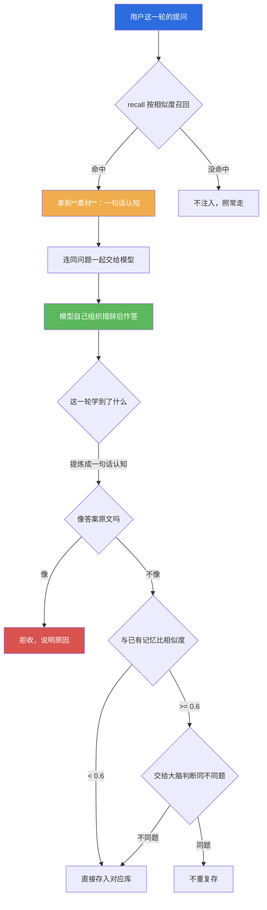

# 精神记忆库（存知识，不存答案）

| 项目 | 内容 |
|---|---|
| 模块 | `core/spirit_memory.py` |
| 自测入口 | `tools/test_spirit_memory.py`（41 项） |
| 数据落盘 | `logs/spirit_memory/knowledge.jsonl`、`method.jsonl`、`diagnosis.jsonl` |
| 同题阈值 | `SAME_TOPIC_THRESHOLD = 0.6` |
| 文档状态 | 已发布，内容与代码同步（实测数字均取自当场自测） |

## 目录

[摘要](#1-摘要) · [与普通记忆的区别](#2-与普通记忆的区别) · [三个库](#3-三个库) ·
[同题判据](#4-同题判据为什么是-06) · [拒收护栏](#5-拒收护栏为什么必须有) ·
[接口](#6-接口) · [使用示例](#7-使用示例) · [边界与限制](#8-边界与限制) · [故障排查](#9-故障排查)

---

## 1. 摘要

普通记忆记的是**发生过什么**：谁说了什么、当时什么情况。那是"经历"。
经历越堆越多，但它不让人变强 —— 同一类问题第二次出现，依然要从头再走一遍。

精神记忆记的是**学到了什么**：一条知识、一个方法、一次诊断经验。它是"认知"。
第三次遇到同类问题时，载体可以把上次想明白的东西拿出来用，不必重新推一遍。
**这是"越用越强"里"强"的那部分。**

| | 普通记忆 | 精神记忆 |
|---|---|---|
| 记什么 | 经历（对话、事实、印象） | 认知（知识、方法、诊断经验） |
| 粒度 | 一段对话、一条事实 | **一句话** |
| 存不存答案原文 | 会存（那是经历） | **绝不存** |
| 用途 | 想起"当时是什么情况" | 知道"这类事该怎么办" |

---

## 2. 与普通记忆的区别

**【为什么必须分开，不能塞进普通记忆】**
两者要回答的问题不同：普通记忆回答"我们之前聊到哪了"，精神记忆回答"这件事我琢磨明白了什么"。
混在一个库里会出现两个后果：检索时"经历"淹没"认知"（经历的量级大得多，实测普通记忆库 1496 条，
认知是几十条的量级）；以及**答案原文会顺着"经历"的通道混进认知里**，而两者对答案原文的容忍度完全相反。

**【记忆是素材，不是答案】**
这是本节最要紧的一条。`recall()` 返回的是**素材**：
调用方必须把它交给模型去推理和组织措辞，**不能原文回吐给用户**。
理由是这个架构的前提 —— 载体负责结构，模型负责措辞；把检索结果直接当回答输出，
等于让载体替模型说话，也等于把上一轮的说法当成这一轮的事实。



**这张图要说的一句话**：召回只给素材，落库只收认知 —— 两头都不许出现答案原文。

---

## 3. 三个库

三个库都落在 `logs/spirit_memory/`，**一行一条、只追加**。

| 库 | 文件 | 存什么 | 例子 |
|---|---|---|---|
| 知识 | `knowledge.jsonl` | 关于用户、世界、领域的**事实性认知** | 「用户偏好简短直接的回答，不喜欢客套」 |
| 方法 | `method.jsonl` | 怎么做事：流程、判据、套路 | 「遇到地区类问题必须先锁定同一地点再比对」 |
| 诊断经验 | `diagnosis.jsonl` | 出了什么错 → 怎么定位 → 怎么修好的 | 「编辑吃掉 `def` 行会让 `ast` 查不出来，要用 ruff F821 兜」 |

`kind` 只认这三个值。传别的值直接拒收，**不猜、不兜底** —— 兜底会让一个拼错的 kind
悄悄变成"知识"，而它本来该进的是诊断经验。

---

## 4. 同题判据（为什么是 0.6）

小脑是字级模型，精细语义弱：实测「我非常喜欢这个方案」与「我非常讨厌这个方案」余弦高达 **0.904**
（比近义对的 0.814 还高）。所以**只靠相似度判定"是不是同一件事"不可靠**。判据因此分两段：

| 相似度 | 走哪条 | 判据说明里如实写明是谁判的 |
|---|---|---|
| < 0.6 | 明确**不同题**，直接分开存 | `规则` |
| ≥ 0.6 且有判官 | **交给大脑（4B）判断** | `大脑` |
| ≥ 0.6 但没有判官 | 保守**当作同题** | `保守` |
| 算不出相似度 | 当作**不同题**分开存 | `保守` |

**【为什么高相似度没有判官时选"当同题"】**
两条路都会错，代价不同：漏合并会让同一件事存很多遍，而精神记忆的价值恰恰在于"同类的只留一条"；
误合并会让两条不同的认知塌成一条，丢的是信息。选前者是因为前者**可发现也可补救**（库里出现近似重复一眼能看出来），
后者丢掉的认知则无声无息。

**【判官抛异常时不许把异常抛出去】**
判官挂了就退回保守分支，并把原因写进 `why`（实测输出：
`保守：相似度 0.880 达阈值，但判官不可用（RuntimeError）`）。精神记忆写不进去只影响"越用越强"，
**绝不能影响这一轮的回答**。

---

## 5. 拒收护栏（为什么必须有）

**【答案原文存进去会怎样】**
答案原文是**概率性的、一次性的**：同一次提问换个说法，生成的答案就不一样。
把上一轮的答案原文存下来复用，等于把随机输出当成事实 —— 那是**记忆污染**，不是学习。
而且它污染的不只是这一条：后面每一轮召回都会把它带上，错会一直传下去。

**【护栏用代码实现，不靠注释自觉】** 判据三条，命中任一条即拒收：

| 判据 | 理由 |
|---|---|
| 超长（> 400 字） | 一句话认知通常短；答案原文通常长 |
| 含「问：…答：…」结构 | 这就是问答对，是答案原文的典型形态 |
| 带 `answer` / `reply` / `output` / `final` / `response` 字段 | 字段名本身就是信号，连字段一起拦 |

被拒的记录返回 `{"ok": False, "action": "rejected", "why": ...}`，**绝不静默存下去**。
宁可少记，绝不记错 —— 少记一条认知只是没学到，记错一条会一直错下去。

---

## 6. 接口

`core/spirit_memory.py`，共 9 个导出：

| 函数 | 签名 | 说明 |
|---|---|---|
| `KINDS` | — | `("knowledge", "method", "diagnosis")` |
| `dir_path` | `dir_path()` | 数据目录，默认 `logs/spirit_memory/` |
| `path_of` | `path_of(kind)` | 某个库的路径；kind 不合法时返回 `None` |
| `remember` | `remember(kind, text, tags=None, source="", llm_judge=None, **kw)` | 存一条，返回 `{"ok", "action", "why", "id"}` |
| `recall` | `recall(query, k=3, kind=None, min_sim=None)` | 按相似度召回，返回素材列表 |
| `same_topic` | `same_topic(a, b)` | 两条文本的余弦；算不出返回 `None` |
| `should_merge` | `should_merge(sim, llm_judge=None, text_a="", text_b="")` | 返回 `(是否同题, 判据说明)` |
| `looks_like_answer` | `looks_like_answer(text)` | 这条文本像不像答案原文 |
| `stats` | `stats()` | 三个库各自的条数、字节数、路径 |

`remember()` 的 `action` 三种取值：

| action | 含义 |
|---|---|
| `added` | 新存了一条 |
| `duplicate` | 已有同题，**不重复存**（这才是精神记忆该有的样子） |
| `rejected` | 被判为答案原文或参数不合法，拒收 |

**本模块从不删除、也从不覆盖任何既有记录，只追加。**
判为同题时是"不写"，不是"改写旧的" —— 历史一旦被改写，回滚与追责都没了依据。

---

## 7. 使用示例

以下代码可直接复制运行。运行前设置环境变量 `PYTHONUTF8` 为 `1`，工作目录为仓库根。

```python
from core import spirit_memory as SM

# 1. 存一条知识
r = SM.remember("knowledge", "用户偏好简短直接的回答，不喜欢客套", tags=["偏好"])
print(r["action"], r["why"])          # added 新存一条

# 2. 同一件事第二次 —— 不重复存
r = SM.remember("knowledge", "用户偏好简短直接的回答，不喜欢客套")
print(r["action"], r["why"])          # duplicate 已有一条同题记忆（...），不重复存

# 3. 护栏：这条会被拒
r = SM.remember("method", "算面积要先确认单位", answer="先统一单位再相乘")
print(r["action"], r["why"])          # rejected 带 `answer` 字段：...

# 4. 召回 —— 拿到的是素材，不是答案
for h in SM.recall("用户喜欢什么样的回答", k=3):
    print("%.3f  %s  %s" % (h["sim"], h["kind"], h["text"]))

# 5. 两个库各自统计
print(SM.stats()["total"])
```

实测输出（第 4 步）：

```text
0.782  knowledge  用户偏好简短直接的回答，不喜欢客套
```

这不是字面匹配 —— 查询里没有"偏好""简短"这些词，是向量空间的真实相似度。

自测：

```powershell
$env:PYTHONUTF8="1"
python tools/test_spirit_memory.py
```

自测分六组：接口形状、正常存取、拒收答案原文、同题判据、只追加不改写、不污染真实库。
**全部写在临时目录**，跑完不留痕，也不创建真实的 `logs/spirit_memory/`。

---

## 8. 边界与限制

- **同题判定的可靠性依赖小脑向量质量。** 0.6 这条线是工程取值，不是理论值；反义对（0.904）高于近义对（0.814）这件事说明单纯提高阈值不能解决反义问题，只能靠大脑判官兜。判官不可用时本模块选择保守合并，**这个选择会丢信息**。
- **`looks_like_answer()` 是启发式。** 它能挡住典型形态（问答对、超长、字段名），但挡不住"一段很短但确实是答案原文"的文本 —— 比如把答案压缩成 50 字再存进来。这条依赖调用方按约定只传**提炼过的认知**。
- **落盘失败被吞掉。** 磁盘满或权限不足时 `remember()` 返回 `rejected` 并给出原因，但**不会中断这一轮对话**。这是有意的取舍：记不上只影响"越用越强"，不该影响"这一轮能不能回答"。
- **没有淘汰与压缩机制。** 只追加意味着三个库会一直变大。当前没有为精神记忆做容量管理，也没做语义去重之外的合并。库大到什么程度会影响检索，未实测。
- **`recall()` 是线性扫描。** 逐条读文件并两两算余弦，没有索引。当前量级（几十条）开销可忽略，**上千条之后需要重做检索结构**，这一点没有实测边界。
- **本模块不判断认知本身对不对。** 它只负责存与取；一条错误的"知识"会被忠实地存下来并召回。纠错依赖别处（用户的反馈、诊断经验的反证）。

---

## 9. 故障排查

| 现象 | 可能原因 | 排查方式 |
|---|---|---|
| 什么都存不进去，全是 `rejected` | 文本被判为答案原文 | 看 `why`：超长就压缩成一句话；带问答对结构就改写成陈述 |
| 同一条认知存了很多遍 | 相似度低于 0.6，被判为不同题 | 打印 `same_topic()` 的实际值；必要时调阈值常量（改前先想清楚代价） |
| 应该合并的两条没合并 | 没传 `llm_judge`，走了保守分支 | 看 `why` 里写的是 `规则` / `大脑` / `保守` —— 本模块**如实写明是谁判的** |
| 召回拿不到东西 | 库是空的，或查询与本条语义差太远 | 先 `stats()` 看条数，再手工 `same_topic()` 比一次 |
| `path_of()` 返回 `None` | kind 拼错（不是三类之一） | 只能是 `knowledge` / `method` / `diagnosis` |
| 记录里有 `vec` 字段 | 正常现象 | 存向量是为了下次召回能比相似度；小脑不可用时这条字段会缺失，此时退化为字面重合 |

---

## 参考

- 设计理念（载体优先后半篇）：[design-philosophy.md](design-philosophy.md)
- 极限补刀（"结果存回结构"这条公式）：[modules/10-boost.md](modules/10-boost.md)
- 内化缓存（另一个"第二次不用重走"的机制）：`core/internalize.py`
- 代码：`core/spirit_memory.py`、自测 `tools/test_spirit_memory.py`

## 变更记录

| 日期 | 版本 | 变更 | 维护者 |
| --- | --- | --- | --- |
| 2026-09-15 | v1.0 | 首次发布：三个库的结构、同题判据与拒收护栏，给出 41 项自测与实测相似度 | 小焦项目 |
