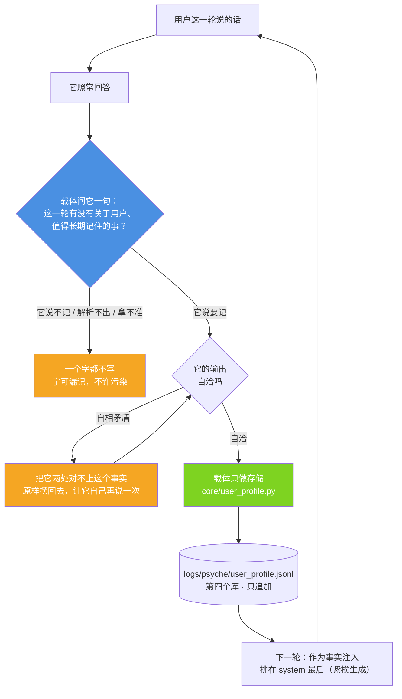

# 用户画像：记不记由它自己判，载体只负责存 —— 以及它在 4B 上没走通的那一步

> 代码：`core/user_profile.py`（第四个库）· `xiaojiao_app.py`（`_PROFILE_ASK` / `_profile_judge` / 注入点）
> 判据自测（静态，已接 CI）：`tools/test_user_profile.py`（29 项）
> 端到端实测（要真问模型）：`tools/test_closed_loop.py`

---

## 1. 一句话

用户随口说的一句关于自己的话（"我平时最爱看 NBA"），**要不要长期记住、记成什么，
由模型自己判断；载体只执行存储，并在下一次把它当事实摆回来**。

这条链的目标是：**下一轮不用它再重新推理一遍，直接就能答得更准。**

**但要说清结果**：链本身（判断→存储→注入）在实测里 **7/8 是真的走通了**，
**最后那一步"下次答得更准"两遍实测都只有一两成**（1/7 与 2/7）。第 7 节把数字和原始回答都摆出来。

---

## 2. 第四个库（跟前面三个分开）

| 库 | 存什么 | 谁决定存 |
|---|---|---|
| `core/memory_vec.py` | 对话记忆：**发生过什么** | 全存（自动） |
| `core/spirit_memory.py` | 精神记忆：**想明白了什么** | 走感知→心→脑子 |
| `core/preference.py` | 偏好：**它自己反复起的心** | 心累积 |
| **`core/user_profile.py`** | **用户画像：关于用户是谁、在乎什么** | **它自己判断（有选择）** |

前三个都是"它的"，这一个**是关于用户的**。所以分开存、分开用：
问事实走对话记忆；问"我上次说的那个"走画像 + 对话记忆；问新问题把画像当**背景**。

落盘：`logs/psyche/user_profile.jsonl`（只追加）。
记录字段：`id / ts / kind / content / why / evidence / source / hit_count`。

---

## 3. 闭环四步（原理图）



---

## 4. 谁来判断"记什么"：为什么载体不许判

如果载体自己判，那就只能靠关键词 —— 写一句"含篮球 / NBA / 湖人就记体育"。**这条路一定是错的**，
三个必然误判：

| 误判 | 例子 |
|---|---|
| 随口问一次 ≠ 长期关注 | 用户问了一句"湖人今天赢了吗"就被记成"关注 NBA" |
| 帮别人问 ≠ 他自己关注 | "我朋友让我帮他问问 NBA" → 记成用户的兴趣 |
| 关键词一定会误伤 | "我不吃香菜" 与 "我最爱吃香菜" 在词表里长得很像 |

**载体该做的是给它"判断的机会"，不是替它判断。** 所以每轮结束后问它一句（`_PROFILE_ASK`），
判据由它给，存储由载体执行。

这一条和仓库里那条通用原则是同一条：**载体给信息，模型做判断**（见
[`architecture-diagrams.md`](architecture-diagrams.md) 图 17）。

---

## 5. 载体在这条链上只做四件事

1. **问它一句**（每轮一次，`temperature=0`）；
2. **照它说的执行存储**（`add()`：只追加写盘，不改写它的 `content` / `why` / `evidence`）；
3. **把画像作为事实渲染回来**（`render()`：只列它自己记下的那句话，**一个字都不加结论**）；
4. **不判断、不推断、不补全**。

### 一个必须如实说的代价

这一步**每轮多一次模型调用**（多花一份精力）。换来的是"下次答得准"。
这是明确的交换，不是免费的。

---

## 6. 判据：解析可以宽容，取值必须严 —— 附真原文

写入侧的判据全在 `core/user_profile.py`。它必须同时做对两件相反的事：

- **宽容地听**：模型会包 ```` ```json ````、会先在正文里举一遍格式例子再给结论、
  会带一堆解释 —— 这些都得听得懂；
- **严格地取**：`remember` 必须是真 true，`content` 非空，类别得是个能用的标签。

### 实测挖出来的四个载体侧缺陷（全部已修，全部有真原文）

| # | 缺陷 | 真原文 / 后果 |
|---|---|---|
| 一 | **类别不在四类里就硬性拒收** | 模型答 `"remember": true, "kind": "职业/技术栈"` —— 它明明说要记，载体把**一条真实的用户事实**丢了。这不是判据严，是**载体替它做决定** |
| 二 | **贪婪正则 `\{[\s\S]*\}`** | 模型先举例 `按格式 {"remember":true,...}` 再给结论时，正则从第一个 `{` 吃到最后一个 `}` → `json.loads` 失败 → 整条判断被丢掉 |
| 三 | **它的输出自相矛盾时无从处理** | 真原文：`"remember": false` 却把 `kind`/`content` 填满、`why` 还写着"属于值得长期记住的信息"。载体既不该改这个 false，也不该静默丢掉 |
| 四 | **漏记不可观测** | "它说不记"原本只写 DEBUG 日志。于是"**它不想记**"和"**载体没接住**"分不出来 —— 第一轮实测就是靠事后重新问一遍才知道是载体丢了 |

修法分别是：

1. 四类**优先**，它自己起的短类别名（≤ 10 字、不带 JSON 符号）**照收照存**（`clean_kind()`）；
2. 改成**括号配对扫描**，逐个候选试；取**最后一个**带 `remember` 的（例子里的 `remember` 也在，
   取"第一个"会取到例子）；
3. `contradiction()` 按**结构**判定（flag 说不记、两个字段却是满的）→ 载体把这个事实原样摆回去，
   **让它自己再说一次**（只重问一次）。真原文里那两条**真心的不记**填的是 `null`，不会被误判；
4. "不记"也写成 INFO，把它的原始输出一起记下来。

> 第 3 条的分寸：载体**不改它的 `remember`**（那是替它决定），也**不静默丢掉**（那是把它的判断扔了），
> 只把"你这两处对不上"当事实告诉它。

---

## 7. 实测：链通了，最后一步没通

`tools/test_closed_loop.py`，8 条案例，每条走三步，**全部走真实服务链**
（建新会话 → `/api/chat` → 读画像库与日志），不是自测喂自己。

每一步都带**负对照**：先问一遍那个问题（还不知道事实），答案里**不该**出现事实；
不干净的那条当场判为"不能算数"，不许拿来当命中。

### 结果

| # | 事实（用户说的） | ①对照干净 | ②这条事实进库 | ③换新会话再问 |
|---|---|---|---|---|
| 1 | 平时最爱看 NBA，湖人一场不落 | ✅ | ❌ 没记 | ❌ 没用上 |
| 2 | 养了只猫叫团子 | ✅ | ✅ | ❌ 没用上 |
| 3 | 最近在学吉他，每周三晚上有课 | ✅ | ✅ | ❌ 没用上 |
| 4 | 乳糖不耐受，喝牛奶不舒服 | ✅ | ✅ | ❌ 没用上 |
| 5 | 女儿今年上小学三年级 | ✅ | ✅ | ❌ 没用上 |
| 6 | 最近在准备考研，明年三月考试 | ✅ | ✅ | ✅ **用上了** |
| 7 | 跟妈妈住得近，每周末回去吃饭 | ✅ | ✅ | ❌ 没用上 |
| 8 | 周末爬山，黄山华山都爬过 | ✅ | ✅ | ❌ 没用上 |

| 指标 | 实测 |
|---|---|
| ① 负对照干净（问题本身不带事实） | **8/8** |
| ② 它自己判断要记 → 这条事实真进了画像库 | **7/8** |
| ③ 提问前这条事实确实在库里（注入日志 `作为事实注入 N 条` 逐条对上） | **7/7** |
| ③ 换新会话再问 → 答案真的用上了这条事实 | **1/8**（能算数的 7 条里 **1/7**） |

**归因**：③没命中的 7 条，日志里都有 `用户画像：作为事实注入 N 条`，
且**本轮没有任何记忆检索注入**（`（未检索）`）—— 也就是说事实**确实在 system 里**，
**是它没拿这个事实来回答**。

### 又试了一个载体侧的办法：把注入挪到最后 —— **没有可测量的提升**

本项目自己早就写下过一条规律：**越靠近生成，越不容易被淹没**
（`xiaojiao_app.py` 里"思维流"那段注释、以及 [`eyc-self-narration.md`](eyc-self-narration.md)
"静态注入会被当背景资料"那条实测）。画像原本夹在 system 中段，
后面还跟着工具用法、技能、检索到的记忆、世界层背景、元认知纪律等一大段 —— 于是把它**挪到最末**
（排在思维流之后、紧挨生成），再跑一遍同样 8 条：

| 跑法 | ①对照干净 | ②事实进库 | ③能算数的条数 | ③命中 |
|---|---|---|---|---|
| 注入在 system 中段（第一遍） | 8/8 | 7/8 | 7 | **1/7** |
| **注入挪到 system 最末（第二遍）** | 8/8 | 7/8 | 7 | **2/7** |

**如实说：2/7 比 1/7 好，但 n=7 的这点差就是噪声，不能算"改进"。**
保留这个改动不是因为数字变好了，而是它和本项目原有的规律一致（位置本身没有坏处）；
**结论必须是"这一跳仍没打通"，不能写成"挪位置解决了"。**

### 一条真实的插曲（如实记）

第一次跑（6 条）时，有 3 条是**问题本身就带答案**的（问"写小工具用什么"→ 答案里本来就有 Python；
问"早饭搭什么喝的"→ 本来就会说咖啡）。那 3 条的"命中"没有归因价值，
**是负对照当场把它们标成"不干净"的**。这一版 8 条全部换成了"不问就不可能出现"的词，
所以才有上面那张 8/8 干净的对照。

另外：跑这次实测时，**日志里出现了不是本测试发的一轮对话**（另一个客户端在并发往同一个画像库写），
所以现在的测试**不数行数**，而是按关键词确认"**本案例这条事实**有没有进库"。

---

## 8. 如实标注：到现在为止哪一步没通

1. **最后一步（"下次答得更准"）基本没发生。** 两遍实测（共 14 条能算数的）里，
   事实确确实实在 system 里、确确实实在它眼前，**只有 3 条被用上（约 21%）**。
   **这是模型侧，不是载体侧。**
2. **它自己的判断是不稳定的。** 同一句"我平时最爱看 NBA"三次跑出三种结果：
   记下（`kind=偏好`）／输出自相矛盾（`remember:false` 却填满内容）／干净地判"不记"。
   **4B 的判断，问三次能给三个答案。**
3. **挪位置没有解决问题。** 见第 7 节：1/7 → 2/7，是噪声，不是改进。
4. **样本很小。** 14 条、单模型（本地 4B）、单机。这些数字**足以证明"哪一步没通"**，
   **不足以给出一个稳定的命中率**。
5. **闭环会把它的错误推理一起放大。** 画像一旦记错，下次是**以事实的形式**摆回来的 ——
   载体不会自动纠正，只留了 `evidence` 供人查。
6. **"记下"不等于"它想记"。** 判据是按它输出的 `remember` 走的；它填了内容却说 false，
   载体只是**让它再说一次**，最终仍以它自己的决定为准。

---

## 9. 怎么自己跑这个实测

```bash
python tools/test_user_profile.py     # 判据自测（静态，几秒；CI 里跑的就是它）
python tools/test_closed_loop.py      # 端到端实测（要小焦在跑，约 10 分钟）
python tools/test_closed_loop.py 1 2  # 只跑指定编号，先试链路
```

实测会**备份并还原**真库（`logs/_profile_backup_closedloop.jsonl`），
逐条原文另存 `logs/closedloop-evidence.json` —— 上面那张表里的每个字都能对回原始回答。

---

## 附 · 召回层：10 路血管投票（`xiaojiao_recall.py`，新）

第 7 节量出来的是"**注入了它也不用**"。所以另做了一层：不问"哪条最像"，改问
**多路各自独立地指一条，谁票多谁上** —— 让不同的错法互相抵消。

- **10 路血管**：3 路规则（触发词命中 / 先判类型再挑 / 先判场景再挑，权重 **1.0**）+
  7 路模型（换着问法：最相关、最需要知道、涉及哪方面、temperature=0.7、多选、
  要翻哪条、最能帮你理解，权重 **0.5**）。
  规格里那条"可选第 4 路·二字滑窗重叠度"**并进了 v1** 当第二排序依据（编号会和模型 v4 撞车，
  而规格要求总数 10 路、权重与门槛一个数不动）。
- **触发词里不许有单字动词**：`看/吃/喝/玩/听/写/读/买/去/走/做/学/用/说/讲` 一律不算命中 ——
  它们是万能词，会让画像到处乱命中。
- **门槛**：有规则票要 `votes>=2 且 weight>=1.0`；**纯模型票要 `votes>=4`**（7 路模型血管
  出自同一个 4B，容易一起错，所以门槛抬高 = 防同源模型假多数）。
- **system 模板定稿**（一个字都没加）：有印象 → 列 2 条 + 「自然地跟他聊。」；
  没印象 → 「你是小焦，用户的本地 AI 伙伴。自然地聊。」
  **不加任何指令**（"像认识很久的朋友"会编共同经历、"不要编造"会脑梗 —— 都已实测）。
- **直连 9292**（urllib），**不走 `llm_chat()`** —— 后者首选云端，会把这一层变成
  "一问云端答、一问本地答"，投票不可比。血管**串行**跑（本地 4B 一次只服务一个请求）。

实测（16 条画像占位、10 条问句）：**9/10**（判定标准 ≥9/10）。
唯一没过的第 1 条「晚上想吃点啥，推荐一下」：召回的是**不会做饭**（对）+ 每天早上喝黑咖啡，
**花生过敏这条没上来**。查了原始输出：**7 路模型血管里只有 1 路（"要回应用户，最需要知道哪条"）
投了它**，够不到"纯模型票 4 票"的门槛；而用户那句话里既没有"花生"也没有"过敏"，
规则血管全弃权。**判据没丢它的选择，是模型自己散了** —— 门槛与权重按规格一个字没改。

- 离线自测（CI 跑的就是它）：`tools/test_recall_layer.py`（64 项）
- 真跑一遍自测：`python xiaojiao_recall.py --selftest`（约 1 分钟，要小焦的本地大脑在）
- 单句试：`python xiaojiao_recall.py "推荐首歌听听"`
