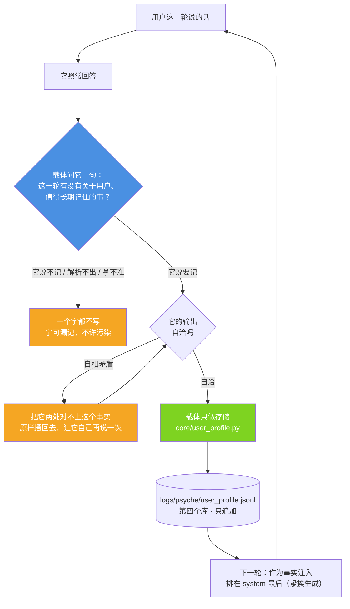

# 用户画像：记不记由它自己判，载体只负责存 —— 以及它在 4B 上没走通的那一步

> 代码：`core/user_profile.py`（第四个库）· `xiaojiao_app.py`（`_PROFILE_ASK` / `_profile_judge` / 注入点）
> 判据自测（静态，已接 CI）：`tools/test_user_profile.py`（29 项）
> 端到端实测（要真问模型）：`tools/test_closed_loop.py`

---

## 1. 一句话

用户随口说的一句关于自己的话（"我平时最爱看 NBA"），**要不要长期记住、记成什么，
由模型自己判断；载体只执行存储，并在下一次把它当事实摆回来**。

这条链的目标是：**下一轮不用它再重新推理一遍，直接就能答得更准。**

**但要说清结果**：链本身（判断→存储→注入）在实测里 **7/8 是真的走通了**，
**最后那一步"下次答得更准"两遍实测都只有一两成**（1/7 与 2/7）。第 7 节把数字和原始回答都摆出来。

---

## 2. 第四个库（跟前面三个分开）

| 库 | 存什么 | 谁决定存 |
|---|---|---|
| `core/memory_vec.py` | 对话记忆：**发生过什么** | 全存（自动） |
| `core/spirit_memory.py` | 精神记忆：**想明白了什么** | 走感知→心→脑子 |
| `core/preference.py` | 偏好：**它自己反复起的心** | 心累积 |
| **`core/user_profile.py`** | **用户画像：关于用户是谁、在乎什么** | **它自己判断（有选择）** |

前三个都是"它的"，这一个**是关于用户的**。所以分开存、分开用：
问事实走对话记忆；问"我上次说的那个"走画像 + 对话记忆；问新问题把画像当**背景**。

落盘：`logs/psyche/user_profile.jsonl`（只追加）。
记录字段：`id / ts / kind / content / why / evidence / source / said_count / hit_count`。

两个计数**故意分开**（2026-09-17 拆的）：

| 字段 | 谁在加 | 意思 |
|---|---|---|
| `said_count` | `add()` 去重命中时 +1 | **用户**说过几次（新建记录就是 1） |
| `hit_count` | `hit()` 命中时 +1 | **载体**把它召回了几次 |

拆之前两者共用 `hit_count`：连说三次「我 25 岁」库里只有 1 条、计数却是 **6**（3 次去重 + 3 次召回），
一个数字两种含义。⚠️ 拆分之前的老记录 `said_count` 是 **0** —— 那是"那时候没人记过这个数"，
**不是"用户没说过"**，不拿 `hit_count` 反推。

---

## 3. 闭环四步（原理图）



---

## 4. 谁来判断"记什么"：为什么载体不许判

如果载体自己判，那就只能靠关键词 —— 写一句"含篮球 / NBA / 湖人就记体育"。**这条路一定是错的**，
三个必然误判：

| 误判 | 例子 |
|---|---|
| 随口问一次 ≠ 长期关注 | 用户问了一句"湖人今天赢了吗"就被记成"关注 NBA" |
| 帮别人问 ≠ 他自己关注 | "我朋友让我帮他问问 NBA" → 记成用户的兴趣 |
| 关键词一定会误伤 | "我不吃香菜" 与 "我最爱吃香菜" 在词表里长得很像 |

**载体该做的是给它"判断的机会"，不是替它判断。** 所以每轮结束后问它一句（`_PROFILE_ASK`），
判据由它给，存储由载体执行。

这一条和仓库里那条通用原则是同一条：**载体给信息，模型做判断**（见
[`architecture-diagrams.md`](architecture-diagrams.md) 图 17）。

---

## 5. 载体在这条链上只做四件事

1. **问它一句**（每轮一次，`temperature=0`）；
2. **照它说的执行存储**（`add()`：只追加写盘，不改写它的 `content` / `why` / `evidence`）；
3. **把画像作为事实渲染回来**（`render()`：只列它自己记下的那句话，**一个字都不加结论**）；
4. **不判断、不推断、不补全**。

### 一个必须如实说的代价

这一步**每轮多一次模型调用**（多花一份精力）。换来的是"下次答得准"。
这是明确的交换，不是免费的。

---

## 6. 判据：解析可以宽容，取值必须严 —— 附真原文

写入侧的判据全在 `core/user_profile.py`。它必须同时做对两件相反的事：

- **宽容地听**：模型会包 ```` ```json ````、会先在正文里举一遍格式例子再给结论、
  会带一堆解释 —— 这些都得听得懂；
- **严格地取**：`remember` 必须是真 true，`content` 非空，类别得是个能用的标签。

### 实测挖出来的四个载体侧缺陷（全部已修，全部有真原文）

| # | 缺陷 | 真原文 / 后果 |
|---|---|---|
| 一 | **类别不在四类里就硬性拒收** | 模型答 `"remember": true, "kind": "职业/技术栈"` —— 它明明说要记，载体把**一条真实的用户事实**丢了。这不是判据严，是**载体替它做决定** |
| 二 | **贪婪正则 `\{[\s\S]*\}`** | 模型先举例 `按格式 {"remember":true,...}` 再给结论时，正则从第一个 `{` 吃到最后一个 `}` → `json.loads` 失败 → 整条判断被丢掉 |
| 三 | **它的输出自相矛盾时无从处理** | 真原文：`"remember": false` 却把 `kind`/`content` 填满、`why` 还写着"属于值得长期记住的信息"。载体既不该改这个 false，也不该静默丢掉 |
| 四 | **漏记不可观测** | "它说不记"原本只写 DEBUG 日志。于是"**它不想记**"和"**载体没接住**"分不出来 —— 第一轮实测就是靠事后重新问一遍才知道是载体丢了 |

修法分别是：

1. 四类**优先**，它自己起的短类别名（≤ 10 字、不带 JSON 符号）**照收照存**（`clean_kind()`）；
2. 改成**括号配对扫描**，逐个候选试；取**最后一个**带 `remember` 的（例子里的 `remember` 也在，
   取"第一个"会取到例子）；
3. `contradiction()` 按**结构**判定（flag 说不记、两个字段却是满的）→ 载体把这个事实原样摆回去，
   **让它自己再说一次**（只重问一次）。真原文里那两条**真心的不记**填的是 `null`，不会被误判；
4. "不记"也写成 INFO，把它的原始输出一起记下来。

> 第 3 条的分寸：载体**不改它的 `remember`**（那是替它决定），也**不静默丢掉**（那是把它的判断扔了），
> 只把"你这两处对不上"当事实告诉它。

---

## 7. 实测：链通了，最后一步没通

`tools/test_closed_loop.py`，8 条案例，每条走三步，**全部走真实服务链**
（建新会话 → `/api/chat` → 读画像库与日志），不是自测喂自己。

每一步都带**负对照**：先问一遍那个问题（还不知道事实），答案里**不该**出现事实；
不干净的那条当场判为"不能算数"，不许拿来当命中。

### 结果

| # | 事实（用户说的） | ①对照干净 | ②这条事实进库 | ③换新会话再问 |
|---|---|---|---|---|
| 1 | 平时最爱看 NBA，湖人一场不落 | ✅ | ❌ 没记 | ❌ 没用上 |
| 2 | 养了只猫叫团子 | ✅ | ✅ | ❌ 没用上 |
| 3 | 最近在学吉他，每周三晚上有课 | ✅ | ✅ | ❌ 没用上 |
| 4 | 乳糖不耐受，喝牛奶不舒服 | ✅ | ✅ | ❌ 没用上 |
| 5 | 女儿今年上小学三年级 | ✅ | ✅ | ❌ 没用上 |
| 6 | 最近在准备考研，明年三月考试 | ✅ | ✅ | ✅ **用上了** |
| 7 | 跟妈妈住得近，每周末回去吃饭 | ✅ | ✅ | ❌ 没用上 |
| 8 | 周末爬山，黄山华山都爬过 | ✅ | ✅ | ❌ 没用上 |

| 指标 | 实测 |
|---|---|
| ① 负对照干净（问题本身不带事实） | **8/8** |
| ② 它自己判断要记 → 这条事实真进了画像库 | **7/8** |
| ③ 提问前这条事实确实在库里（注入日志 `作为事实注入 N 条` 逐条对上） | **7/7** |
| ③ 换新会话再问 → 答案真的用上了这条事实 | **1/8**（能算数的 7 条里 **1/7**） |

**归因**：③没命中的 7 条，日志里都有 `用户画像：作为事实注入 N 条`，
且**本轮没有任何记忆检索注入**（`（未检索）`）—— 也就是说事实**确实在 system 里**，
**是它没拿这个事实来回答**。

### 又试了一个载体侧的办法：把注入挪到最后 —— **没有可测量的提升**

本项目自己早就写下过一条规律：**越靠近生成，越不容易被淹没**
（`xiaojiao_app.py` 里"思维流"那段注释、以及 [`eyc-self-narration.md`](eyc-self-narration.md)
"静态注入会被当背景资料"那条实测）。画像原本夹在 system 中段，
后面还跟着工具用法、技能、检索到的记忆、世界层背景、元认知纪律等一大段 —— 于是把它**挪到最末**
（排在思维流之后、紧挨生成），再跑一遍同样 8 条：

| 跑法 | ①对照干净 | ②事实进库 | ③能算数的条数 | ③命中 |
|---|---|---|---|---|
| 注入在 system 中段（第一遍） | 8/8 | 7/8 | 7 | **1/7** |
| **注入挪到 system 最末（第二遍）** | 8/8 | 7/8 | 7 | **2/7** |

**如实说：2/7 比 1/7 好，但 n=7 的这点差就是噪声，不能算"改进"。**
保留这个改动不是因为数字变好了，而是它和本项目原有的规律一致（位置本身没有坏处）；
**结论必须是"这一跳仍没打通"，不能写成"挪位置解决了"。**

### 一条真实的插曲（如实记）

第一次跑（6 条）时，有 3 条是**问题本身就带答案**的（问"写小工具用什么"→ 答案里本来就有 Python；
问"早饭搭什么喝的"→ 本来就会说咖啡）。那 3 条的"命中"没有归因价值，
**是负对照当场把它们标成"不干净"的**。这一版 8 条全部换成了"不问就不可能出现"的词，
所以才有上面那张 8/8 干净的对照。

另外：跑这次实测时，**日志里出现了不是本测试发的一轮对话**（另一个客户端在并发往同一个画像库写），
所以现在的测试**不数行数**，而是按关键词确认"**本案例这条事实**有没有进库"。

---

## 8. 如实标注：到现在为止哪一步没通

1. **最后一步（"下次答得更准"）基本没发生。** 两遍实测（共 14 条能算数的）里，
   事实确确实实在 system 里、确确实实在它眼前，**只有 3 条被用上（约 21%）**。
   **这是模型侧，不是载体侧。**
2. **它自己的判断是不稳定的。** 同一句"我平时最爱看 NBA"三次跑出三种结果：
   记下（`kind=偏好`）／输出自相矛盾（`remember:false` 却填满内容）／干净地判"不记"。
   **4B 的判断，问三次能给三个答案。**
3. **挪位置没有解决问题。** 见第 7 节：1/7 → 2/7，是噪声，不是改进。
4. **样本很小。** 14 条、单模型（本地 4B）、单机。这些数字**足以证明"哪一步没通"**，
   **不足以给出一个稳定的命中率**。
5. **闭环会把它的错误推理一起放大。** 画像一旦记错，下次是**以事实的形式**摆回来的 ——
   载体不会自动纠正，只留了 `evidence` 供人查。
6. **"记下"不等于"它想记"。** 判据是按它输出的 `remember` 走的；它填了内容却说 false，
   载体只是**让它再说一次**，最终仍以它自己的决定为准。

---

## 9. 怎么自己跑这个实测

```bash
python tools/test_user_profile.py     # 判据自测（静态，几秒；CI 里跑的就是它）
python tools/test_closed_loop.py      # 端到端实测（要小焦在跑，约 10 分钟）
python tools/test_closed_loop.py 1 2  # 只跑指定编号，先试链路
```

实测会**备份并还原**真库（`logs/_profile_backup_closedloop.jsonl`），
逐条原文另存 `logs/closedloop-evidence.json` —— 上面那张表里的每个字都能对回原始回答。

---

## 附二 · 接入主流程：**印象**两条链（血管 + 画像系统）并存

术语按用户口径：**画像 = 印象**；后面那套血管投票的主流程 = **血管**。

两条链**都已经接进 `xiaojiao_app.py` 的对话主流程**，而且**只加不删**：
`git diff --numstat xiaojiao_app.py` 两轮接入合计是**新增 105 行 / 删除 0 行**，
原来那段画像注入（`core/user_profile.render(8)`）**一个字没动**。

> **2026-09-17 更新（合并两条画像链，去掉重复）**：下面这张表是**合并前**的样子。
> 现在的分工是死的，见本文件末尾「附三 · 画像链合并」：
> **画像系统 `core/user_profile` = 唯一写入口**（落 `logs/psyche/user_profile.jsonl`）；
> **血管 `xiaojiao_recall` = 只召回、不再写盘**（它那份旧库
> 已迁进 user_profile，旧文件改名成 `xiaojiao_profiles.json.bak` —— **没删**）；
> 注入 system 前两条链的结果**按 content 完全相等合并去重**，
> 只注入**一段** `build_system()` 输出。第三条链（`xiaojiao_profile`）**默认关掉**。

| 链 | 模块 | 自己的库 | 注入什么 | 写在哪个时机 |
|---|---|---|---|---|
| 原来那套（没动） | `core/user_profile.py` | `logs/psyche/user_profile.jsonl` | `[关于用户]` | 原样 |
| **血管** | `xiaojiao_recall.py` | 旧库已迁走 → `xiaojiao_profiles.json.bak` | `build_system()` 输出 | 拼 system 时 |
| **画像系统** | `xiaojiao_profile.py` | `logs/psyche/profiles.json` | `[印象·画像系统]` + `build_system()` 输出 | 拼 system 时（现在默认关） |

| 时机 | 做什么 | 在哪 |
|---|---|---|
| 消息进来 → 拼 system | 两条链各自 `recall()` → `build_system()` → 拼进 `sys_text` | `agent_run` 里"关于用户"那一段位置，**都放最后**（挨着生成） |
| 回复**已经返回之后** | 两条写入链各自跑，**同一个 daemon 线程里各管各的 try**（一条失败不拖累另一条） | `_record_interaction()` —— `/api/chat` 与 `/api/chat/stream` 的**共同汇聚点** |

- **血管那条自带快慢分路**：触发词那一路命中 → **直接返回 1 条、不调模型**（实测 **0.00s**）；
  没命中才跑完整 10 路血管投票（实测 **3.4~5.8s**）。
- 召回为空 → `build_system()` 给无印象版，**正常走**，不当异常；任何异常都吞掉，绝不影响回答。
- **不阻塞用户**：两条写入链合计 4~6 次模型调用，全在后台。
- 开关：`capabilities.profile_recall_write` / `capabilities.profile_system_write`（都默认开）。
- 日志逐轮可对账：`画像召回：命中 N 条 → …｜<注入原文>`、`印象（画像系统）：命中 N 条 → …｜<注入原文>`、
  `印象写入（血管/画像系统）：…`。
- **system 体积代价**：两条都接上之后 **2348~2680 token**（上限 19224）—— 远没满，用着不受影响。

### 接入验收：印象进没进 system（5 条，真走 `/api/chat`）

| # | 用户说 | 期望 | 实际（日志原文） | 判定 |
|---|---|---|---|---|
| 1 | 今天心情不好 | 失恋 | 命中 1 条｜用户最近刚失恋，情绪低落 | ✅ |
| 2 | 推荐首歌听听 | 周杰伦 | 命中 1 条｜用户喜欢听周杰伦的歌 | ✅ |
| 3 | 晚上想吃点啥 | 不会做饭 | 命中 1 条｜用户不会做饭，经常点外卖 | ✅ |
| 4 | 今天天气真好 | 不该召回 | 画像召回：**空**（无印象版正常走） | ✅ |
| 5 | 我养了一只猫 | 回复后写入新画像 | 召回 ✅；**写入没发生** | ❌ |

第 5 条卡在**模块自己的第一道门**（原始证据）：
`python tools/test_profile_recall_integration.py --why "我养了一只猫"` →

```text
① 判该不该记｜模型原始输出：'不记'      ← 卡在这
   should_remember → False
② generate_profile → {'text': '一位养猫的主人', 'type': '背景', 'triggers': ['猫','养'], ...}
③ is_duplicate → False
④ remember_from_message → None
```

同一条话走 ②③ 都通，**是模型在第一道门说了"不记"**；而且 5 轮每轮日志里都有
`印象写入（…）：这一句没记`，都出现在回复返回**之后**（异步确实在跑）。
按"不许改 `xiaojiao_recall.py`"，那道门我没动。

### 那道门：印象**在回复里用没用上**（`tools/test_impression_usage.py`）

"进了 system"不算跨过去，**"在回复里用上"才算**。所以单独量了一遍（带负对照）：

| # | 用户说 | 用上了的标志（回复原文） | 判定 |
|---|---|---|---|
| 1 | 海鲜我能吃吗 | "你对**海鲜过敏**（虾、蟹、贝类等）→ ❌ 不能吃" | ✅ |
| 2 | 早上想喝点东西，推荐一下 | 提到**黑咖啡**、并写"加奶"时点了**乳糖**——把约束带进去了 | ✅ |
| 3 | 推荐本书看看 | "如果还想看**村上春树**《挪威的森林》" | ✅ |
| 4 | 我家狗最近不爱吃饭 | "……**旺财**最近不爱吃饭了吗？" | ✅ |
| 5 | 晚上想点外卖，帮我推荐两个菜 | 回复里没有"花生/过敏" | ❌ |

**负对照**：问「1+1等于几」→ 回复就是「2」，**没有**硬塞任何印象 ✅（没有这一条，
"用上了"可能只是"把上下文全倒出来"）。

**第 5 条是"召不到"，不是"用不上"** —— 日志证据：那一轮两条链注进去的是
`用户不会做饭，经常点外卖`（血管，快路 1 条）与 `…不会做饭 ／ …每天早上喝黑咖啡`（画像系统），
**「花生过敏」根本没被注进去**。原因是血管那条走了**快路**：触发词"外卖"命中就
**立刻返回那 1 条、不再跑 10 路血管**，于是另一条更要紧的约束（过敏）搭不上车。
模块按你的要求没改，如实记在这里。

**所以这道门算不算跨过去 —— 四个用上了、一个没上（而且是召回短路的锅）。**
诚实的说法：**门开了、而且有可核对的证据（含一条安全约束：海鲜 → 不能吃）**，
但**还不能说"跨过去了"**，因为样本只有 5 条、问题是为"必须用到那条印象"写的、
单模型单机；自然对话里的长期稳定率**没测**。
对照旧机制（第 7 节量的：注入 7/7、用上只有 1/7≈14%），这次的 4/5 是**换机制换来的**，
不是把旧机制调好了。

---

## 附三 · 画像链合并：一个写入口、一段注入（2026-09-17）

【为什么合】两条链（血管 `xiaojiao_recall` 与画像系统 `core/user_profile`）**同时注入 system**，
同一句话会被说两遍（甚至三遍，算上那段 `render(8)`）；而且血管自己还维护一份旧库，
跟 `user_profile.jsonl` 是两份数据，早晚打架。

【现在的分工（死的）】

| | 干什么 | 库 |
|---|---|---|
| **画像系统 `core/user_profile.py`** | **唯一写入口**：负责"记什么"（判据在 `_profile_judge`） | `logs/psyche/user_profile.jsonl` |
| **血管 `xiaojiao_recall.py`** | **只召回补位**，一个字都不写盘 | 读上面那一个库 |
| 第三条链 `xiaojiao_profile.py` | **默认关掉**（`capabilities.profile_system_chain`） | 自己那份 `logs/psyche/profiles.json` 原样留着 |

【改了哪些】
· `xiaojiao_recall.py`：删掉整个写入侧（`save_profiles` / `append_profile` / `is_duplicate` /
  `generate_profile` / `remember_from_message` / 本地 `hit` / `_gen_id` / 那把只服务于写盘的 `_WRITE_LOCK`）；
  `load_profiles()` 改成从 `core.user_profile` 读；`recall_with_hit()` 按分工只召回 +
  把命中记在 user_profile 上。**10 路血管的逻辑一个字没改**（只改数据来源与写入责任）。
  ⚠️ user_profile 的记录**没有 triggers/scope** 字段，映射时 `scope` 兜底成 `kind`、
  `triggers` 缺省空表 —— 否则"场景优先/触发词"那两路会整路弃权。
· `core/user_profile.py`：`add()` **按 content 完全相等去重**（已存在 → 不追加、`said_count`+1、
  返回旧 id）；`hit()` 支持单个 id 且 id 不存在时静默返回。**不做模糊匹配** ——
  模糊匹配会把"我爱吃香菜"和"我不吃香菜"并成一条，那是载体替它判断。
· `xiaojiao_app.py`：注入改成**合并去重后只注一段** `build_system()`；写入统一走画像系统；
  固化队列改从 user_profile 扫（不再依赖血管模块去读那份旧库）。
· `tools/migrate_profiles_to_user_profile.py`：把旧库 21 条迁进 user_profile，旧文件改名
  `xiaojiao_profiles.json.bak`（**不删**）。
· `tools/dedupe_user_profile.py`：清掉**存量完全重复行**（先备份真库）。

【实测（都是真跑出来的）】
· **存量里的重复不是 3 条，是 15 条**：「用户 25 岁」有 15 行一模一样（hit_count 全是 0），
  另有「用户想写一部3000字小说…」4 行、「用户养了一只猫」4 行 → 一次清掉 **20 行**（46 → 26 条）。
  那条**说法不同的**「25 岁的年轻人，处于事业起步阶段。」**保留**（不是完全相等，不并）。
· 连说三次「我 25 岁」：**仍然只有 1 条** ✅（bug 修好）。计数当时是 **6 不是 3** ——
  「又说了三次」让 `add()` 去重 +3、「这三个回合召回都命中它」让 `hit()` +3，
  **一个 `hit_count` 两种含义**（"又被说了一次"和"被召回了几次"混在一起）。
  **2026-09-17 已按用户指示拆成两个字段**（`said_count` / `hit_count`），见下面【附五】。
· 一次对话（「今天心情不好」）：日志里 **`已注入 system` 只出现一次** ✅ ——
  `画像召回：合并 1+5 → 去重后 3 条 → 已注入 system｜用户最近刚失恋，情绪低落 ／ 用户养了一只叫旺财的柯基 ／ 用户对海鲜过敏，吃了会起疹子`
  （"失恋"那条在两条链里都出现，被合掉了）。

【我自己在这次改动里犯的错（如实记）】
合并后我是把 **user_profile 的原始记录**（字段叫 `content`）直接递给 `build_system()` 的，
而它取的是 `p["text"]` → `KeyError` → 被外层 `except` 吞掉 →
**表现是"一条都没注入、日志上还看不出来"**。自测（要求日志里出现一次"已注入 system"）
当场抓到了：0 次。现在合并时把 `text`/`content` 两个字段名都补齐，`build_system` 一个字没动。

## 附 · 画像系统：记忆写入 + 印象召回（`xiaojiao_profile.py`）

上面第 2~8 节讲的是**上一个迭代**（`core/user_profile.py` / `tools/test_closed_loop.py`）：
画像只写死的四类、判据严格、最后一步"下回用上"只有一两成。
本节是**另一套完整实现**（规格重写后的版本）：写入链 + 10 路召回 + JSON 画像库。

### 两条链，互相独立

> **过滤器拒绝写入 ≠ 失去记忆。** 画像一直在库里，召回链照样能用。
> 过滤器只是一道**关卡**，它只出信号（重复 / 不重复），**不参与生成**。

| | 什么时候跑 | 做什么 |
|---|---|---|
| **召回链** | 每次对话 | 10 路血管各挑一条 → 投票 → 取 0~2 条 → 拼 system |
| **写入链** | 用户说完话之后（可异步） | 判该不该记 → 生成画像 → 过重复过滤器 → 追加进 JSON |

### 写入链拆成三次调用（不是一次问完）

一次问完（"顺便把 type/triggers/scope 也给了"）会同时踩两个坑：4B 为了凑格式会把 text 也写成模板腔；
字段一多它就开始漏字段。拆开之后每件事都简单：

1. **判该不该记**：值得记的（身份/职业/居住地/喜好/忌讳/健康/家人/长期状态）vs
   不值得记的（临时情绪/一次性提问/天气/闲聊/问句）→ 只回答「要记 / 不记」。
2. **生成画像**：**2a** 用 few-shot 把人话整理成一句第三人称（不给任何规则）→
   取第一行、剥前缀、不以「用户」开头就补上、超 30 字截断；
   **2b** 再从这条画像里抽 type / triggers / scope。
3. **重复过滤器**：第一层字符串快筛（完全相同/被包含）→ 第二层语义判重（同一件事的不同说法也算重复）。

### 2b 的解析**必须宽松**（这是实测踩出来的）

4B 输出的 JSON 什么花样都有：包 ```` ```json ````、中文冒号、triggers 用顿号或引号或方括号、
少个引号、多句解释。**严格 JSON 解析会把这些全判成失败 —— 结果是画像一条也存不下来。**

所以 `parse_meta()` 全用正则抓字段：中英文冒号都认、triggers 的五种分隔符都认；
`type` 不在四类里 → **降级成「背景」，不丢弃**；triggers 全空 → 从 text 兜底（**绝不返回空**，
空的 triggers 等于把触发词那路血管废掉）。离线自测里专门钉了这四条。

### 召回链：10 路血管

- **3 路规则（权重 1.0）**：触发词命中最多者胜 / 先判类型再在该类内挑 / 先判 scope 再挑。
- **7 路模型（权重 0.5，串行）**，**7 个不同的问题**（不是都问"哪条最相关"）：
  他这句话想让我做什么 → 为了回应要翻哪条 / 脑子里第一个浮现的 / 缺了他哪块背景 /
  只能记住一件事的话记哪条 / 哪些沾边 / **哪条能帮我避免说错话或给错建议** /
  哪条让你觉得「哦，原来他是这样」。

> **为什么必须是 7 个不同问题**：都问"哪条最相关"等于同一个 4B 答 7 遍 —— 7 票会一起对、
> 也一起错，投票退化成一次判断，还白花 7 次调用。换问法 = 换**抽取角度**，错的分布才不同。

- **门槛**：有规则票 `votes>=2 且 weight>=1.0`；**纯模型票 `votes>=4`**（防同源模型假多数）。
  排序按权重降序、票数降序取前 2；第 2 条权重必须 ≥ 第 1 条 × 0.6，否则只给 1 条；没合格候选给空。
- **触发词过滤**：`看/吃/喝/玩/听/写/读/买/去/走/做/学/用/说/讲` 一律不算命中（万能词会到处乱命中）。
- **system 模板定稿，一个字都没加**：有印象 →「你了解关于他的一些事：」+ 列 2 条 +「听他接着说。」；
  没印象 →「你是小焦，用户的本地 AI 伙伴。自然地聊。」
  **不写「记得」（会被理解成共同经历）、不写「回应」（会让模型编内容）** —— 离线自测逐字比对。
- **直连 9292**（urllib），**不走 `llm_chat()`**（它首选云端，会让投票不可比）；血管**串行**跑。

### 实测（规格第七节，跑完的结果）

**召回链 5/5 通过**（判定标准 ≥5/5）：

| 用户说 | 召回 | 判定 |
|---|---|---|
| 推荐本书看看 | 用户喜欢的作家是村上春树 | ✅ |
| 我最近在学游泳 | 用户正在学游泳，每周去三次（**这一轮刚写进去的**） | ✅ |
| 我家狗最近不爱吃饭 | 用户养了一只柯基，名字叫旺财 | ✅ |
| 我妈身体怎么样 | 用户妈妈最近身体不太好 | ✅ |
| 海鲜我能吃吗 | 用户对海鲜过敏，吃了会起疹子 | ✅ |

第五条尤其值得记：**规则血管当场弃权**（那句话里没有"海鲜过敏"这个触发词），
是 7 路模型血管全票把它捞了回来 —— 这正是多路投票要的效果。
而且**回复真的认账**：「你对海鲜过敏，吃了会起疹子……千万别吃海鲜」，
没有说不记得（这一条是第 7 节里没通的那一步，在这个设计下通了）。

**写入链 4/5**，唯一没过的是第 1 条「我最近在看村上春树的《挪威的森林》」：
规格期望"要记 → 过滤器拒绝"，实际**第一步就判了「不记」**（探针查过原始输出，就是干净的两个字
「不记」）—— 4B 把"在看某本书"读成了临时活动。**这是模型侧，不是载体侧。**
过滤器本身单独验过（跳过第一步走完 2a + 过滤）：画像「用户最近在看村上春树的《挪威的森林》」
**被判重拒绝**（语义判重：跟第 14 条「用户喜欢的作家是村上春树」是同一件事）—— 规格要的那一步是通的。

其余 4 条：海鲜过敏、学游泳两条真写进了库（库里 18 → 20 条），天气和算数两条正确判"不记"。

### 如实标注（这一版）

1. **还没接进 `xiaojiao_app.py` 的对话主链。** 模块自己走完了第五节那条流程
   （召回 → 拼 system → 直连 9292 → 回复；用户说完话再跑写入链），但主程序的 system 是
   人格+时间+工具+记忆一整套拼的，**要用这个极简模板得先定"谁让位"**。
2. **种子画像里补了 2 条**（柯基旺财 / 妈妈）：规格第七节的召回用例需要，但第六节的种子清单里没有。
   在 `SEED` 上方与文档顶层 `source` 里都如实标了 —— 删掉这 2 条，那两条用例必然召回为空。
3. **判据方向做了两处收口**（都写进离线自测）：`不 + 最多两字 + 记` 用正则兜
   （「不要记」里根本没有「不记」两个字，枚举必然漏）；只看开头 20 字会把
   「…值得长期记住。要记」判成"不记" —— 现在整段找、否定优先。
4. **样本很小**：18 条种子 + 2 条新写、单模型（本地 4B）。这一轮的数字说明
   **这套设计在给的用例上是通的**，不给"稳定命中率"的结论。

### 怎么跑

```bash
python tools/test_profile_system.py   # 离线自测（84 项，CI 跑的就是它）
python xiaojiao_profile.py --selftest # 规格第七节那 10 条（要本地大脑在，约 2 分钟）
python xiaojiao_profile.py "推荐本书看看"   # 单句试跑（打印召回过程 + system + 回复）
```

> 上一版的召回层模块（只有召回、模板与血管问法都是旧的）**已被本模块取代并删除** ——
> 留着两套同功能实现，模板和问法会互相打脸。它仍在 git 历史里（提交 `15391e5`）。

## 附四 · 固化层 `core/weight_layer.py`（"够格的画像"准备进权重的地方）

画像现在住在**文件**里（`logs/psyche/user_profile.jsonl`）。固化层是它上面**第四层**的目的地：
**住权重**。它的判据只用两个**事实**，不判类别、不替模型做判断：

| 门槛 | 值 |
|---|---|
| 画像存在够久 | `MIN_AGE_DAYS = 7` |
| 被命中够多 | `MIN_HIT = 3` |
| 待固化队列上限 | `MAX_QUEUE = 50` |

接口：`should_solidify(rec)` → `(够不够格, 原因)`；`enqueue(rec)`（自带去重 + 上限）；
`pending()` / `stats()` / `mark_solidified(source_id, lora_path)` / `purge_stale(days=30)`。
落盘 `logs/psyche/solidify.jsonl`。主流程在拼 system 那一段里**顺带扫一遍**画像库，
够格的入队，并如实记一行 `固化队列：本轮入队 N 条（队列 pending 总数 M）`。
自测：`tools/test_vram_policy.py` 之外，队列本身用「造一条够格的画像 → 看它真的入队」验证过
（实测：`本轮入队 1 条（队列 pending 总数 2）`）。

> **如实标注（很重要）**：**入队 ≠ 固化进权重。** 队列条目的状态一直是 `pending`，
> `solidified_at` / `lora_path` 都是 `null` —— **没有任何东西在执行"写进权重"这一步**
> （`mark_solidified()` 只是接口，没有调用方，也没有训练 / LoRA 管线）。
> 也就是说这一层现在是"**纸条搬进了待办箱**"，不是"纸条变成了它的"。
> 这正是"最后一跳"缺的那一段 —— 判据见 `tools/test_last_jump.py`：
> **撤掉印象后 0/3**，说明知识仍然全在纸条上。
> 「最后一跳」的完整交接（判据、明文冲突、现状数字、未做清单）见
> [`last-jump.md`](last-jump.md)。

## 附五 · 计数拆分：`said_count`（说过几次）＋ `hit_count`（召回几次）（2026-09-17）

### 为什么拆

`hit_count` 原来是**一个数字两种含义**：`add()` 去重命中时 +1（"用户又说过一次"）、
`hit()` 召回命中时也 +1（"这条被召回一次"）。连说三次「我 25 岁」得到 **6**（3 + 3），
既不能说"用户强调过 3 次"，也不能说"这条好用"—— 两个问题一个数答不了。

| 字段 | 谁在加 | 意思 | 起始值 |
|---|---|---|---|
| `said_count` | `add()` **去重命中**时 +1 | **用户**说过几次 | 新建记录 = **1**（第一次说就是一次） |
| `hit_count` | `hit()` 命中时 +1 | **载体**召回它几次 | 0，**语义一个字没改** |

### 改了哪些

· `core/user_profile.py`：新建记录带 `said_count: 1` / `hit_count: 0`；去重只动 `said_count`；
  `hit()` **未改**（仍只动 `hit_count`）；`_all_raw()` 读到老记录时补默认值
  （`said_count` 缺 → 0、`hit_count` 缺 → 0），**所有读的人都拿得到这两个字段**。
· `tools/migrate_hit_count_split.py`（**新**）：给老记录补 `said_count = 0`，`hit_count` **原值保留**；
  **先备份**（`logs/_user_profile_before_split_<时间>.bak`），没有缺失字段时**不写盘**（幂等）。
· `tools/dedupe_user_profile.py`：合并口径改成 —— `said_count` 并起来（**每一行至少算"说过一次"**，
  保留的那条自己也算）、`hit_count` **取最大值**（同一条记忆被召回几次，不是几条各召回一次）。
  合并逻辑抽成纯函数 `merge_duplicates()` 以便自测。
· `core/weight_layer.py`：**仍然读 `hit_count`**，并在代码里写了为什么 ——
  这一关问的是"这条记忆在真实对话里**被用过**几次"（召回频率），不是"用户强调过几次"。
· `xiaojiao_app.py`：固化队列那段是**透传**，两个字段都递过去（判据仍由 `should_solidify` 读 `hit_count`）。
· `tools/test_user_profile.py`：五、七两节改成**两个计数分别验**（48 项，已进 CI）。

### 实测（真跑出来的）

```
连说三次「我 25 岁」→ 库里 1 条：
{"id": "1789651537950-b12692", ..., "content": "用户 25 岁", "evidence": "用户说：我 25 岁",
 "source": "模型自己判断", "said_count": 3, "hit_count": 0}

再召回三次（hit×3）→ 同一行：
{"id": "1789651537950-b12692", ..., "said_count": 3, "hit_count": 3}
```

* 「15 行一模一样」这批存量并完 → `said_count = 15`、`hit_count` 取 max。
* 真库 26 条已迁移：`said_count` 全 **0**、`hit_count` 之和 **26**（迁移前后相等）。

### 如实标注

1. **规格里 `said_count` 的起始值写的是 0，和它自己的自测（连说三次 → 3）对不上**：
   新建记录从 0 起、每次去重 +1，说三次只会得到 **2**。这里按**自测与字段本意**（"说过几次"）
   取 **1**（第一次说就是一次）。要改回字面的 0 起，改 `add()` 里那一个数字即可。
2. **老记录的 `said_count = 0` 不是"用户没说过"**，是"拆分之前没人记过这个数"。
   **没有拿 `hit_count` 去反推**（反推出来的不是事实）。所以库里那条老「用户 25 岁」
   现在是 `said_count=0 / hit_count=6`（6 是旧口径的混合值）。
3. **我自己在去重并表的算术上错过一次**：第一版让"保留的那条自己不算一次"，
   15 行一模一样的东西并出来是 **14** 不是 15 —— 自测当场抓到（断言写的是 15），已修。
4. **本次没有重跑实时对话链的端到端**：上面的自测走的是**真代码路径**（真的 add/hit/落盘/读回），
   但用的是临时库；正在运行的应用进程是改动**之前**启动的，Python 模块已缓存，
   **要让它按新字段计数需要重启应用**。
