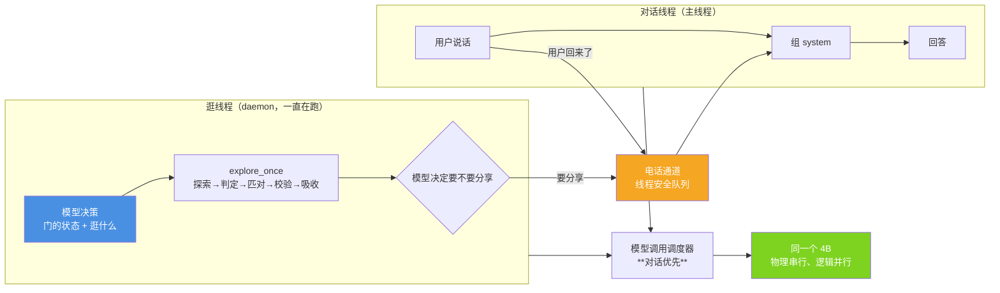

# 小焦的世界（主动逛 + 双线程 + 电话通道）

| 项目 | 内容 |
|---|---|
| 双线程 | `core/dual_thread.py` |
| 电话通道 | `core/phone_channel.py` |
| 模型调度 | `core/model_scheduler.py` |
| 世界层 | `core/world/`（explorer / verifier / firewall / model / perception / judge，**复用，未新建**） |
| 自测 | `tools/test_4_gaps.py` 第 [6][7] 组 |
| 文档状态 | 已发布，内容与代码同步 |

## 1. 摘要

小焦要能**同时**做两件事：跟用户对话、自己在外面逛。这不是"轮着来"，是**真并行**：

- 逛的状态一直在跑，对话的状态也一直在跑；
- 两者用**电话通道**互相说话；
- 用**调度器**排队抢那一个 4B。

三条铁律：**逛必须后台跑**（不抢资源、不阻塞用户）／**逛着也能对话**（双线程 + 电话通道 + 调度器）／
**全部交给模型自主决策**（不设定时任务、不设比例、不设计数器）。

---

## 2. 门的状态：由模型控，三档

| 档位 | 含义 | 资源 |
|---|---|---|
| `open` | 随时能出去，也可能马上又出门 | 保留少量 |
| `half` | 回家了但没想好，半开半关 | 保留极少 |
| `locked` | 真休息了，今天不出门 | **全部释放** |

**谁决定门的状态？模型自己。** 载体只负责"照着门的状态分配资源"与"如实记录为什么"。

**【为什么不设"逛多久/几点逛"这类定时任务】** 定时任务会让小焦在**用户正在说话**的时候突然出门，
或者整晚空转。模型看着最近的对话自己判断"现在该不该出去"，比任何固定节奏都贴合实际 ——
代价是它有时候会判断错，所以每次决策都**留痕**（`why`），可复盘。

实测一次真实决策：`{'door': 'locked', 'want': '我关心', 'why': '模型自主决策：locked / 我关心'}`。

---

## 3. 四个回调：载体不认识"世界层"，只认识这四个口子

`dual_thread.browse_once()` 的一轮是 **决策 → 逛 → 存 → 分享**，四步都由调用方注入：

| 回调 | 由谁实现（`xiaojiao_app.py`） | 做什么 |
|---|---|---|
| `decide_fn` | `_browse_decide` | 问模型：门开到哪一档、想逛什么 |
| `browse_fn` | `_browse_action` | 调 `core/world/explorer.get_explorer().explore_once(topic)` |
| `store_fn` | 不需要 | 世界层的 `explore_once` **内部已经串了** 探索→判定→匹对→校验→吸收 全链 |
| `share_fn` | `_browse_share` | 问模型：这条要不要说给用户听 |

**脏东西在 `firewall` 那一步就被隔离了**，所以这里不重复做一遍过滤。



**这张图要说的一句话**：**并行的是状态，串行的是算力。**

---

## 4. 模型调用调度器：物理串行，逻辑并行

本地只有一个 4B，显存不够跑两个实例 —— **推理本身必须一个接一个**，这一点绕不过去。
但"推理串行"**不等于**"两条线程要互相等"：

- 逛线程的推理在排队时，逛线程的**状态机照常跑**（它在想什么、逛到哪了，都不丢）；
- 用户一说话，对话线程的调用**插到队头**，逛线程那些**还没开始**的调用让路；
- **已经跑起来的那一次跑完就交还** —— 不能中途打断，打断了这一轮的 KV 就废了。

用户感受到的是"毫秒级排队"，不是"等后台逛完"。

实测（`tools/test_4_gaps.py`）执行顺序：

```text
['阻塞开始', '阻塞结束', '用户这一句', '后台跑']
```

**用户这一句插到了"排队中的后台"前面**，且后台**没有被饿死**（最终跑到了）。后台让路计数 `yielded=1`。

---

## 5. 电话通道：双向 + 有界

| 消息类型 | 方向 | 用途 |
|---|---|---|
| `share` | 逛 → 对话 | 我逛到什么了，你要不要告诉用户 |
| `ask` | 逛 → 对话 | 我在想一件事，帮我看看 |
| `ctl` | 对话 → 逛 | 用户回来了 / 先别插话 / 继续逛 |
| `reply` | 对话 → 逛 | 对某个 `ask` 的回答 |

三个设计点：

1. **必须加锁**：`queue.Queue` 本身线程安全，但"查一眼再取"是两步操作，中间会被另一条线程插进来。
2. **有界**：上限 64，满了**丢最旧**的。逛线程跑一整天、对话线程一直没读，无界队列就是内存泄漏；
   而旧消息的时效性已经没了 —— 小焦在用户面前说一句十分钟前的"我刚看到…"，比不说更奇怪。
3. **分类投递**：读的人可以只取自己关心的那一类。

对话线程用 **`peek` 语义**读分享：这一轮用不上就留着，下一轮还有机会 ——
取走又用不上就白丢了。

---

## 6. 主流程接线

- **逛线程 lazy 启动**：第一次真正对话时起（不在 `import` 期起）。
  理由：`import` 期起会让任何 `import xiaojiao_app` 的脚本（含全部自测）凭空多一个后台逛网的线程 ——
  那是副作用，不是能力。起一次，幂等。
- **转达**：`agent_run` 组 system 时调 `_browse_relay()` 看一眼电话通道，
  有话就加一段"小焦刚才在外面逛到的"，**并明确要求"无关就不要硬塞"**。

---

## 7. 安全红线：逛世界不碰本地

- 小焦的"世界"是**互联网**，不是本地磁盘。主动逛世界时**只逛互联网，完全不碰本地**。
- 用户**明确指定**文件时走的是一条单独的最小权限通道，见 [minimal-access.md](minimal-access.md)。
- 本地内容**绝不混进世界记忆** —— 混进去之后，下一次"逛世界"就会带着本地磁盘的内容上路，
  那是最糟的泄露路径。

---

## 8. 边界与限制

- **物理串行是硬的。** 4B 只有一个实例，同一时刻只能跑一次推理。调度器保证的是**优先级与公平**，不是并行算力 —— 后台任务多的时候，用户仍会感到变慢（只是不会被"后台先跑完"堵住）。
- **不能中途打断已在跑的推理。** 用户在后台推理进行到一半时说话，要等那一次跑完（实测 `avg_wait_ms` 在跑长任务时会到百毫秒级）。
- **门的状态由模型定，它会判断错。** 可能今天一直 `locked` 什么都不逛，也可能频繁出门。每次决策都留痕可复盘，但**没有兜底节奏** —— 这是"完全交给模型"的代价，是有意选的。
- **逛到的内容质量不受本模块控制。** 过滤、校验、隔离都在 `core/world/` 里，本模块只负责"什么时候逛、逛完要不要说"。
- **`explore_once` 是阻塞调用。** 它跑在网络请求上，一次可能几百毫秒到几秒；逛线程里阻塞不影响用户（那是 daemon），但会让"下一轮逛"推迟。
- **分享判断也是模型定的。** 它可能把不相关的东西说给用户听，也可能一直不说。提示词里写明了"无关就不要硬塞"，但没有硬拦截。

---

## 9. 故障排查

| 现象 | 可能原因 | 排查方式 |
|---|---|---|
| 从没主动分享过 | 门长期 `locked`，或分享判断一直说"不说" | `dual_thread.status()` 看 `shared` 与 `door`；`phone_channel.counts()` 看队列 |
| 后台一直不逛 | 世界层探索器没起来 | `xiaojiao_app._browse_explorer()` 是否为 `None` |
| 用户说话变慢 | 后台有一次长推理正在跑 | `model_scheduler.stats()` 看 `busy` 与 `avg_wait_ms` |
| 电话通道涨满、`dropped` 一直涨 | 对话线程没在读（例如一直是短会话） | `phone_channel.counts()`；丢的是最旧的，不会丢新的 |
| 逛线程起了两条 | 不该发生 —— `start()` 幂等 | `dual_thread.status()` 的 `thread` 名字应恒为 `xiaojiao-browse` |

---

## 参考

- 最小权限（用户指定读本地文件时）：[minimal-access.md](minimal-access.md)
- 设计理念（记忆检索是素材 / 五类领域闸门）：[design-philosophy.md](design-philosophy.md)
- 代码：`core/dual_thread.py`、`core/phone_channel.py`、`core/model_scheduler.py`、`core/world/`

## 变更记录

| 日期 | 版本 | 变更 | 维护者 |
| --- | --- | --- | --- |
| 2026-09-15 | v1.0 | 首次发布：门的三档、四个回调、调度器优先级实测、电话通道语义 | 小焦项目 |
