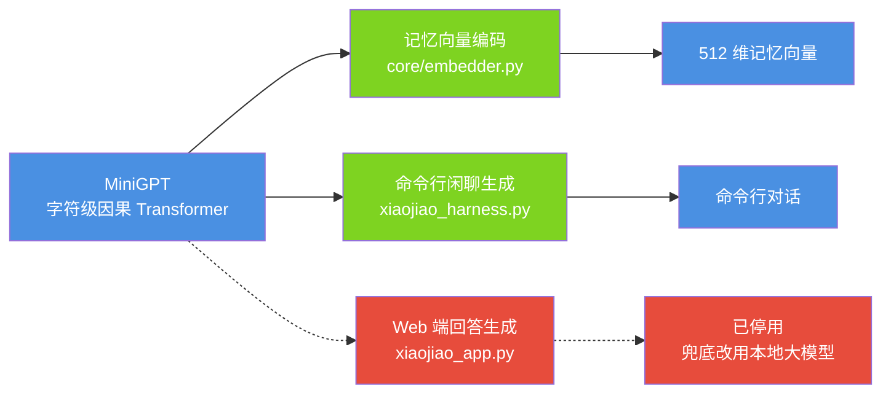
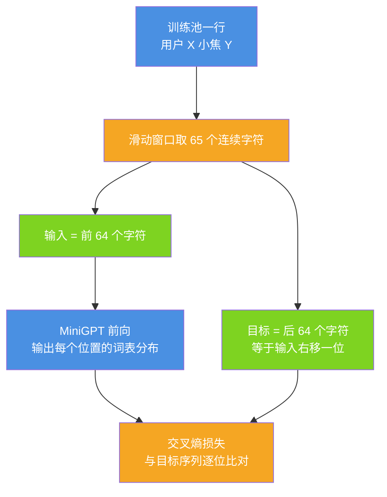
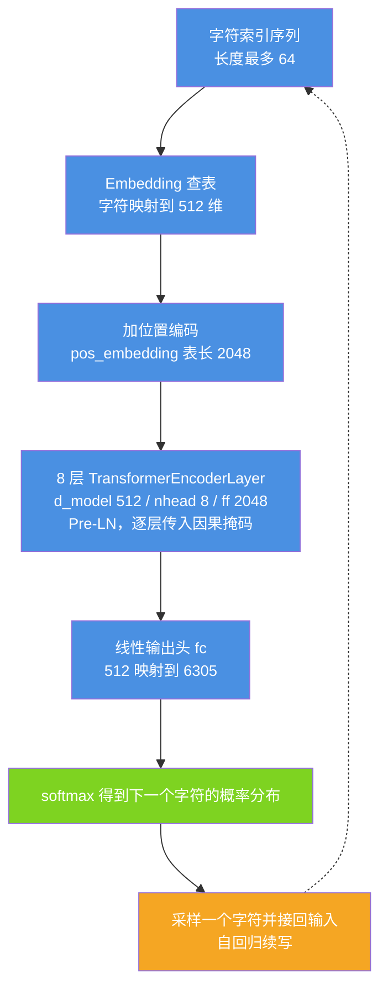
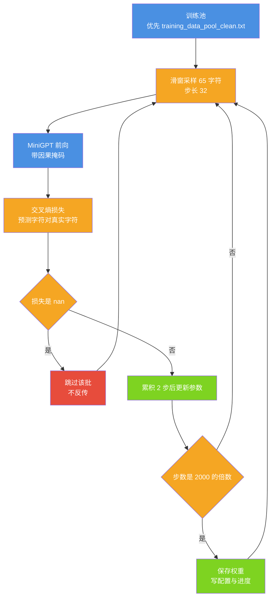
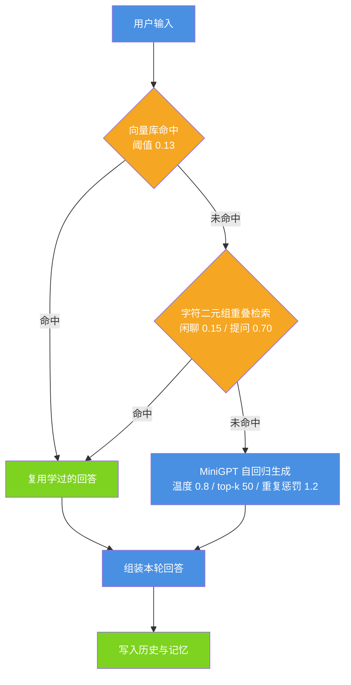

# 自研小模型 MiniGPT：结构与训练

| 项 | 值 |
| --- | --- |
| 适用版本 | v1.0 |
| 最后更新 | 2026-09-14 |
| 维护者 | 小焦项目 |
| 文档状态 | 稳定 |
| 文档定位 | 模型本身：网络结构、训练、推理与向量编码。怎么用、怎么换模型见 [model_cn.md](model_cn.md) |

**摘要**：小焦自研的 MiniGPT 是一个字符级因果 Transformer（causal language model，只在给定前文时预测下一个字符）；本文给出它的实测结构参数、训练器行为、推理路径，以及它在当前代码里的三处真实用途。

## 目录

1. [定位与真实职责](#1-定位与真实职责)
2. [字符级语言模型](#2-字符级语言模型)
3. [网络结构](#3-网络结构)
4. [关键设计](#4-关键设计)
5. [训练](#5-训练)
6. [推理](#6-推理)
7. [作为向量编码后端](#7-作为向量编码后端)
8. [边界与限制](#8-边界与限制)
9. [故障排查](#9-故障排查)
10. [扩展方向](#10-扩展方向)
11. [参考](#11-参考)

---

## 1. 定位与真实职责

MiniGPT 不承担工具调用与复杂推理。它当前在代码里有三处用途，其中一处在 Web 端已经停用：

| 用途 | 实现位置 | 状态 |
| --- | --- | --- |
| 记忆向量编码（主后端） | `core/embedder.py` 的 `_grab_brain()` / `_embed_minigpt()` | 在用 |
| 命令行闲聊生成 | `xiaojiao_harness.py` 的 `generate()` | 在用 |
| Web 端回答生成 | `xiaojiao_app.py` 的 `xiaojiao_reply()` | 已停用 |

Web 端停用有明确代码依据：`xiaojiao_app.py` 第 7302 行注明「已停用自建小模型的语言生成（只会胡诌），绝不用于说话」，且 `xiaojiao_reply()` 没有任何调用点。Web 端在本地大模型不可用时的兜底对象是 llama-swap 上的本地大模型（`_local_brain_model()`），不是 MiniGPT。

**图 1 · MiniGPT 的真实职责**
说明：模型本身只做「下一个字符预测」；当前承担记忆向量编码与命令行闲聊，Web 端生成已停用。
代码位置索引：`core/embedder.py`、`xiaojiao_harness.py`、`xiaojiao_app.py`



---

## 2. 字符级语言模型

MiniGPT 的输入与输出都是**字符**，不是词或子词。词表就是训练语料里出现过的所有不同字符。

| 事实 | 实测值 | 出处 |
| --- | --- | --- |
| 词表大小 | 6305 | `vocab.pkl` 的 `vocab_size` 与 `len(char2idx)` 均为 6305 |
| 语料行格式 | `用户 <用户的话> 小焦 <小焦的回答>` | `convert.py` 的写入格式 |
| 推理前缀 | `用户<输入>小焦` | `xiaojiao_harness.py` 的 `main()` |

词表构建由 `train_model.py` 的 `build_vocab()` 完成：扫描训练池所有非空行，收集字符集合后排序，生成 `char2idx` / `idx2char`；语料为空时兜底写入空格与换行两个字符。

学习目标是最朴素的自监督任务：给定连续字符，预测下一个字符。因为中文句子本身就是字符序列，学会「下一个字」就等于学会续写；代价是序列变长、且不携带词一级的语义。

**图 2 · 训练样本的构造方式**
说明：滑动窗口取 65 个连续字符，前 64 个是输入，后 64 个是目标，两者相差一个字符位置。
代码位置索引：`train_model.py` 的 `LazyTextDataset.__getitem__()`



---

## 3. 网络结构

结构定义在 `train_model.py` 与 `xiaojiao_harness.py` 的 `MiniGPT` 类中，两处一致。参数不写死在文档里，而是训练时存进 `model_config.json`，加载时按它建模型，避免猜错。

| 部件 | 实测值 | 说明 |
| --- | --- | --- |
| `vocab_size` | 6305 | 字符词表大小，等于输出类别数 |
| `embed_size` | 512 | 字符 embedding 与隐状态维度 |
| `num_heads` | 8 | 多头自注意力的头数 |
| `hidden_size` | 2048 | 前馈层中间维度 |
| `num_layers` | 8 | `TransformerEncoderLayer` 层数 |
| `seq_len` | 64 | 训练时单个样本的长度 |
| 位置编码表 | 2048 | 代码常量 `nn.Embedding(2048, embed_size)`，与 `seq_len` 解耦 |
| **参数量** | **32,730,273（约 3273 万）** | 本次实测，见下方复现方法 |

参数量实测方法（可直接复制运行，工作目录为仓库根）：

```python
# 实测参数量：实例化 train_model.py 里的 MiniGPT 并统计
import importlib.util

spec = importlib.util.spec_from_file_location("tm", "train_model.py")
tm = importlib.util.module_from_spec(spec)
spec.loader.exec_module(tm)          # train_model.py 顶层无副作用
net = tm.MiniGPT(6305, 512, 8, 2048, 8)
print(sum(p.numel() for p in net.parameters()))     # 32730273
```

同一份统计作用于 `mini_gpt_model.pth` 的 `state_dict` 得到 32,730,273，与实例化模型逐项一致（100 个张量），说明权重文件与 `model_config.json` 描述的是同一个架构。

**图 3 · 一次前向的数据流**
说明：字符索引查表并与位置向量相加，经 8 层带因果掩码的编码层后由线性输出头产生词表分布。
代码位置索引：`train_model.py` 的 `MiniGPT.forward()`、`xiaojiao_harness.py` 的 `MiniGPT.forward()`



---

## 4. 关键设计

### 4.1 因果掩码

```python
mask = torch.triu(torch.ones(seq_len, seq_len, device=x.device), diagonal=1).bool()
for layer in self.layers:
    x = layer(x, src_mask=mask)
```

上三角为 `True` 的位置被遮蔽，每个字符只能看到自己及之前的字符。训练与推理使用同一套掩码，口径一致。

这是早期「输出乱码」的根因：旧版前向写成 `layer(x, x)` 且不带掩码，训练时每个位置都能看到未来，推理时却看不到，两边学到的分布不是一回事。

### 4.2 用编码层加掩码，而不是解码层

`TransformerEncoderLayer` 只含自注意力，配合 `src_mask` 即可做因果建模；`TransformerDecoderLayer` 还带 cross-attention，而未遮蔽的 cross-attention 会提供一条「看到未来」的通路。`train_model.py` 的类文档字符串记录了这个取舍。

### 4.3 其他结构选择

| 选择 | 取值 | 影响 |
| --- | --- | --- |
| `norm_first` | `True` | Pre-LN，训练更稳 |
| `batch_first` | `True` | 张量形状为 `(batch, seq, dim)` |
| `dropout` | 0.1 | 仅在训练时生效 |
| 位置编码表长 | 2048 | 允许推理输入长于训练 `seq_len`；`core/embedder.py` 把单条文本截到 1024 字符，留一半余量 |
| 词表粒度 | 字符 | 无需分词、中文友好；缺点是序列长，同义改写难以共享统计量 |

---

## 5. 训练

训练器为 `train_model.py`，关键常量集中在文件顶部（第 26–37 行）：

| 常量 | 值 | 含义 |
| --- | --- | --- |
| `EMBED_SIZE` | 512 | 隐状态维度 |
| `NUM_HEADS` | 8 | 注意力头数 |
| `HIDDEN_SIZE` | 2048 | 前馈层中间维度 |
| `NUM_LAYERS` | 8 | 层数 |
| `SEQ_LEN` | 64 | 样本长度 |
| `BATCH_SIZE` | 16 | 批大小 |
| `ACCUMULATION_STEPS` | 2 | 梯度累积步数 |
| `LR` | 3e-4 | 学习率 |
| `MAX_STEPS` | 20000 | 训练步数上限 |
| `LOG_EVERY` | 100 | 打印间隔 |
| `SAVE_EVERY` | 2000 | 保存间隔 |

执行顺序：

1. **选语料**：`training_data_pool_clean.txt` 存在就用它，否则回退 `training_data_pool.txt`。
2. **建词表**：写入 `vocab.pkl`，键为 `char2idx` / `idx2char` / `vocab_size`。
3. **建模型并打印参数量**：启动日志中会输出实测的 32,730,273。
4. **续训**：`mini_gpt_model.pth` 存在时加载其权重继续训练，没有则从随机初始化开始。
5. **数据集**：`LazyTextDataset` 惰性分块，步长为 `seq_len // 2`（即 32），按 65 字符窗口切片，样本数为 `(总字符数 - 64) // 32`；读取时可用 `max_chars` 限制上限。
6. **优化器**：优先 `bitsandbytes.optim.AdamW8bit`，导入失败回退 `torch.optim.AdamW(lr=3e-4, weight_decay=0.01)`。
7. **混合精度与梯度累积**：CUDA 上用 `torch.autocast(float16)` 配 `GradScaler`，每 `ACCUMULATION_STEPS` 步执行一次参数更新。
8. **稳定性**：`torch.isnan(loss)` 为真时跳过该批，不反传。
9. **落盘**：每 2000 步保存一次 `.pth`，同时写 `model_config.json` 与 `progress.txt`；训练结束再保存一次。

**图 4 · 训练循环**
说明：滑窗采样、前向、交叉熵、按累积步长更新，每 2000 步落盘一次并刷新配置。
代码位置索引：`train_model.py` 的 `main()`



### 5.1 与旧文档不一致的两处

- 训练器**不往任何固定盘位写副本**，仓库里也没有 `mini_gpt_model_backup.pth`。续训只依赖当前目录的 `mini_gpt_model.pth`。
- `progress.txt` 只写不读（仓库内没有任何读取方），因此它是一个进度留痕，不是断点续训依据。

### 5.2 训练侧风险

`massive_distill.py` 与 `distill_and_train.py` 各自定义了一份 MiniGPT，参数为 `embed=128 / heads=4 / hidden=256 / layers=4 / pos=1024`，且都把结果保存为 `mini_gpt_model.pth`。运行这两个脚本会覆盖 `train_model.py` 产出的 512/8/2048/8 权重，而 `model_config.json` 仍是旧配置，随后 `xiaojiao_harness.load_model()` 的 `load_state_dict(strict=True)` 会因形状不匹配而失败。`massive_distill.py` 在训练结束时还会清空 `training_data_pool.txt`。运行前请先备份权重；本轮仅修文档，未改动这两个脚本。

---

## 6. 推理

命令行入口是 `xiaojiao_harness.py`。

### 6.1 文件定位顺序

`_resolve_brain_paths()` 按以下优先级决定模型、词表、配置三个路径：

1. 环境变量 `XIAOJIAO_BRAIN_MODEL` / `XIAOJIAO_BRAIN_VOCAB` / `XIAOJIAO_BRAIN_CONFIG`；
2. `xiaojiao_control.json` 的 `brain.xiaojiao.model_path` / `vocab_path` / `config_path`；
3. 当前目录自动探测 `*.pth` / `vocab*.pkl` / `model_config*.json`；
4. 默认值 `mini_gpt_model.pth` / `vocab.pkl` / `model_config.json`。

### 6.2 加载

`load_model()` 读取词表与权重；有 `model_config.json` 就按它建模型，没有则从权重形状推断（`embed_size` 取 embedding 第 1 维、`num_layers` 取 `layers.*` 的最大编号、`hidden_size` 取 `linear1` 第 0 维）。推断分支用固定头维 64 反算 `num_heads`（512 除以 64 得 8），因此没有 `model_config.json` 时得到的只是该口径下的结果，`train_model.py` 才会在每次保存权重时同时写出真实架构。加载使用 `load_state_dict(state, strict=True)`，架构不符会直接抛错而不是静默降级。

### 6.3 生成参数与循环

| 常量 | 值 | 作用 |
| --- | --- | --- |
| `MAX_NEW_TOKENS` | 40 | 单次最多生成的字符数 |
| `TEMPERATURE` | 0.8 | 采样温度 |
| `TOP_K` | 50 | 只在概率最高的 50 个候选里采样 |
| `REPETITION_PENALTY` | 1.2 | 对已生成字符降权，抑制复读 |
| 上下文窗口 | 512 | 输入超过 512 个字符时只取末尾 512 个 |
| 停止条件 | 换行，或再次出现「用户 / 小焦」 | 保证只返回一句话 |

### 6.4 检索阈值

检索先于生成，用于让回答「对得上」而不是接龙。阈值定义在 `xiaojiao_harness.py`：

| 常量 | 值 | 作用 |
| --- | --- | --- |
| `RETRIEVE_THRESHOLD` | 0.15 | 闲聊检索的相似度下限，低于它退回生成 |
| `QUESTION_THRESHOLD` | 0.70 | 提问只有接近原话命中才用语料，否则走联网思考 |
| `RETRIEVE_MAX_PAIRS` | 300000 | 索引的问答对上限 |

**图 5 · 推理时的回答来源**
说明：先查向量库，再查字符二元组重叠，两者都不命中才让 MiniGPT 自回归生成。
代码位置索引：`xiaojiao_harness.py` 的 `retrieve_reply()` / `generate()`



检索的第一顺位是 `self_learn/vstore.py` 的向量库（`search(query, k=1, threshold=0.13)`），失败才回退字符二元组重叠；详细口径见 [self_learn.md](self_learn.md)。

---

## 7. 作为向量编码后端

`core/embedder.py` 把 MiniGPT 当作文本编码器使用，输出 512 维单位向量，供记忆检索使用。这条路径与「生成」无关，只用它的编码层。

| 参数 | 值 | 说明 |
| --- | --- | --- |
| `DIM` | 512 | 与 `model_config.json` 的 `embed_size` 对齐 |
| `SPACE_VERSION` | 2 | 向量空间版本；改池化口径需要加一并重建向量 |
| `_MAX_CHARS` | 1024 | 单条文本截断长度（位置编码表 2048 的一半） |
| `_TAIL_WIN` | 32 | 末尾窗口的字数 |
| `_TAIL_W` | 0.35 | 尾窗均值在最终向量中的权重 |
| `_CALIB_ALPHA` | 0.15 | 公共方向权重 |

编码口径：取 `embedding` 与 `pos_embedding` 相加，逐层前向时**不传掩码**（`src_mask=None`，即双向编码），再做池化。池化是「全文均值 + 末尾 32 字均值」的加权和；随后叠加 `0.15` 倍的单位公共方向 `MU`。`MU` 由 48 句固定常量句算出的平均方向得到，作用是抬高相似度分值区间，让它落回检索阈值认得的量纲。

后端选择是惰性的，只判定一次：

| 后端 | 触发条件 | 实现 |
| --- | --- | --- |
| `minigpt` | 能拿到模型与 `char2idx` | 过编码器栈 + 尾窗加权均值 + 公共方向 |
| `hash` | 模型或词表缺失 | 字符 2/3-gram 计数哈希成 512 维单位向量 |

取模型时优先借用 `xiaojiao_app` 已经加载好的 `XJ_MODEL` / `XJ_C2I`，拿不到才自行加载，避免重复占用内存。两套后端口径不同，后端切换会影响已入库向量的可比性。

---

## 8. 边界与限制

- **能力边界**：约 3273 万参数、字符级、训练 `seq_len` 为 64 的模型无法承担工具调用与多步推理；工具调用由大脑模型完成，见 [self_learn.md](self_learn.md)。
- **Web 端生成已停用**：`xiaojiao_app.py` 不再用它说话，理由与代码位置见第 1 节。
- **训练侧覆盖风险**：`massive_distill.py` / `distill_and_train.py` 会以另一套架构覆盖 `mini_gpt_model.pth`，详见 5.2。
- **数据格式不一致**：`distill_and_train.py` 写入训练池的行格式是 `问题 答案`，不含「用户 / 小焦」标记，与训练池约定 `用户 X 小焦 Y` 不一致（`clean_data.py` 的过滤正则与 `xiaojiao_harness.py` 的配对正则都按后者）。
- **未实测项**：训练损失曲线与生成质量没有自动化测试，`docs/testing-report.md` 亦记为手测。本文所有参数量与文件计数均为本次实测，未实测的内容一律标注。

---

## 9. 故障排查

| 现象 | 原因 | 处理 |
| --- | --- | --- |
| 启动提示缺少 `mini_gpt_model.pth` 或 `vocab.pkl` | 权重或词表不在预期路径 | 先运行 `python train_model.py`；或核对第 6.1 节的路径优先级 |
| `load_state_dict` 报形状不匹配 | 权重与 `model_config.json` 不是同一架构（常见原因是 5.2 的覆盖） | 用同架构备份恢复；或删除 `model_config.json`，让加载端按权重形状推断 |
| 生成结果乱码 | 训练与推理的掩码口径不一致 | 确认 `train_model.py` 与 `xiaojiao_harness.py` 的 `forward()` 都传 `src_mask` |
| 回答只有半句 | 生成遇到换行或「用户 / 小焦」即停 | 属预期行为；需要完整答案时走联网路径 |
| 记忆检索相似度整体偏高或偏低 | 向量口径与库中向量的 `SPACE_VERSION` 不一致 | 变更口径后需要重建向量库 |

---

## 10. 扩展方向

- 用 BPE 或子词分词替换字符级，压缩序列长度。
- 在检索侧引入 FAISS 或专用句向量模型替换字符二元组重叠与 MiniGPT 编码，提高区分度（`core/embedder.py` 的后端是可替换的设计）。
- 用 `logs/feedback.jsonl` 的反馈数据做偏好优化；根目录的 `feedback_log.json` 是早期版本留下的产物。
- 把蒸馏目标从「对话」升级到「思维链」「工具调用」，让学生模型覆盖更多能力点。

---

## 11. 参考

- [model_cn.md](model_cn.md)：小焦壳与模型接入（怎么用、怎么换）
- [pipeline.md](pipeline.md)：从语料到可交互小焦的完整管线
- [modules/07-transformer.md](modules/07-transformer.md)：Transformer 模块的深入说明
- 代码：`train_model.py`、`xiaojiao_harness.py`、`core/embedder.py`、`model_config.json`

## 变更记录

| 日期 | 版本 | 变更 |
| --- | --- | --- |
| 2026-09-14 | v1.0 | 重写：对齐代码 + 统一文风 |
