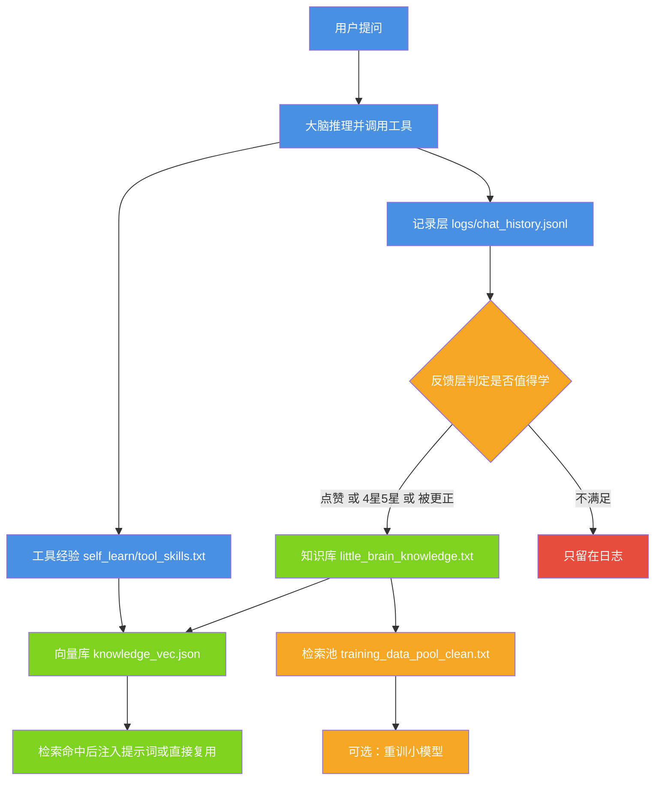

# 小焦 · 持续学习子模块（self_learn）

| 项 | 内容 |
| --- | --- |
| 文档名称 | 小焦 · 持续学习子模块（self_learn） |
| 适用版本 | v1.0 |
| 最后更新 | 2026-09-14 |
| 维护者 | 小焦项目 |
| 文档状态 | 稳定 |
| 实现主体 | `self_learn/` 目录（Python，零外部依赖） |
| 被调用方 | `xiaojiao_app.py`、`video_service/video_api.py`、`xiaojiao_harness.py` |
| 本次核对环境 | Windows、Python 3.13.13 |
| 本次核对方式 | 逐文件读源码；实际执行 `stats`、`search`、`log`、`feedback`、`reflect` 五个子命令；统计各数据文件条目数与标签分布 |

术语约定：本文把可替换的模型服务称为「大脑」，把不做推理、只负责检索与记忆的轻量部件称为「小脑」。`self_learn` 是仓库根目录下的一个子目录，既可以由主程序在运行时调用，也可以单独用命令行操作。

---

## 目录

- [1. 摘要](#1-摘要)
- [2. 模块定位](#2-模块定位)
- [3. 文件与职责](#3-文件与职责)
- [4. 数据流](#4-数据流)
- [5. 与主程序的交互](#5-与主程序的交互)
- [6. 命令行使用](#6-命令行使用)
- [7. 向量库接口](#7-向量库接口)
- [8. 与对话记忆的硬隔离](#8-与对话记忆的硬隔离)
- [9. 边界与限制](#9-边界与限制)
- [10. 故障排查](#10-故障排查)
- [11. 参考](#11-参考)
- [变更记录](#变更记录)

---

## 1. 摘要

`self_learn` 解决的问题是：让系统在长期使用中积累「什么需求用哪个工具、怎么用才成功、失败后下次怎么改」这类可检索复用的经验，并在下一次遇到同类需求时直接复用，而不必重新推理。

积累的载体是文本与一个轻量向量库，不依赖模型训练。可选的重训小模型步骤需要另外的脚本，本模块只负责把语料准备好。

---

## 2. 模块定位

### 2.1 学什么

本模块只沉淀**工具用法与失败反思**，即「用户要做什么 → 系统调用了哪个工具、传了什么参数、结果如何」。例如：

- 用户要在桌面新建目录并写入一个网页文件 → 记录为一次 `run_command` 加 `write_file` 的组合用法。
- 用户要查一个 IP 的归属地 → 记录为一次带 `geo` 参数的工具调用。

### 2.2 不学什么

本模块不记录开放式闲聊，也不保存原始对话全文。原始对话由对话记忆模块单独保存，两者文件与向量维度都不同，见 [8. 与对话记忆的硬隔离](#8-与对话记忆的硬隔离)。

### 2.3 两条入口

同一套数据既可由主程序自动写入，也可由命令行手动写入。主程序在每轮对话结束时自动记录，在用户点赞、点踩或更正时自动判定是否值得学；命令行用于补录、批量构建与人工检查。

---

## 3. 文件与职责

| 文件 | 类型 | 职责 |
| --- | --- | --- |
| `learn.py` | 源码 | 持续学习引擎的命令行入口，实现 `log`、`feedback`、`build`、`reflect`、`search`、`stats`、`train` 七个子命令 |
| `vstore.py` | 源码 | 轻量向量库：字符 2/3-gram 哈希向量化、余弦相似度检索、落盘 |
| `little_brain_knowledge.txt` | 数据 | 知识库，由 `build` 或主程序追加。本次核对为 214 行（8980 字节） |
| `tool_skills.txt` | 数据 | 工具经验的可读日志，由主程序 `_learn_skill()` 追加。本次核对为 3025 行 |
| `knowledge_vec.json` | 数据 | 向量库落盘文件。本次核对为 297 条 |

运行时还会读写以下仓库内文件，它们不在本目录下：

| 文件 | 职责 |
| --- | --- |
| `../logs/chat_history.jsonl` | 记录层：每次交互一行。本次核对为 2130 行 |
| `../logs/feedback.jsonl` | 反馈层：点赞、点踩、星级与更正。本次核对文件大小 666 字节，其中点赞 6 条 |
| `../training_data_pool_clean.txt` | 检索池，同时作为可选重训的语料。本次核对为 1000212 行 |

`little_brain_knowledge.txt`、`tool_skills.txt`、`knowledge_vec.json`、`videos/`、`logs/` 都已被 .gitignore 忽略，属于运行态产物，干净克隆里不存在。

---

## 4. 数据流

### 4.1 图 1 · 从一次交互到可检索的经验

说明：一次交互先落到日志，只有被判定为「值得学」的才进入知识库；工具经验另走一条并行通路，两条通路最终都汇聚到同一个向量库，供下次检索命中。

代码位置索引：`self_learn/learn.py` 的 `cmd_log()`（第 42–56 行）、`cmd_feedback()`（第 59–68 行）、`cmd_build()`（第 85–125 行）、`cmd_reflect()`（第 136–151 行）；`xiaojiao_app.py` 的 `_learn_skill()`（第 4204–4233 行）。



### 4.2 值得学的判定规则

`_good(fb, corrected)` 的判定顺序如下，命中任一条即为值得学：

1. 反馈里带更正内容。
2. 反馈值为 `good`。
3. 去掉「星」字后能转成整数且不小于 4，即 `4星`、`5星`。

主程序 `POST /api/feedback` 里的等价判定还额外接受点赞符号。判定通过后，主程序立刻把这次交互写进知识库与检索池；命令行则需要再跑一次 `build`。

### 4.3 向量化方式

`vstore.py` 不使用任何外部依赖：把文本统一转小写，统计字符 2-gram（权重 1.0）与 3-gram（权重 0.6）的哈希计数，得到 256 维向量并做 L2 归一化，检索时按余弦相似度排序。

条目主键是文本的 MD5 前 8 位十六进制。同一段文本再次写入会替换旧条目，不会重复累积。

---

## 5. 与主程序的交互

本节回答「它和主程序怎么交互、动的是哪个文件、哪个接口」。

| 交互方 | 位置 | 交互方式 |
| --- | --- | --- |
| 自动记录每次交互 | `xiaojiao_app.py` 第 8934 行 `_record_interaction()`，在第 8563、8757 行被调用 | 追加一行到 `logs/chat_history.jsonl`，返回 `log_id` |
| 用户反馈接口 | `xiaojiao_app.py` 第 8949 行 `POST /api/feedback` | 追加到 `logs/feedback.jsonl`；判定值得学时追加到 `self_learn/little_brain_knowledge.txt` 与 `training_data_pool_clean.txt` |
| 工具经验沉淀 | `xiaojiao_app.py` 第 4204 行 `_learn_skill()`，在第 7314 行被调用 | 追加到 `self_learn/tool_skills.txt`，并调用 `vstore.add(..., tag="tool_skill")` |
| 工具经验召回 | `xiaojiao_app.py` 第 4236 行 `_recall_skills()`，在第 7188 行被调用 | 调用 `vstore.search(..., threshold=0.12)`，把命中的前 3 条注入提示词 |
| 检索层复用 | `xiaojiao_harness.py` 第 213–219 行 | 调用 `vstore.search(query, k=1, threshold=0.13)`，命中即复用 |
| 视频提示词学习库 | `video_service/video_api.py` 的 `_refine_prompt()` | 调用 `vstore.search(..., threshold=0.35)` 与 `vstore.add(..., tag="video_prompt")` |
| 成长指标接口 | `xiaojiao_app.py` 第 8986 行 `GET /api/brain`、第 9031 行 `GET /api/growth` | 统计知识库条数、日志条数、反馈分布 |

主程序把 `self_learn` 目录加入 `sys.path` 后直接 `import vstore`，因此向量库不需要独立进程或服务。

---

## 6. 命令行使用

在仓库根目录执行即可，脚本会自行定位目录，不要求先 `cd` 进 `self_learn`。

不带参数运行会打印用法：

```bash
python self_learn/learn.py
```

### 6.1 记录一次交互

```bash
python self_learn/learn.py log "在桌面建 tests1 写上 index.html" "已完成" "[{\"tool\":\"run_command\"},{\"tool\":\"write_file\"}]"
```

第三个参数是工具轨迹，可选，是 JSON 字符串。缺省时只记录问答，不记录工具用法。

实测输出：

```text
已记录交互 log_id= 20260914_201709846436
```

### 6.2 记录用户反馈

```bash
python self_learn/learn.py feedback <log_id> good
python self_learn/learn.py feedback <log_id> 5星
python self_learn/learn.py feedback <log_id> bad "更正的答案"
```

带更正内容时该条必定会被学进知识库，与是否点赞无关。

实测输出：

```text
已记录反馈: good
```

### 6.3 构建知识库

```bash
python self_learn/learn.py build
```

它做两件事：把判定为值得学、且尚未写入的交互追加到知识库；随后把知识库当前全文追加到检索池。同时每条新增样本会写入向量库，标签为 `learned`。

注意 `build` 不是增量同步：只要本次有新增，就会把整个知识库再次追加进检索池，重复执行会让检索池按知识库大小的整数倍增长，见 [9.3](#93-检索池的重复追加)。

### 6.4 查看成长指标

```bash
python self_learn/learn.py stats
```

实测输出：

```text
小焦 · 持续学习成长指标
  交互记录(日志): 2130 条
  反馈: 点赞 6 | 4星5星 0 | 踩 0 | 更正 0
  小脑知识库: 214 条  -> <仓库根>\self_learn\little_brain_knowledge.txt
  检索池: 1000212 条  -> <仓库根>\training_data_pool_clean.txt
  向量库知识: 297 条  -> <仓库根>\self_learn\knowledge_vec.json
```

### 6.5 检索自测

```bash
python self_learn/learn.py search "截取B站视频"
```

该子命令的命中阈值是 0.5，比运行时使用的 0.12 到 0.13 严格得多，因此出现「命中为 False 但 top 3 明显相关」是正常现象。实测输出：

```text
查询: 截取B站视频
命中(>0.5): False | 最佳: 0.233 用户 删掉 <任意不存在的路径> → 小焦用「web_
```

### 6.6 生成一条反思

```bash
python self_learn/learn.py reflect "示例问题" "示例回答" "bad" "示例更正"
```

反思文本会同时写入知识库与向量库（标签 `reflection`）。实测输出：

```text
已生成反思并存入知识库+向量库:
  反思: 用户问「示例问题」，小焦答「示例回答」，反馈「bad」。用户更正为「示例更正」。下次遇到此类问题应: 直接按更正的方式回答
```

### 6.7 重训小模型

```bash
python self_learn/learn.py train
```

该子命令当前只打印一行提示，不执行训练；真正的重训由仓库根的 `train_model.py` 完成。详见 [9.1](#91-train-是占位实现)。

### 6.8 本文实际执行过的命令

`stats`、`search`、`log`、`feedback`、`reflect`（含不带参数的用法输出）均已实际执行并核对输出。`build` 与 `train` 未执行：前者会向检索池追加整个知识库，后者是占位实现。

---

## 7. 向量库接口

`vstore.py` 对外提供四个函数。

| 函数 | 签名 | 说明 |
| --- | --- | --- |
| `embed` | `embed(text) -> list[float]` | 把文本转成 256 维归一化向量 |
| `add` | `add(text, tag="", doc_id=None) -> str` | 写入或替换一条，返回条目 id |
| `search` | `search(query, k=3, threshold=0.13) -> dict` | 返回 `{"top": [...], "best": (...), "hit": bool}` |
| `count` | `count() -> int` | 返回条目总数 |

`search` 返回的每个命中项是三元组 `(分数, 文本, 标签)`。`hit` 表示最高分是否达到阈值。

当前库内的标签分布（本次核对）：`tool_skill` 292 条、`video_prompt` 3 条、`reflection` 2 条，合计 297 条。条目字段为 `id`、`text`、`tag`、`v`，其中 `v` 为长度 256 的数组。

标签只用于区分来源与人工查看，检索本身不按标签过滤——写入时用了什么标签，都能被后续检索命中。

---

## 8. 与对话记忆的硬隔离

这是本模块最重要的一条红线。

### 8.1 两个库分工不同

| 库 | 文件 | 维度 | 内容 |
| --- | --- | --- | --- |
| 工具经验库（本模块） | `self_learn/knowledge_vec.json` | 256 维 | 工具用法、失败反思、精炼提示词 |
| 对话记忆库 | `../logs/xiaojiao_memory_vec.jsonl` | 512 维 | 历史对话，一行一条、只追加 |

两个库的内容性质不同：工具经验是**可复用的做事方法**，对话记忆是**发生过的事实**。把它们混在一起，检索时「上次回答过什么」会挤掉「这件事该怎么做」，两个库都会失效。

### 8.2 隔离由代码强制，不靠约定

对话记忆模块 `../core/memory_vec.py` 在文件头写明「绝不读写 `self_learn/knowledge_vec.json`」，并把这条红线钉在代码里：

- 常量 `_FORBIDDEN` 指向 `self_learn/knowledge_vec.json`。
- 函数 `_assert_not_forbidden(path)` 在取路径时比对，命中即抛 `RuntimeError`，报错信息为「禁止把对话记忆写进 …，两库必须隔离」。
- `path()` 每次返回记忆库路径前都会调用该断言。

负责对话记忆向量化的 `../core/embedder.py` 在文件头同样写明「只读小脑权重，绝不碰 `self_learn/knowledge_vec.json`」。

### 8.3 因此本模块的写入范围

`self_learn` 只写自己的四个文件（知识库、工具经验日志、向量库、以及仓库根的检索池）。它不读写 `logs/xiaojiao_memory_vec.jsonl`，也不调用对话记忆模块的任何函数。

反过来，对话记忆模块也不得把任何内容写入 `self_learn/knowledge_vec.json`；如果将来有人试图改这条路径，代码会直接报错而不是静默污染。

---

## 9. 边界与限制

### 9.1 train 是占位实现

`cmd_train()` 只打印一行「运行 train_model.py 即可」的提示，不执行训练。重训需要单独调用仓库根的 `train_model.py`，并按它自己的依赖与硬件要求准备环境。

### 9.2 向量库是词形匹配，不是语义匹配

`vstore.embed()` 是字符 n-gram 哈希，同义不同词（例如「查 IP」与「看下我公网地址」）不一定能互相命中。它换来了零依赖与可预期的行为，代价是召回能力有限。

### 9.3 检索池的重复追加

`build` 在本次有新增时，会把知识库**全文**追加到检索池，而不是只追加新增行。多次执行后检索池会累积多份历史副本。写检索池前不做去重，也不做去重校验。

### 9.4 记录层与反馈层只增不改

`logs/chat_history.jsonl` 与 `logs/feedback.jsonl` 都是只追加文件。更正内容会作为新行写入反馈文件，不会回改原记录；`build` 与主程序在合并时按 `log_id` 取更正后的文本。

### 9.5 工具经验文件不含去重

`tool_skills.txt` 逐次追加，同一次工具调用重复发生就会重复记录（可在本机文件里看到连续重复的同一条）。向量库按文本主键去重，因此重复只体现在可读日志上。

### 9.6 反馈覆盖率低

反馈完全由用户手动触发。本次核对时 2130 条交互记录对应 6 条点赞、0 条星级、0 条点踩、0 条更正，因此进入知识库的样本远少于记录总数。这不影响已有能力，但决定了知识库的增长速度。

---

## 10. 故障排查

| 现象 | 原因 | 处理 |
| --- | --- | --- |
| 提示「暂无交互日志」 | 记录层文件不存在 | 先跑一次 `log`，或让主程序完成一轮对话 |
| 提示「未知命令」 | 子命令拼写错误 | 不带参数运行本脚本可打印全部子命令 |
| `stats` 的向量库条数与知识库条数差距大 | 两条通路写入时机不同 | 正常现象：主程序反馈接口直接写知识库，向量库只在 `build` 或工具调用时写入 |
| 检索总是命中不相关内容 | 阈值过低 | 运行时阈值 0.12 到 0.13 偏宽松，这是为了尽量复用；确需严格判定时改用 `search` 子命令的 0.5 阈值观察 |
| 报错「禁止把对话记忆写进 …」 | 有人把对话记忆库指向了工具经验库 | 这是预期的红线保护，改回 `logs/xiaojiao_memory_vec.jsonl` |
| 中文输出乱码 | 控制台编码不是 UTF-8 | 先执行 `$env:PYTHONUTF8="1"` |

---

## 11. 参考

- [`../docs/self_learn.md`](../docs/self_learn.md)：持续学习功能说明。
- [`../docs/six-infinity.md`](../docs/six-infinity.md)：六个无限的原理与实测，含记忆相关的设计取舍。
- [`../docs/modules/03-memory-depth.md`](../docs/modules/03-memory-depth.md)：记忆深度模块。
- [`../core/memory_vec.py`](../core/memory_vec.py)：对话记忆向量库与红线断言。
- [`../core/embedder.py`](../core/embedder.py)：对话记忆的 512 维向量化。
- [`../learn_from_neko.py`](../learn_from_neko.py)：从 N.E.K.O. 记忆目录导入偏好。
- [`../tools/check_docs.py`](../tools/check_docs.py)：文档与代码一致性检查。
- [`learn.py`](learn.py)、[`vstore.py`](vstore.py)：本模块源码。

---

## 变更记录

| 日期 | 版本 | 变更 |
| --- | --- | --- |
| 2026-09-14 | v1.0 | 重写：对齐代码 + 统一文风 |
