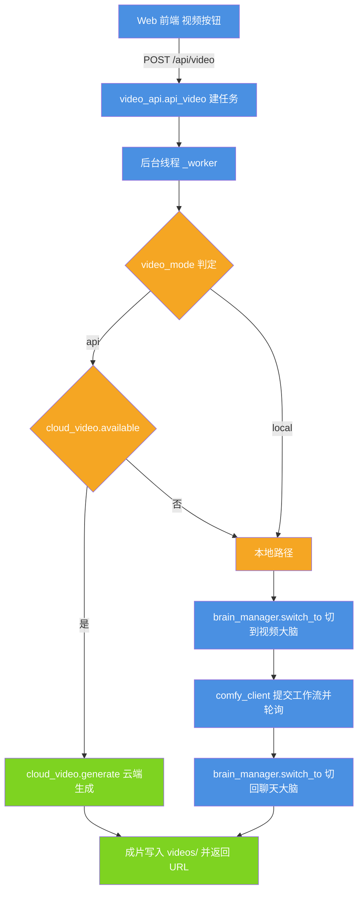
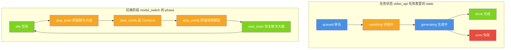

# 小焦 · 文生视频子模块（video_service）

| 项 | 内容 |
| --- | --- |
| 文档名称 | 小焦 · 文生视频子模块（video_service） |
| 适用版本 | v1.0 |
| 最后更新 | 2026-09-14 |
| 维护者 | 小焦项目 |
| 文档状态 | 稳定 |
| 实现主体 | `video_service/` 目录（Python，Flask Blueprint） |
| 挂载位置 | `xiaojiao_app.py` 第 8058–8067 行 |
| 本次核对环境 | Windows、Python 3.13.13、Flask 3.1.3、requests 2.34.2 |
| 本次核对方式 | 逐文件读源码；在本机注册 Blueprint 后用 Flask 测试客户端请求全部端点，并在 Web 运行时通过真实 HTTP 复核；导入各模块实际执行配置探测 |

术语约定：本文把可替换的模型服务称为「大脑」；`video_service` 是挂在主程序 Web 端口上的一个子模块，不是独立进程，也不监听自己的端口。

---

## 目录

- [1. 摘要](#1-摘要)
- [2. 模块定位](#2-模块定位)
- [3. 文件与职责](#3-文件与职责)
- [4. 启动与挂载](#4-启动与挂载)
- [5. 架构与数据流](#5-架构与数据流)
- [6. 配置](#6-配置)
- [7. 接口](#7-接口)
- [8. 与主程序的交互](#8-与主程序的交互)
- [9. 使用示例](#9-使用示例)
- [10. 依赖与前置条件](#10-依赖与前置条件)
- [11. 边界与已知问题](#11-边界与已知问题)
- [12. 故障排查](#12-故障排查)
- [13. 参考](#13-参考)
- [变更记录](#变更记录)

---

## 1. 摘要

`video_service` 解决的问题是：在主程序 Web 端口（默认 5000）上提供一个「生成视频」入口，并在本地显卡只有一个模型位的前提下，让聊天大脑与视频模型轮流占用显存，用户全程只看到一次点击和一条进度。

它对外只暴露一组 HTTP 接口，对内提供两条互斥的生成路径：本地 ComfyUI + Wan，以及云端视频 API。

---

## 2. 模块定位

### 2.1 两条生成路径

| 路径 | 判定条件 | 显存占用 | 实现文件 |
| --- | --- | --- | --- |
| 本地 | 视频模式为 `local`，或模式为 `api` 但云端不可用 | 占用本地显存 | `model_switch.py` + `comfy_client.py` + `workflow_wan.json` |
| 云端 | 视频模式为 `api` 且存在带密钥的视频模型 | 不占本地显存 | `cloud_video.py` |

模式默认值是 `api`。判定顺序见 [6.1](#61-模式判定)。

### 2.2 显存互斥

本地路径的核心约束是：聊天大脑与视频模型不能同时驻留显存。模块通过「先卸载一个，再加载另一个」保证任一时刻只有一个模型占位，生成结束后再切回聊天大脑。

### 2.3 两个入口

同一个能力有两个调用方，最终都落到同一套工作流文件：

- Web 入口：前端「视频」按钮 → `POST /api/video`（异步任务 + 轮询）。
- 工具入口：插件 `plugins/video_generation.py` 的工具 `generate_video`，供模型在对话中直接调用（同步返回）。

---

## 3. 文件与职责

| 文件 | 职责 |
| --- | --- |
| `__init__.py` | 包标记，只有一行注释 |
| `config.py` | 配置与路径自动探测：ComfyUI 目录、视频模型根目录、端口、输出目录、检查点文件名 |
| `model_switch.py` | 显存切换协调器：卸载/恢复聊天大脑，启动/停止 ComfyUI，对外提供切换阶段状态 |
| `comfy_client.py` | ComfyUI HTTP 客户端：提交工作流、轮询进度与历史、下载成片 |
| `video_api.py` | Flask Blueprint：全部 HTTP 接口、后台任务线程、任务状态持久化、提示词精炼 |
| `cloud_video.py` | 通用云端视频适配器：按 `base_url` / 模型名特征识别协议并分发 |
| `agenes.py` | Agnes 云端文生视频的独立实现（当前无调用方，见 [11.6](#116-无调用方的模块)） |
| `workflow_wan.json` | 本地路径的 ComfyUI 工作流模板，含 `__CKPT__` 与 `__POS__` 两个占位符 |
| `_jobs.json` | 运行态产物：任务状态表落盘，进程重启后自动读回（已被 .gitignore 忽略） |

---

## 4. 启动与挂载

### 4.1 本模块不能单独启动

`video_service` 没有 `__main__`，也没有自己的端口。它必须由主程序加载：主程序把该目录加入 `sys.path`，导入 `video_api` 里的 Blueprint 对象并注册到 Flask 应用上。

挂载代码位于 `xiaojiao_app.py` 第 8058–8067 行：

```python
_vdir = os.path.join(os.path.dirname(os.path.abspath(__file__)), "video_service")
if _vdir not in sys.path:
    sys.path.insert(0, _vdir)
try:
    from video_api import bp as _video_bp
    app.register_blueprint(_video_bp)
    print("视频服务已挂载（ComfyUI + Wan2.1，按需切换模型）")
except Exception as _e:
    print("视频服务未挂载:", _e)
```

挂载失败只打印一行提示，不会阻断 Web 服务。因此「网页能打开」不代表「视频服务已挂载」。

### 4.2 启动命令

在仓库根目录执行任一命令即可，两者都会让 Blueprint 生效：

```bash
# 一键启动：读控制文件 → 起大脑 → 起 Web(5000) → 打开浏览器 → 拉起 N.E.K.O.
python start_xiaojiao.py

# 只起 Web：不自动拉起大脑与 N.E.K.O.，适合只调视频模块
python xiaojiao_app.py
```

本文没有实际执行上面两条命令（它们会常驻监听端口并打开浏览器）。下面这条只验证导入与挂载所需的前置条件，已实际执行：

```bash
python -c "import sys; sys.path.insert(0, 'video_service'); import video_api; print('video_api OK, mode =', video_api.video_mode())"
```

实测输出：

```text
video_api OK, mode = api
```

### 4.3 确认已挂载

Web 起来之后，访问任意一个本模块的接口即可确认。`/api/video/state` 在空闲时的实测返回：

```http
GET /api/video/state

{"busy": false, "error": null, "job": null, "message": "", "phase": "idle", "progress": 0}
```

若返回 404，说明挂载失败，请看启动日志里的「视频服务未挂载」那一行。

---

## 5. 架构与数据流

### 5.1 图 1 · 双模式分派

说明：一次视频请求进来后，由模式配置与云端可用性共同决定走本地还是云端；两条路最终都写回同一个输出目录。

代码位置索引：`video_service/video_api.py` 的 `video_mode()`（第 19–34 行）与 `_worker()`（第 198–270 行）；`video_service/cloud_video.py` 的 `available()`（第 65–67 行）。



### 5.2 图 2 · 任务状态与切换阶段是两套状态

说明：任务状态由 `video_api` 维护并按任务记录，切换阶段由 `model_switch` 维护且全进程只有一份。两者互不覆盖，接口返回的 `state` 与 `phase` 分别来自这两套状态。

需要特别注意：`model_switch` 并没有 `generating` 这个阶段。生成期间切换阶段停留在 `start_comfy`，`generating` 只存在于任务状态里。

代码位置索引：`video_service/video_api.py` 第 199–270 行；`video_service/model_switch.py` 的 `_state`（第 15 行）与 `_set()`（第 74–82 行）。



### 5.3 本地工作流的节点链

`workflow_wan.json` 的节点链与占位符如下。全部节点来自 ComfyUI 自定义节点包 `ComfyUI-WanVideoWrapper`，不是 ComfyUI 内置节点。

| 序号 | 节点 | 关键输入 |
| --- | --- | --- |
| 1 | `WanVideoModelLoader` | `model` = `__CKPT__`，`quantization` = `fp8_e4m3fn` |
| 2 | `LoadWanVideoT5TextEncoder` | `model_name` = `umt5_fp8.safetensors` |
| 3 | `WanVideoTextEncode` | `positive_prompt` = `__POS__`，`negative_prompt` 固定 |
| 4 | `WanVideoEmptyEmbeds` | 832 × 480，33 帧 |
| 5 | `WanVideoSampler` | steps 14、cfg 5.0、shift 7.0、seed 42、scheduler `unipc` |
| 6 | `WanVideoVAELoader` | `model_name` = `vae_fp8.safetensors` |
| 7 | `WanVideoDecode` | 开启 VAE 分块 |
| 8 | `CreateVideo` | fps 24 |
| 9 | `SaveVideo` | `filename_prefix` = `xiaojiao_wan`，`format` = `mp4` |

占位符替换由 `video_api._load_workflow()`（第 82–90 行）完成：`__CKPT__` 换成 `config.find_checkpoint()` 的结果，`__POS__` 换成精炼后的提示词。

更换 ComfyUI 版本或换用内置节点时，工作流同样需要重画。判断标准是节点类名是否存在于你的 ComfyUI 里。

---

## 6. 配置

### 6.1 模式判定

`video_mode()` 按以下顺序取值，先命中者生效：

1. 环境变量 `XIAOJIAO_VIDEO_MODE`，取值只能是 `api` 或 `local`。
2. 操控文件 `xiaojiao_control.json` 的 `brain.video_mode`。
3. 默认值 `api`。

本机实测：`brain.video_mode` 未配置，`video_mode()` 返回 `api`。

注意模式为 `api` 时并不保证走云端：`_worker()` 还会再问一次 `cloud_video.available()`，即是否存在一个带有密钥、且名称或地址里含 `video` 的模型。本机实测 `cloud_video.available()` 为 `False`（控制文件里的两个模型都不满足该条件），因此即使 `video_mode()` 为 `api`，实际仍回落到本地路径。

### 6.2 常量与实测值

`config.py` 在导入时完成全部探测，以下是本机的实际结果。

| 常量 | 含义 | 本机实测值 |
| --- | --- | --- |
| `VIDEO_ROOT` | 视频模型根目录 | `G:\moxing__xiaojiao\视频模型` |
| `COMFY_DIR` | 含 `main.py` 的 ComfyUI 目录 | `...\ComfyUI_windows_portable\ComfyUI` |
| `COMFY_PORT` | ComfyUI 端口 | `8188` |
| `COMFY_URL` | ComfyUI 基地址 | `http://127.0.0.1:8188` |
| `BRAIN_PORT` | 聊天大脑兜底端口 | `8080` |
| `OUT_DIR` | 成片输出目录 | `<仓库根>/videos` |
| `find_checkpoint()` | 检查点文件名 | `dit_fp8.safetensors` |
| `brain_llama()` | 大脑启动三元组 | `C:\llama\llama-server.exe`、`C:\llama\xiaojiao1.0-4B.gguf`、8080、ctx 20224 |

目录不写死在代码里，按以下顺序探测：

- `COMFY_DIR`：环境变量 `XIAOJIAO_COMFY_DIR` → `xiaojiao_control.json` 的 `brain.comfy_dir` → `VIDEO_ROOT` 下递归找 `main.py`（最多 4 层）→ 调 `install_all.discover_comfy()` 全盘探测。
- `VIDEO_ROOT`：环境变量 `XIAOJIAO_VIDEO_ROOT` → 从 `brain.comfy_dir` 逐层向上找到含 `dit_fp8.safetensors` 的那一层 → 调 `install_all.discover_video_root()` 全盘探测。
- `find_checkpoint()`：先看 `COMFY_DIR/models/checkpoints`，再看 `VIDEO_ROOT`，取文件名含 `wan`、`fp8`、`dit`、`1.3b` 之一的 `.safetensors` / `.ckpt`。

### 6.3 环境变量

| 变量 | 作用 | 默认值 |
| --- | --- | --- |
| `XIAOJIAO_VIDEO_MODE` | 强制视频模式 `api` 或 `local` | 未设，读控制文件，再退 `api` |
| `XIAOJIAO_VIDEO_ROOT` | 视频模型根目录 | 自动探测 |
| `XIAOJIAO_COMFY_DIR` | ComfyUI 目录 | 自动探测 |
| `XIAOJIAO_COMFY_PORT` | ComfyUI 端口 | `8188` |
| `XIAOJIAO_KEEP_COMFY` | 设为 `1` 时启动 ComfyUI 带 `--lowvram` | 未设 |
| `XIAOJIAO_WAN_MODEL` | 替换工作流里的 `__MODEL__` 占位符 | `wan2.6-t2v` |
| `LLAMA_PORT` | 聊天大脑兜底端口 | `8080` |

`XIAOJIAO_WAN_MODEL` 在当前的 `workflow_wan.json` 里没有对应占位符，替换不产生效果，见 [11.5](#115-无效的环境变量)。

### 6.4 温存与常驻

- 操控文件 `brain.keep_warm` 为 `true` 时，本地路径生成完不卸载视频模型；`stop_comfy()` 直接返回，ComfyUI 进程保留。
- `keep_warm` 为 `false` 时，任务完成后会起一个守护线程等 15 分钟；期间没有新的排队、切换或生成任务，就调用 `stop_comfy()` 释放显存。

本机实测 `brain.keep_warm` 为 `true`。

---

## 7. 接口

### 7.1 HTTP 接口

下表全部在本机注册 Blueprint 后用 Flask 测试客户端请求过，并在 Web 运行时用真实 HTTP 复核，返回值为实测结果。

| 方法 | 路径 | 说明 | 实测 |
| --- | --- | --- | --- |
| POST | `/api/video` | 建任务。请求体 `{"prompt": "场景"}`，提示词截断到 80 字 | 空提示词返回 400 |
| GET | `/api/video/status` | 查询单个任务，参数 `job` | 不存在的任务返回 `{"state": "unknown"}` |
| GET | `/api/video/current` | 当前活动任务 + 切换阶段 | 200，返回最近一条任务记录 |
| GET | `/api/video/state` | 切换阶段快照 | 200，`phase` 为 `idle` |
| GET | `/api/video/mode` | 读视频模式 | 200，`{"mode": "api", "ok": true}` |
| POST | `/api/video/mode` | 写视频模式，请求体 `{"mode": "api"}` 或 `{"mode": "local"}` | 非法值返回 400 |
| GET | `/api/video/refine` | 只精炼提示词，参数 `prompt`，不学习也不切换 | 200 |
| GET | `/api/video/promptkb` | 提示词学习库统计 | 200，`{"count": 0, "recent": []}`，见 [11.1](#111-提示词学习库接口恒返回-0) |
| GET | `/videos/<name>` | 从 `OUT_DIR` 提供成片 | — |
| GET | `/media/<name>` | 从仓库 `media/` 提供媒体文件 | — |

任务忙时 `POST /api/video` 不返回错误码，而是返回 200 加 `{"ok": false, "busy": true}`，前端据此提示「正在生成/切换模型中，请稍候」。

### 7.2 任务记录字段

任务对象持久化在 `video_service/_jobs.json`，字段如下。本机该文件存有 14 条历史任务。

| 字段 | 含义 |
| --- | --- |
| `state` | `queued` / `switching` / `generating` / `done` / `error` |
| `prompt` | 用户原始输入 |
| `refined_prompt` | 精炼后的提示词 |
| `message` | 面向用户的进度文案 |
| `progress` | `{"value": n, "max": n}`，来自 ComfyUI 的进度接口 |
| `url` | 本机成片地址，形如 `/videos/<文件名>` |
| `video_url` | 云端路径下的远程地址 |
| `error` | 失败原因 |
| `ts` | 建任务时间戳 |

### 7.3 关键函数签名

| 文件 | 函数 | 职责 |
| --- | --- | --- |
| `config.py` | `find_comfy_dir()` | 定位 ComfyUI 目录 |
| `config.py` | `find_checkpoint()` | 返回检查点文件名或 `None` |
| `config.py` | `brain_llama()` | 返回 `(server, gguf, port, ctx)` |
| `model_switch.py` | `stop_brain()` | 卸载聊天大脑，优先走 llama-swap 卸载接口 |
| `model_switch.py` | `start_brain()` | 恢复聊天大脑，llama-swap 不可用时直接起进程 |
| `model_switch.py` | `start_comfy()` | 启动 ComfyUI 并等端口就绪 |
| `model_switch.py` | `stop_comfy()` | 停止 ComfyUI 释放显存，`keep_warm` 时跳过 |
| `model_switch.py` | `get_state()` | 无锁快照，读切换阶段 |
| `comfy_client.py` | `submit_workflow(workflow)` | 提交工作流，返回 `prompt_id` |
| `comfy_client.py` | `wait_output(prompt_id, timeout=1800, progress_cb=None)` | 轮询到出片，返回 `(filename, subfolder, type)` |
| `comfy_client.py` | `download_video(filename, subfolder, ftype, out_path)` | 下载成片到本地 |
| `cloud_video.py` | `available()` | 是否配置了可用的云端视频模型 |
| `cloud_video.py` | `generate(prompt, mode=None, ...)` | 按协议分发，返回 `(本地路径, 远程地址)` |
| `video_api.py` | `video_mode()` | 解析当前视频模式 |
| `video_api.py` | `_refine_prompt(raw, save=True)` | 精炼提示词：先查向量库，再请大脑改写，最后模板兜底 |

精炼提示词的三级策略：先按相似度查 `self_learn/vstore.py` 的向量库（阈值 0.35），命中就直接复用学过的；未命中则请聊天大脑改写并写入向量库（标签 `video_prompt`）；大脑也不可用时给原始提示词追加固定的电影级修饰词。

---

## 8. 与主程序的交互

本节回答「它和主程序怎么交互、动的是哪个文件、哪个接口」。

| 交互方 | 位置 | 交互方式 |
| --- | --- | --- |
| 主程序挂载 | `xiaojiao_app.py` 第 8058–8067 行 | 加 `sys.path` → 导入 `video_api.bp` → `app.register_blueprint()` |
| 前端界面 | `xiaojiao_app.py` 第 9949、9985–10000、10256–10325 行 | 首页内联 HTML/JS：视频按钮、模式下拉、轮询 `/api/video/status`、恢复中断任务 |
| 大脑调度 | `brain_manager.py` 第 239–251 行 `switch_to()` | 本地路径调用 `switch_to("video")` 与 `switch_to("chat")`，由注册表决定起停 |
| 显存控制 | `video_service/model_switch.py` | `brain_manager` 的 `wake("video")` 会调 `start_comfy()`，`sleep` 路径会调 `stop_comfy()` |
| 工具入口 | `plugins/video_generation.py` | 工具 `generate_video` 直接调用 `model_switch.stop_brain()` / `start_comfy()` 与 `comfy_client`，并使用同一份 `workflow_wan.json` |
| 提示词学习库 | `self_learn/vstore.py` | `_refine_prompt()` 读写 `knowledge_vec.json`，标签 `video_prompt` |
| 环境自检 | `xiaojiao_app.py` 第 8335 行 `/api/env` | 体检项里包含视频模型根目录的探测结果 |
| 停止大脑 | `xiaojiao_app.py` 第 3354 行 | 停止聊天大脑时导入 `video_service.model_switch` 复用其卸载逻辑 |

`brain_manager.BRAINS` 注册表里与本模块相关的两项：`chat`（端口 9292，llama-swap 托管）与 `video`（端口 8188，类型 `comfy`）。

工具入口与 Web 入口有两点差异：工具入口是同步阻塞并把结果直接写进对话；精炼提示词与采样参数是各自实现的，工作流文件的占位符替换也只做 `__CKPT__` 与 `__POS__`。

---

## 9. 使用示例

以下命令需要 Web（默认 5000）已经在跑。Windows 10 及以上自带 `curl.exe`，在 PowerShell 里请写 `curl.exe` 以避开 `Invoke-WebRequest` 的别名。

查询当前状态：

```bash
curl -s http://127.0.0.1:5000/api/video/state
```

提交一次生成：

```bash
curl -s -X POST http://127.0.0.1:5000/api/video \
  -H "Content-Type: application/json" \
  -d "{\"prompt\":\"女孩在樱花树下奔跑\"}"
```

返回形如：

```json
{"ok": true, "job": "190814290419"}
```

轮询任务：

```bash
curl -s "http://127.0.0.1:5000/api/video/status?job=190814290419"
```

完成时的记录样例（取自本机 `_jobs.json`）：

```json
{
  "state": "done",
  "prompt": "女孩在樱花树下奔跑",
  "message": "完成",
  "refined_prompt": "A girl walks slowly under a canopy of blooming cherry blossoms, soft morning light filtering through petals, shallow depth of field, cinematic, dreamy, warm tones.",
  "url": "/videos/20260830_190820_wan.mp4"
}
```

切换视频模式：

```bash
curl -s -X POST http://127.0.0.1:5000/api/video/mode \
  -H "Content-Type: application/json" -d "{\"mode\":\"local\"}"
```

本机 `videos/` 目录下共有 11 个成片，其中 9 个文件名带 `_wan` 后缀来自本地路径，2 个带 `_agnese` 后缀来自云端路径。

---

## 10. 依赖与前置条件

### 10.1 通用

- 主程序 Web 已在运行，`requirements.txt` 里的 `flask` 与 `requests` 已安装。

### 10.2 云端路径

需要额外配置一个带密钥的视频模型（写进 `xiaojiao_control.json` 的 `models` 列表，名称或地址里含 `video`）。`cloud_video.py` 按地址特征识别协议：

| 协议 | 识别特征 | 状态 |
| --- | --- | --- |
| Agnes | 地址或模型名含 `agnes` | 已实现 |
| OpenAI 兼容视频 | 地址以 `/v1` 结尾，或含 `openai`、`videos` | 已实现，按多个候选端点依次尝试 |
| Gemini | 地址含 `generativelanguage` 或 `gemini` | 未实现，调用即抛出「暂未完整实现」 |
| 其他 | — | 抛出「暂未支持的视频 API 协议」 |

云端路径另外做了每分钟一次请求的节流，用于避开免费额度的限流。

### 10.3 本地路径

本地路径需要额外安装以下内容，缺任一项都会在生成阶段失败：

| 项目 | 说明 |
| --- | --- |
| ComfyUI | 便携版或自装均可，目录下要有 `main.py` |
| 自带 Python | 便携版的 `python_embeded/python.exe`，代码会优先使用它；找不到才退回当前解释器 |
| 自定义节点 `ComfyUI-WanVideoWrapper` | 必需。`workflow_wan.json` 的 9 个节点全部来自它 |
| 自定义节点 `ComfyUI-AnyDeviceOffload` | 本机已安装；工作流里的 `force_offload` 相关字段与之配合 |
| 视频模型 `dit_fp8.safetensors` | 必需。放 `models/checkpoints` 或视频模型根目录 |
| 文本编码器 `umt5_fp8.safetensors` | 必需。由 `LoadWanVideoT5TextEncoder` 按文件名加载 |
| VAE `vae_fp8.safetensors` | 必需。由 `WanVideoVAELoader` 按文件名加载 |
| 聊天大脑服务 | llama-swap（默认 9292）或 llama-server（默认 8080），用于提示词精炼与切换 |

本机核对结果：以上各项均已就位，`COMFY_DIR/main.py` 存在，`python_embeded/python.exe` 存在，三个模型文件都在，两个自定义节点目录都在。

目录结构参考（本机实际形态）：

```text
视频模型/
├── ComfyUI-WanVideoWrapper/
└── ComfyUI_windows_portable_nvidia_cu126/
    ├── python_embeded/python.exe
    └── ComfyUI_windows_portable/
        ├── python_embeded/python.exe
        └── ComfyUI/
            ├── main.py
            ├── custom_nodes/{ComfyUI-WanVideoWrapper, ComfyUI-AnyDeviceOffload}
            └── models/
                ├── checkpoints/dit_fp8.safetensors
                ├── text_encoders/umt5_fp8.safetensors
                └── vae/vae_fp8.safetensors
```

### 10.4 硬件

本地路径的前提是显存放不下聊天大脑与视频模型两份权重。消费级单卡常见情形即如此，因此本模块采用互斥切换而非并行加载。具体占用随模型与量化方式变化，本文不写死数值。

---

## 11. 边界与已知问题

以下条目均来自本次逐项核对，属于代码现状。按约定本文只记录，不修改代码。

### 11.1 提示词学习库接口恒返回 0

`api_video_promptkb()`（第 354–369 行）读取的是 `os.path.dirname(__file__)/knowledge_vec.json`，即 `video_service/knowledge_vec.json`。该文件不存在（向量库的真实位置是 `self_learn/knowledge_vec.json`），读取抛异常后 `count` 保持 0。

实测：`GET /api/video/promptkb` 返回 `{"count": 0, "recent": []}`。

影响是「提示词学习库统计」这一项展示恒为空，不影响精炼与生成——`_refine_prompt()` 走的是 `self_learn/vstore.py`，路径正确。

### 11.2 三处超时口径不一致

| 位置 | 值 | 含义 |
| --- | --- | --- |
| `video_api._sweep()` | 600 秒 | 清理仍处于切换中或生成中的任务 |
| `_sweep()` 写入的提示文案 | 30 分钟 | 与实际阈值不符 |
| `comfy_client.wait_output()` | 1800 秒 | 轮询 ComfyUI 出片的真实上限 |
| `model_switch.start_comfy()` | 240 秒 | 等 ComfyUI 端口就绪的上限 |

实测行为以代码阈值为准：切换中或生成中的任务超过 600 秒会被标记为失败，此时 `wait_output` 的 1800 秒额度尚未用完。旧文档写的「ComfyUI 就绪上限 3 分钟」也不成立，实际是 240 秒。

### 11.3 单机单任务

任一时刻只允许一个处于 `queued`、`switching` 或 `generating` 的任务；新请求直接被拒。这是显存互斥的直接后果，不是配置项。

### 11.4 任务状态表无上限

`_jobs` 只增不删，并整体写入 `_jobs.json`。长期使用后该文件会持续变大，`/api/video/current` 在无活动任务时会返回最后一条历史记录。

### 11.5 无效的环境变量

`_load_workflow()` 会把 `__MODEL__` 替换为 `XIAOJIAO_WAN_MODEL`（默认 `wan2.6-t2v`），但 `workflow_wan.json` 里没有 `__MODEL__` 占位符，替换没有任何效果。

### 11.6 无调用方的模块

`agenes.py` 是 Agnes 云端视频的独立实现，全仓库没有任何文件导入它；云端路径实际走的是 `cloud_video.py` 里的通用适配器。该文件属备用实现，改动它不会影响线上的云端路径。

### 11.7 工作流与 ComfyUI 版本绑定

`workflow_wan.json` 的节点类名、以及文本编码器与 VAE 的文件名都是写死的。更换 ComfyUI 版本、换用内置节点或改模型文件名，都必须同步改这份 JSON，否则提交时会被 ComfyUI 拒绝并带出具体报错。

### 11.8 未实测的部分

本文的实测覆盖配置探测、Blueprint 注册、全部 HTTP 接口的请求响应、以及历史产物核对。以下内容未在本次核对中实际触发：

- 端到端重新生成一次视频（需要显存与 4 分钟量级的模型加载时间）。
- 云端路径的实际出片。
- ComfyUI 未安装时 `start_comfy()` 的报错路径。

---

## 12. 故障排查

| 现象 | 原因 | 处理 |
| --- | --- | --- |
| 接口全部 404 | Blueprint 未挂载 | 看启动日志的「视频服务未挂载」，按提示补依赖 |
| 返回 `{"busy": true}` | 已有任务在切换或生成 | 等当前任务结束；超过 600 秒会被自动清理 |
| 报「找不到 ComfyUI」 | `COMFY_DIR` 没探测到 | 设 `XIAOJIAO_COMFY_DIR` 指向含 `main.py` 的目录 |
| 报「ComfyUI 启动超时(4分钟)」 | 首次加载模型慢，或端口被占 | 确认 8188 未被其他进程占用，或提高等待上限 |
| ComfyUI 拒绝工作流 | 节点类名或模型文件名与你的环境不符 | 按报错里的缺失节点调整 `workflow_wan.json`，见 [11.7](#117-工作流与-comfyui-版本绑定) |
| 报缺模型 | 检查点、文本编码器或 VAE 缺失 | 按 [10.3](#103-本地路径) 把三个文件放到对应目录 |
| 生成失败后聊天大脑没恢复 | `start_brain()` 兜底失败 | `start_brain()` 不抛异常，只在状态里记 `error`；检查 `brain_llama()` 返回的路径是否存在 |
| 提示词没被精炼 | 大脑服务不在线 | 三层兜底会退回模板修饰词；确认 9292 或 8080 有服务 |
| 视频模型不释放 | `brain.keep_warm` 为 `true` | 这是预期行为；改为 `false` 后闲置 15 分钟自动释放 |

---

## 13. 参考

- [`../docs/video.md`](../docs/video.md)：文生视频功能说明。
- [`../docs/brain-switch.md`](../docs/brain-switch.md)：多大脑切换机制。
- [`../docs/install.md`](../docs/install.md)：安装与依赖清单。
- [`../docs/modules/01-carrier-core.md`](../docs/modules/01-carrier-core.md)：载体核心智力，含模型与载体的分工。
- [`../plugins/video_generation.py`](../plugins/video_generation.py)：工具入口实现。
- [`../brain_manager.py`](../brain_manager.py)：大脑注册表与切换。
- [`../self_learn/README.md`](../self_learn/README.md)：向量库与提示词学习库。
- [`../tools/check_docs.py`](../tools/check_docs.py)：文档与代码一致性检查。
- [`config.py`](config.py)、[`model_switch.py`](model_switch.py)、[`comfy_client.py`](comfy_client.py)、[`video_api.py`](video_api.py)、[`cloud_video.py`](cloud_video.py)、[`workflow_wan.json`](workflow_wan.json)：本模块源码。

---

## 变更记录

| 日期 | 版本 | 变更 |
| --- | --- | --- |
| 2026-09-14 | v1.0 | 重写：对齐代码 + 统一文风 |
